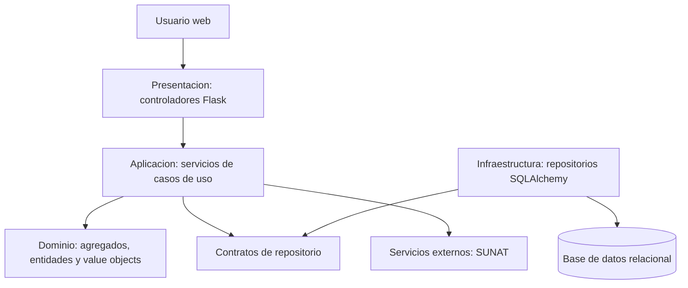

# SoftwareTextil

Sistema web para la gestión integral de una operación textil. El proyecto cubre catálogo de prendas, inventario, carrito de compras, pedidos, pagos, despachos, facturación electrónica, ingresos, egresos y cierre contable.

El sistema fue modelado con UML en StarUML y organizado en Python con **Domain-Driven Design (DDD)**, arquitectura en capas, Flask, SQLAlchemy y `uv` como gestor de entorno y dependencias.

---

## Integrantes

| Integrante |
| --- |
| Condori Pallardel, Emilio |
| Gutierrez Castilla, Carlos Enrique |
| Huayhua Perez, Lizzy Arlette |
| Peñalva Humire, Javier Alonzo |
| Quispe Suarez, Angelo Josué |

---

## Alcance

SoftwareTextil permite administrar el flujo principal de una empresa textil desde la publicación de prendas hasta el registro contable de la operación.

| Área | Alcance |
| --- | --- |
| Catálogo | Registro de prendas, categorías y tipos de producto |
| Inventario | Control de stock, movimientos, alertas y despachos |
| E-commerce | Carrito de compras, pedidos, historial y pagos |
| Administración | Usuarios, roles, permisos, sesiones y configuración |
| Contabilidad | Ingresos, egresos, impuestos, declaraciones y cierre contable |
| Facturación | Comprobantes electrónicos y comunicación con SUNAT |

---

## Arquitectura

El proyecto usa un monolito modular. Cada módulo conserva sus reglas de negocio dentro del dominio y se comunica con las demás capas mediante servicios y contratos de repositorio.



| Capa | Responsabilidad |
| --- | --- |
| Presentación | Expone rutas HTTP con Flask |
| Aplicación | Coordina casos de uso y DTOs |
| Dominio | Contiene reglas de negocio, agregados, objetos de valor y contratos |
| Infraestructura | Implementa persistencia, repositorios y servicios externos |

---

## Módulos Del Dominio

| Módulo | Responsabilidad principal |
| --- | --- |
| Autenticación | Credenciales, sesiones e intentos de inicio de sesión |
| Usuarios y roles | Usuarios del sistema, roles y permisos |
| Catálogo | Prendas, categorías y tipos de producto |
| Inventario | Stock, movimientos, alertas y consulta de existencias |
| Compras | Carrito de compras e items seleccionados |
| Pedidos | Generación, detalle e historial de pedidos |
| Pagos | Métodos de pago y procesamiento |
| Despachos | Preparación, confirmación y guía de remisión |
| Contabilidad | Ingresos, egresos, impuestos y cierre contable |
| Facturación | Comprobantes electrónicos y envío a SUNAT |
| Compartido | Enums, objetos de valor y conceptos comunes |

---

## Diagramas UML

Los archivos fuente de StarUML se encuentran en `assets/Diagramas_uml/`. Las imágenes exportadas para la documentación están en `assets/figuras_uml/`.

La carpeta `assets/starUML_codigo/` conserva el código generado originalmente por StarUML como evidencia del proceso de modelado. Ese código no se importa directamente en la aplicación porque StarUML genera nombres y firmas que requieren normalización para Python.

### Autenticación


### Usuarios y Roles


### Inventario


### Catálogo


### Compras, Pedidos y Pagos


### Sistema Contable Textil


### Encargado de Inventario y Logística


---

## Estructura Del Proyecto

```text
SoftwareTextil/
├── assets/
│   ├── Diagramas_uml/          # Archivos fuente StarUML (.mdj)
│   ├── figuras_uml/            # Exportaciones de diagramas UML
│   ├── figuras_casos_uso/      # Diagramas de casos de uso
│   ├── figuras_prototipo/      # Capturas del prototipo
│   └── starUML_codigo/         # Codigo generado por StarUML como referencia
├── docs/
│   ├── arquitectura.md
│   ├── modelo_dominio.md
│   └── prototipo.md
├── src/software_textil/
│   ├── presentation/           # Controladores Flask
│   ├── application/            # Servicios de aplicación y DTOs
│   ├── domain/                 # Modelo de dominio puro
│   └── infrastructure/         # Persistencia, repositorios y servicios externos
├── tests/
├── pyproject.toml
├── uv.lock
└── README.md
```

---

## Instalación

El proyecto usa `uv` para gestionar Python, el entorno virtual y las dependencias. `pyproject.toml` define las dependencias y `uv.lock` fija versiones reproducibles.

### Instalar uv

```bash
curl -LsSf https://astral.sh/uv/install.sh | sh
```

En Windows PowerShell:

```powershell
irm https://astral.sh/uv/install.ps1 | iex
```

### Preparar el entorno

```bash
git clone git@github.com:javierRock/SoftwareTextil.git
cd SoftwareTextil
uv sync
```

### Ejecutar la aplicación

```bash
uv run flask --app "software_textil:create_app()" run --debug
```

### Ver rutas disponibles

```bash
uv run flask --app "software_textil:create_app()" routes
```

---

## API Principal

| Método | Ruta | Uso |
| --- | --- | --- |
| `GET` | `/health` | Verifica que la aplicación responda |
| `POST` | `/auth/login` | Inicia sesión |
| `POST` | `/auth/logout` | Cierra sesión |
| `POST` | `/catalogo/prendas` | Registra una prenda |
| `POST` | `/catalogo/categorias` | Crea una categoría |
| `POST` | `/catalogo/tipos-producto` | Crea un tipo de producto |
| `POST` | `/inventario/stock` | Crea stock inicial de una prenda |
| `GET` | `/inventario/stock/<prenda_id>` | Consulta stock por prenda |
| `POST` | `/inventario/ingresos` | Registra ingreso de stock |
| `POST` | `/inventario/salidas` | Registra salida de stock |
| `POST` | `/inventario/ajustes` | Ajusta stock |
| `POST` | `/despachos` | Crea un despacho |
| `POST` | `/despachos/<despacho_id>/confirmar` | Confirma un despacho |
| `POST` | `/contabilidad/ingresos` | Registra ingreso contable |
| `POST` | `/contabilidad/egresos` | Registra egreso contable |
| `POST` | `/facturacion/comprobantes` | Emite comprobante electrónico |

---

## Documentación Complementaria

| Documento | Contenido |
| --- | --- |
| [`docs/modelo_dominio.md`](docs/modelo_dominio.md) | Lenguaje ubicuo, contextos delimitados y agregados |
| [`docs/arquitectura.md`](docs/arquitectura.md) | Capas, dependencias y estructura técnica |
| [`docs/prototipo.md`](docs/prototipo.md) | Pantallas del prototipo y flujo de interfaz |

---

## Tecnologías

| Tecnología | Uso |
| --- | --- |
| Python 3.11+ | Lenguaje principal |
| Flask | Framework web |
| SQLAlchemy | Persistencia ORM |
| uv | Gestión de entorno y dependencias |
| StarUML | Modelado UML |
| Mermaid | Diagramas en Markdown |

---

## Referencias

- Evans, E. *Domain-Driven Design*.
- [Citerus DDD Sample Core](https://github.com/citerus/dddsample-core).
- [Modern DDD Cargo Tracker](https://github.com/eclipse-ee4j/cargotracker).
