# SoftwareTextil

Sistema de gestión de inventario textil desarrollado con **Domain-Driven Design (DDD)** y arquitectura en capas.

> Proyecto académico — **Ingeniería de Software**
> Universidad Nacional de San Agustín de Arequipa

---

## Integrantes

| Integrante | 
| --- |
| Condori Pallardel, Emilio |
| Gutierrez Castilla, Carlos Enrique |
| Huayhua Perez, Lizzy Arlette |
| Peñalva Humire, Javier Alonzo |
| Quispe Suarez, Angelo Josué |

**Docente:** Edgar Sarmiento Calisaya — **Grupo:** 3ro A — **Escuela:** Ciencia de la Computación

---

## Descripción

SoftwareTextil ayuda al encargado de inventario a controlar el movimiento diario de prendas en almacén. El sistema registra productos textiles, controla cantidades disponibles, guarda ingresos y salidas, prepara despachos, genera alertas de stock bajo y entrega reportes para tomar decisiones rápidas.

El proyecto toma como referencia [DDDSample Core](https://github.com/citerus/dddsample-core): separa el dominio de la tecnología, define agregados claros, trabaja con repositorios por agregado y documenta las relaciones del modelo antes de implementar la lógica completa.

---

## Enfoque DDD

El equipo mantiene las reglas del negocio dentro del dominio. Flask atiende las rutas web, SQLAlchemy resuelve la persistencia y la capa de aplicación coordina los casos de uso.

| Concepto DDD | Aplicación en SoftwareTextil |
| --- | --- |
| Lenguaje ubicuo | Términos del negocio: prenda, stock, ingreso, salida, ajuste, despacho |
| Agregado | Raíces que protegen reglas: `Prenda`, `StockPrenda`, `MovimientoInventario`, `Despacho`, `Usuario` |
| Objeto de valor | Valores inmutables: `Cantidad`, `Dinero`, `Talla`, `Color`, `CodigoPrenda` |
| Repositorio | Contratos de persistencia por agregado: `RepositorioStockPrenda`, `RepositorioDespacho` |
| Servicio de dominio | Reglas transversales: `PoliticaStock` para evaluación de stock bajo |
| Evento de dominio | Eventos publicados: `StockIngresado`, `StockDescontado`, `DespachoConfirmado` |
| Fábrica | Construcción de agregados complejos: `FabricaDespacho` |

---

## Lenguaje Ubicuo

| Término | Definición |
| --- | --- |
| Prenda | Producto textil terminado (polo, pantalón, uniforme), listo para venta |
| Categoría | Agrupación comercial: uniformes, ropa casual, ropa deportiva |
| Stock | Cantidad disponible de una prenda en almacén |
| Nivel mínimo | Umbral que dispara una alerta de reposición |
| Ingreso | Entrada de prendas por producción, compra o devolución |
| Salida | Egreso de prendas por venta, despacho, merma o ajuste |
| Ajuste | Corrección manual por conteo físico o deterioro |
| Movimiento | Registro inmutable de ingreso, salida o ajuste |
| Despacho | Preparación y envío de prendas a un cliente |
| Guía de remisión | Documento que acompaña el despacho físico (requerido por SUNAT) |
| Alerta de stock bajo | Notificación cuando `stockActual < nivelMinimo` |

---

## Modelo de Dominio

El modelo de dominio fue diseñado como un diagrama de clases UML siguiendo las prácticas de DDD: entidades, objetos de valor, agregados, servicios de dominio y sus relaciones.

### Organización del modelo con paquetes UML


### Gestión de Inventario y Logística

El modelo principal organiza el dominio textil alrededor de inventario, movimientos, despachos y facturación electrónica.

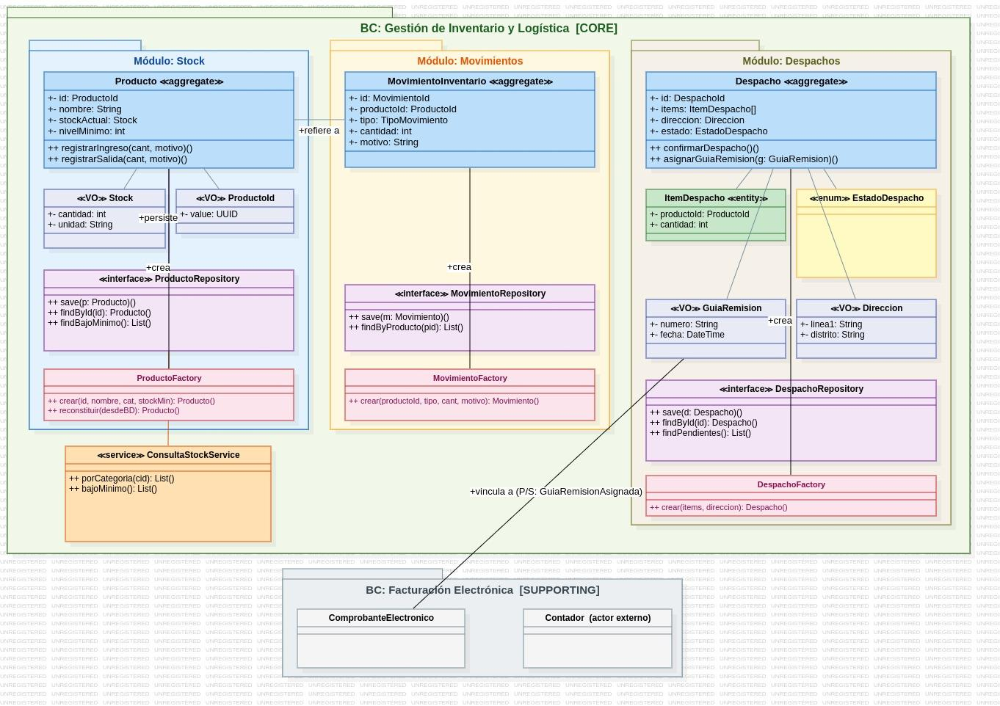

### Diagrama de Clases del Dominio

`StockPrenda` es el agregado central. `Prenda` describe el producto textil, `MovimientoInventario` registra cada cambio de cantidad y `Despacho` agrupa las salidas físicas.

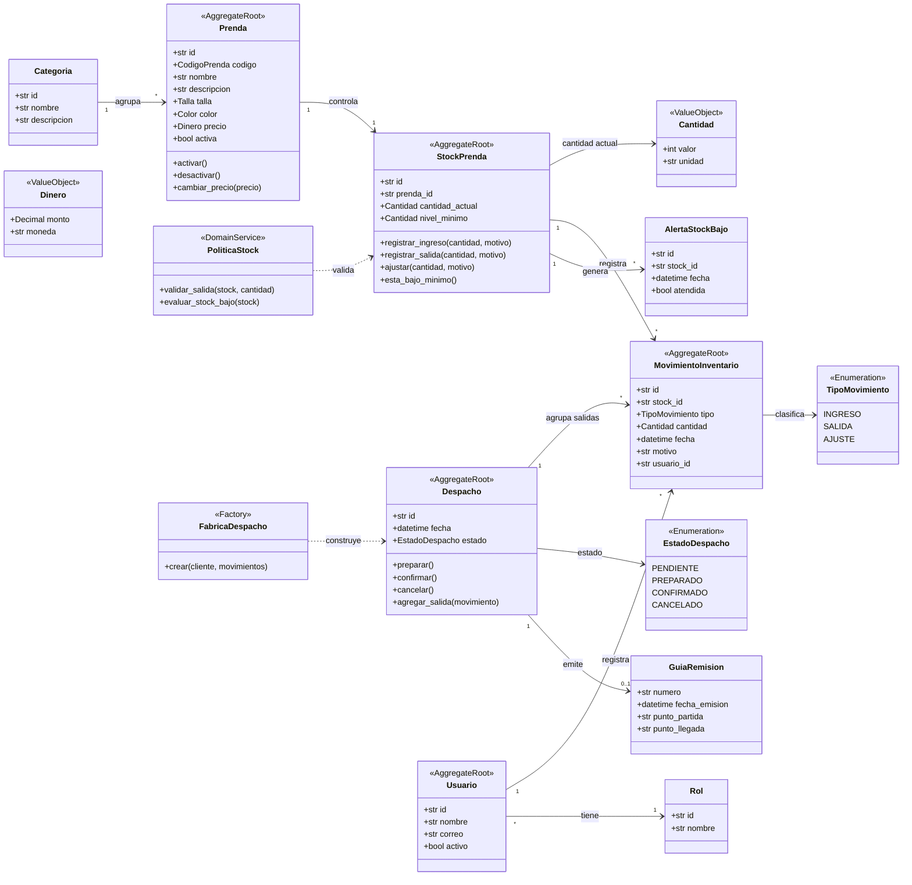

### Relaciones de Entidades

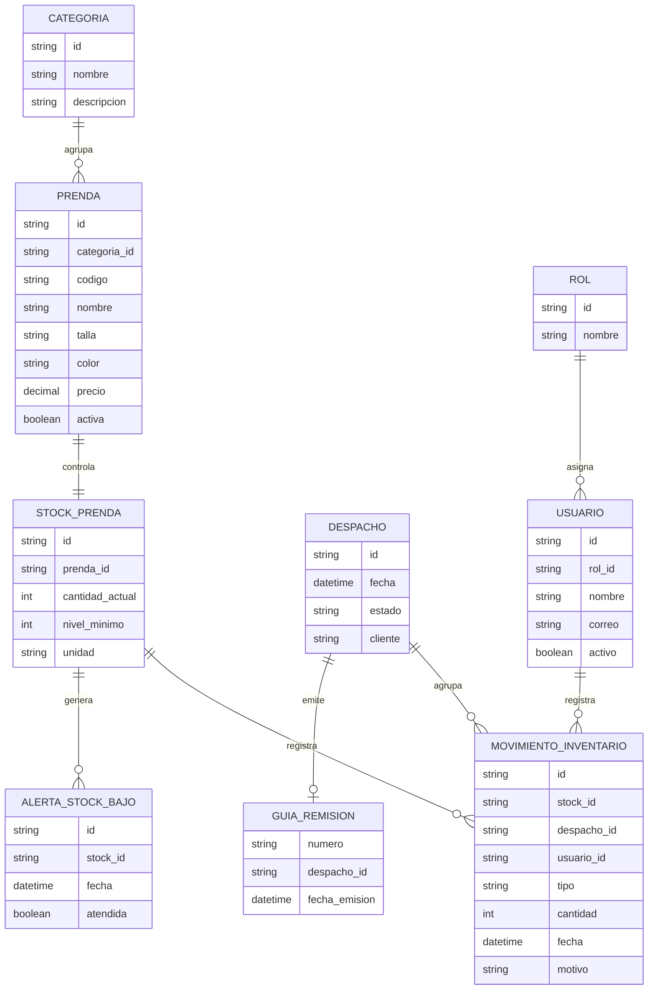

---

## Bounded Contexts y Módulos

El dominio se divide en contextos delimitados con responsabilidades claramente definidas.

### Autenticacion y Catalogo

Entidades y servicios de autenticación, credenciales, sesiones, catálogo, prendas y categorías.

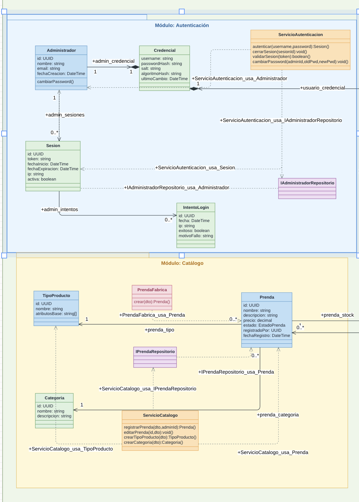

### Usuarios e Inventario

Módulos para usuarios, roles, permisos, inventario, stock, movimientos y alertas.

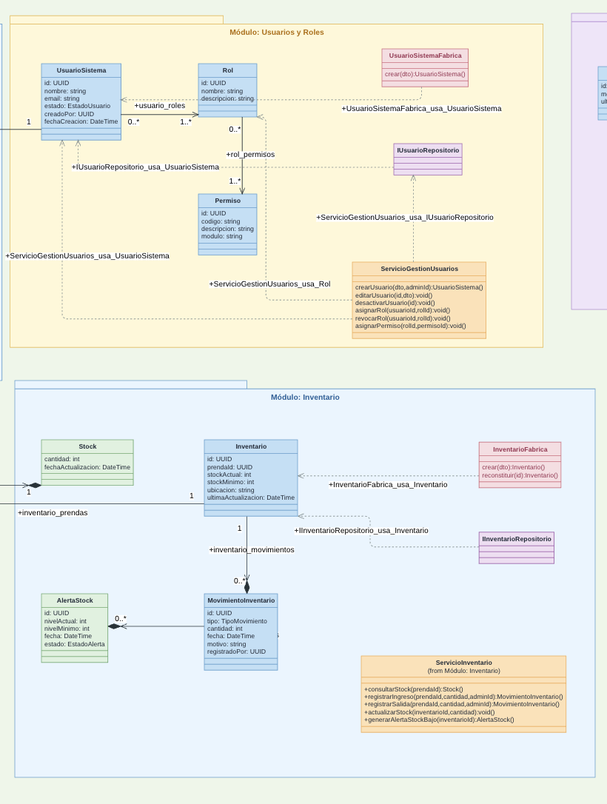

### Configuracion y Reportes

Configuración general del sistema, parámetros y reportes de inventario o ventas.

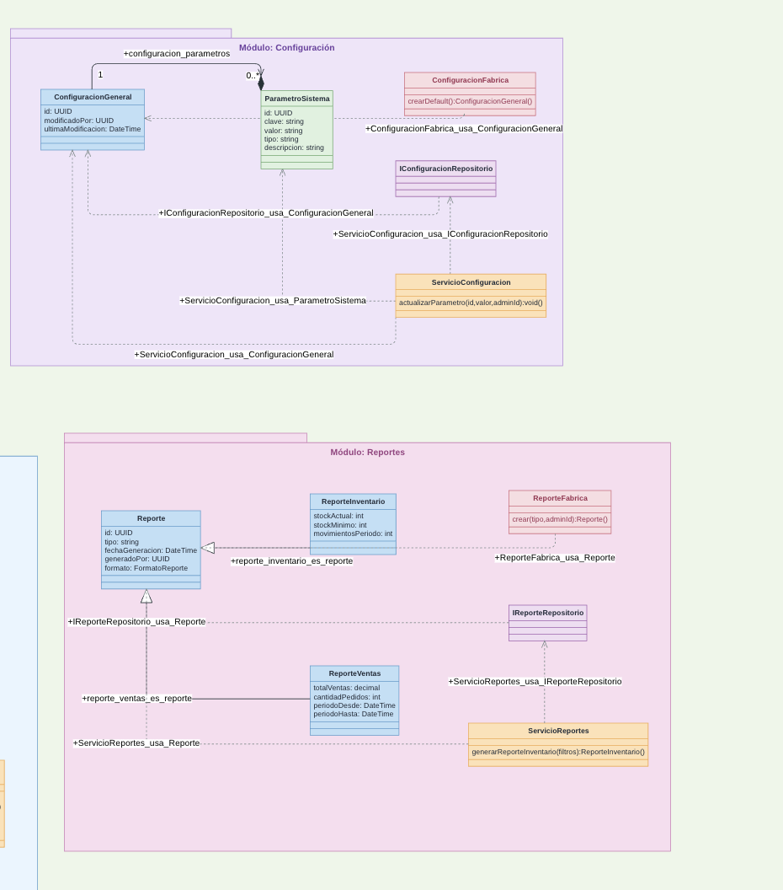

### Sistema Contable Textil

Contextos delimitados para autenticación, gestión de ingresos/egresos, inventario, facturación SUNAT, impuestos y auditoría.

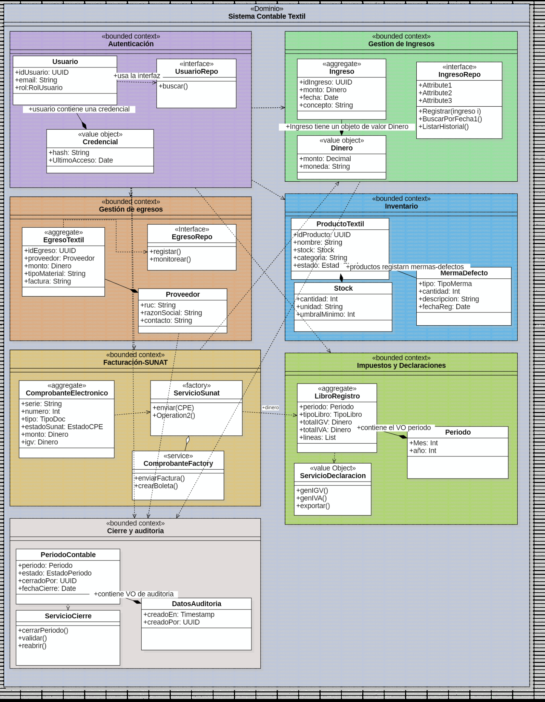

### Dominio E-Commerce Textil

Agregados para usuarios, carrito de compras, historial, pedidos, catálogo, pagos y entregas.

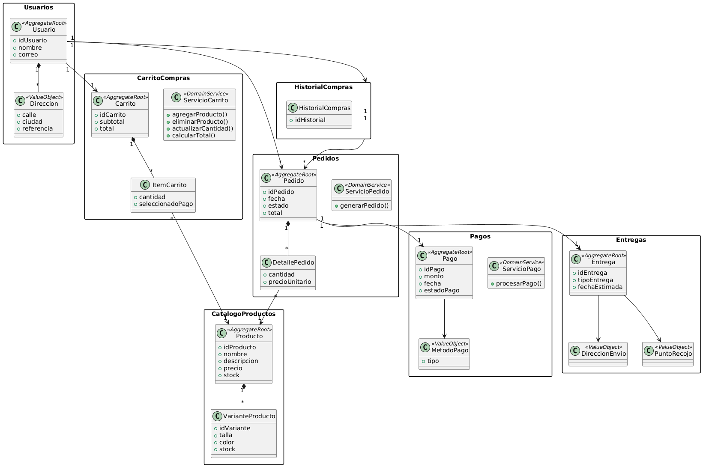

### Mapa de Modulos

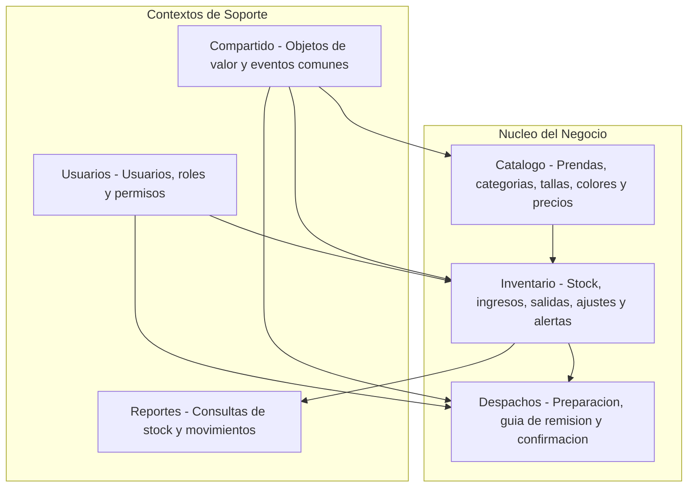

| Modulo | Responsabilidad | Agregados principales |
| --- | --- | --- |
| Catalogo | Informacion comercial de las prendas | `Prenda` |
| Inventario | Existencias, movimientos y alertas | `StockPrenda`, `MovimientoInventario` |
| Despachos | Salida fisica de prendas y guia de remision | `Despacho` |
| Usuarios | Acceso, roles y responsables de movimientos | `Usuario` |
| Reportes | Consulta de informacion sin modificar reglas | `ReporteInventario` |
| Compartido | Objetos de valor, eventos y errores del dominio | `Cantidad`, `Dinero`, `CodigoPrenda` |

---

## Arquitectura

SoftwareTextil usa un monolito modular. Una sola aplicación desplegable con responsabilidades separadas por capas y módulos.

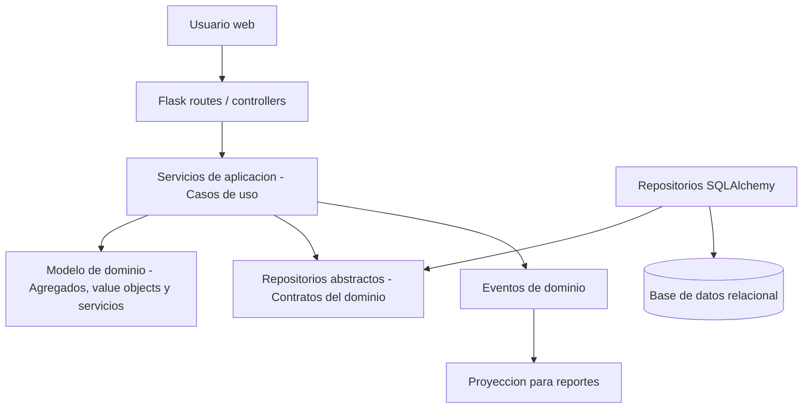

### Diagrama de Clases por Capas

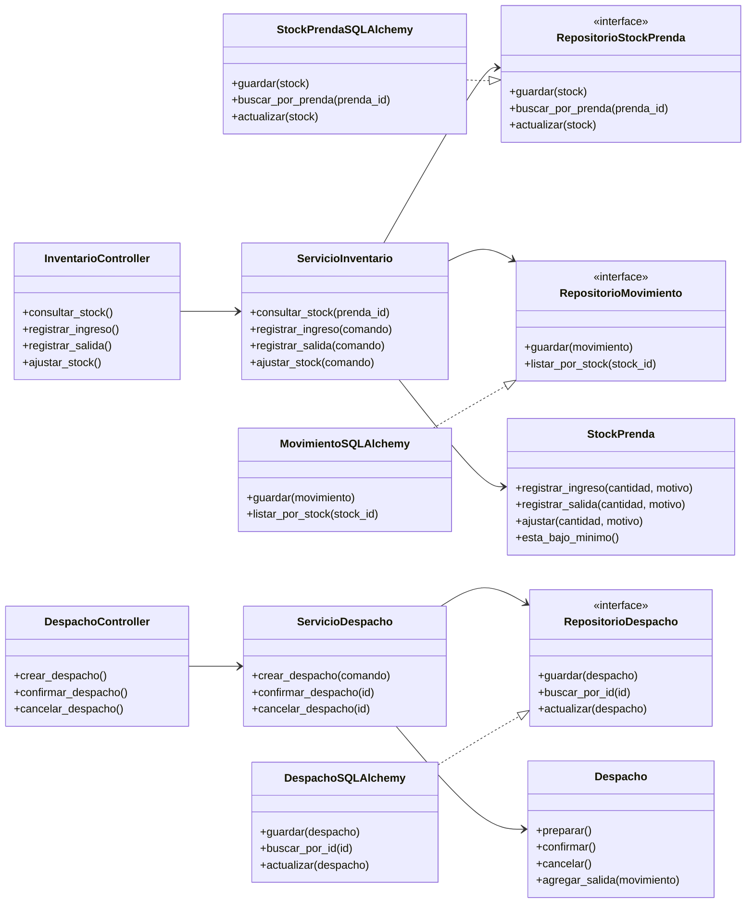

### Codigo generado desde StarUML

El modelo fue diseñado en StarUML y se generó código fuente para Python.

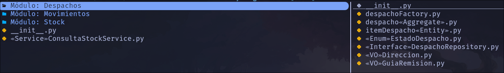

---

## Funcionalidades

| Funcionalidad | Descripcion |
| --- | --- |
| Gestionar prendas | Registrar, actualizar, consultar y desactivar prendas del catalogo |
| Organizar categorias | Agrupar prendas por linea comercial, uso, talla o color |
| Controlar stock | Consultar cantidades disponibles y niveles minimos |
| Registrar ingresos | Registrar entradas por produccion, compra o devolucion |
| Registrar salidas | Descontar prendas por venta, despacho, merma o ajuste |
| Ajustar stock | Corregir diferencias detectadas en conteo fisico |
| Generar alertas | Detectar prendas con stock por debajo del nivel minimo |
| Preparar despachos | Armar el despacho y asociar movimientos de salida |
| Emitir guia de remision | Registrar datos necesarios para el traslado fisico |
| Consultar movimientos | Revisar historial de ingresos, salidas y ajustes |
| Generar reportes | Consultar stock, movimientos, alertas y despachos |
| Administrar usuarios | Gestionar usuarios, roles y permisos |

### Casos de Uso

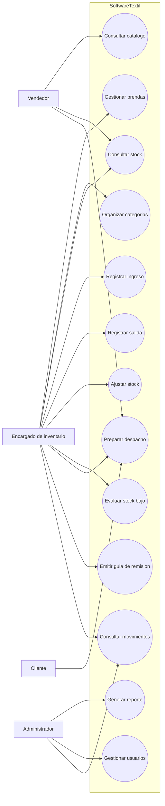

### Flujo: Registrar Salida

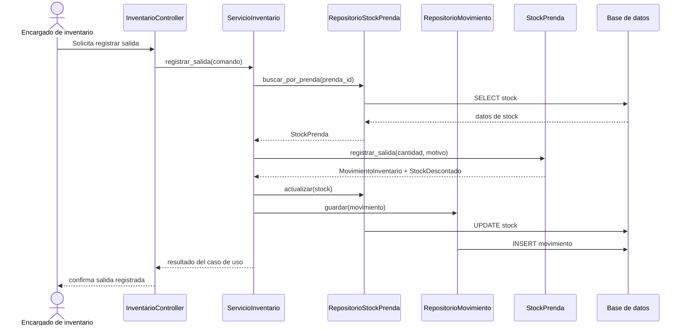

### Prototipo de Interfaz

```
+--------------------------------------------------------------------------------+
| SoftwareTextil                                      Usuario: Encargado          |
| Inventario textil                                   Fecha: 2026-06-15           |
+-------------------------+------------------------------------------------------+
| Menu                    | Panel principal                                      |
|                         |                                                      |
| Inicio                  | Indicadores del dia                                  |
| Catalogo                | +----------------+----------------+----------------+ |
| Inventario              | | Stock bajo: 8  | Movimientos:15 | Despachos: 4   | |
| Movimientos             | +----------------+----------------+----------------+ |
| Despachos               |                                                      |
| Reportes                | Acciones rapidas                                     |
| Usuarios                | [Registrar ingreso] [Registrar salida] [Despachar]  |
|                         |                                                      |
|                         | Ultimos movimientos                                  |
|                         | +------------+----------+----------+---------------+ |
|                         | | Prenda     | Tipo     | Cantidad | Responsable   | |
|                         | +------------+----------+----------+---------------+ |
|                         | | Polo azul  | Salida   | 12       | Almacen       | |
|                         | | Uniforme   | Ingreso  | 30       | Produccion    | |
|                         | +------------+----------+----------+---------------+ |
+-------------------------+------------------------------------------------------+
```

### Flujo de la GUI

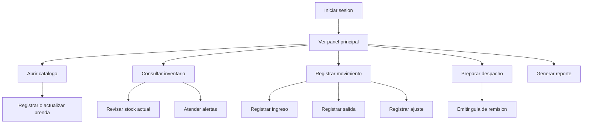

---

## API REST

| Metodo | Ruta | Descripcion |
| --- | --- | --- |
| `GET` | `/api/prendas` | Lista prendas del catalogo |
| `POST` | `/api/prendas` | Registra una prenda nueva |
| `GET` | `/api/inventario/stock/{prenda_id}` | Consulta stock de una prenda |
| `POST` | `/api/inventario/movimientos` | Registra ingreso, salida o ajuste |
| `GET` | `/api/inventario/movimientos` | Lista movimientos con filtros |
| `POST` | `/api/despachos` | Crea un despacho |
| `POST` | `/api/despachos/{id}/confirmacion` | Confirma un despacho |
| `GET` | `/api/reportes/inventario` | Genera reporte de inventario |

Ejemplo de registro de movimiento:

```json
{
  "prenda_id": "PRE-001",
  "tipo": "SALIDA",
  "cantidad": 12,
  "unidad": "unidades",
  "motivo": "Despacho a cliente",
  "usuario_id": "USR-001"
}
```

---

## Estructura del Proyecto

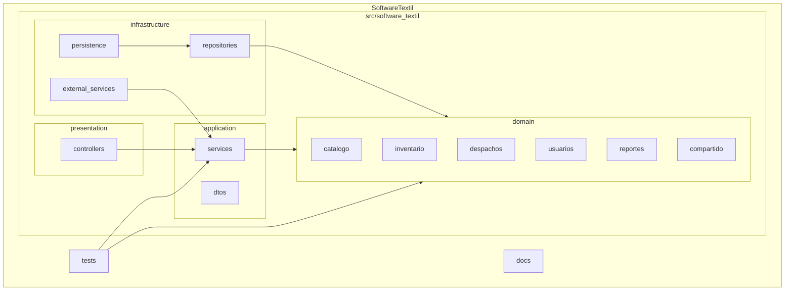

```
SoftwareTextil/
├── README.md
├── pyproject.toml
├── requirements.txt
├── assets/
│   └── lab05/                # Diagramas UML del modelo de dominio
├── docs/
│   ├── prototipo.md
│   ├── modelo_dominio.md
│   └── arquitectura.md
├── src/
│   └── software_textil/
│       ├── presentation/     # Controladores Flask
│       │   └── controllers/
│       ├── application/      # Casos de uso y DTOs
│       │   ├── dtos/
│       │   └── services/
│       ├── domain/           # Modelo de dominio puro
│       │   ├── catalogo/
│       │   ├── inventario/
│       │   ├── despachos/
│       │   ├── usuarios/
│       │   ├── reportes/
│       │   └── compartido/
│       └── infrastructure/   # Implementaciones tecnicas
│           ├── external_services/
│           ├── persistence/
│           └── repositories/
└── tests/
```

---

## Instalacion

```bash
# Clonar el repositorio
git clone git@github.com:javierRock/SoftwareTextil.git
cd SoftwareTextil

# Crear entorno virtual
python -m venv .venv
source .venv/bin/activate

# Instalar dependencias
pip install -r requirements.txt
```

> La aplicación Flask ejecutable se implementará en próximas iteraciones.

---

## Tecnologias

| Tecnologia | Uso |
| --- | --- |
| Python 3.11+ | Lenguaje principal |
| Flask 3.0+ | Framework web para controladores y rutas HTTP |
| SQLAlchemy 2.0+ | Mapeo objeto-relacional para persistencia |
| Mermaid | Diagramas visibles directamente en GitHub |
| StarUML | Modelado UML formal y generacion de codigo |
| GitHub | Control de versiones y entrega del repositorio |

---

## Criterios de Diseno

| Criterio | Aplicacion |
| --- | --- |
| DDD | Reglas modeladas con conceptos del negocio textil |
| Contextos delimitados | Catalogo, inventario, despachos, usuarios y reportes separados |
| Agregados | Cada raiz protege invariantes |
| Repositorios | El dominio declara contratos, la infraestructura implementa |
| Arquitectura en capas | Presentacion, aplicacion, dominio e infraestructura |
| Bajo acoplamiento | El dominio no depende de Flask ni SQLAlchemy |
| Escalabilidad | Modulos nuevos sin romper el nucleo |

---

## Referencias

- Evans, E. *Domain-Driven Design* — Guía para entidades, objetos de valor, agregados y repositorios
- [Citerus DDD Sample Core](https://github.com/citerus/dddsample-core) — Referencia para relaciones de entidades, capas y API
- [Modern DDD Cargo Tracker](https://github.com/eclipse-ee4j/cargotracker) — Referencia para casos de uso y separación por módulos
