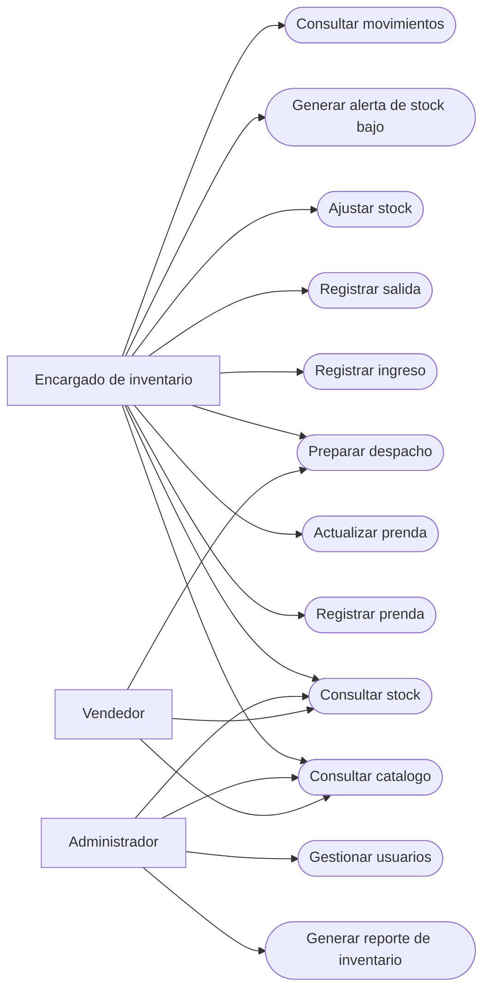
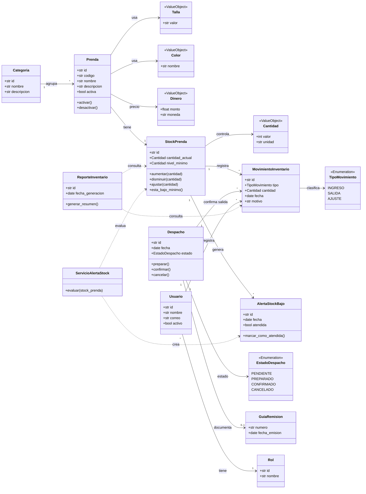
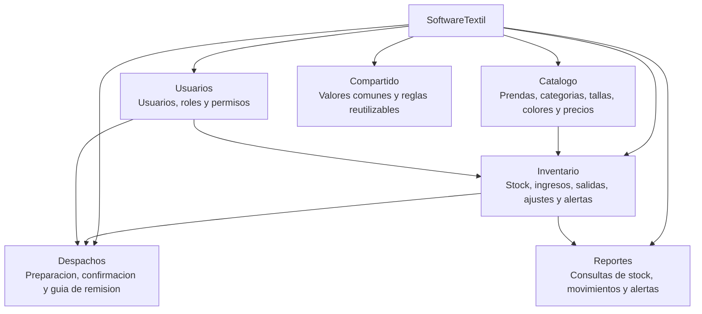
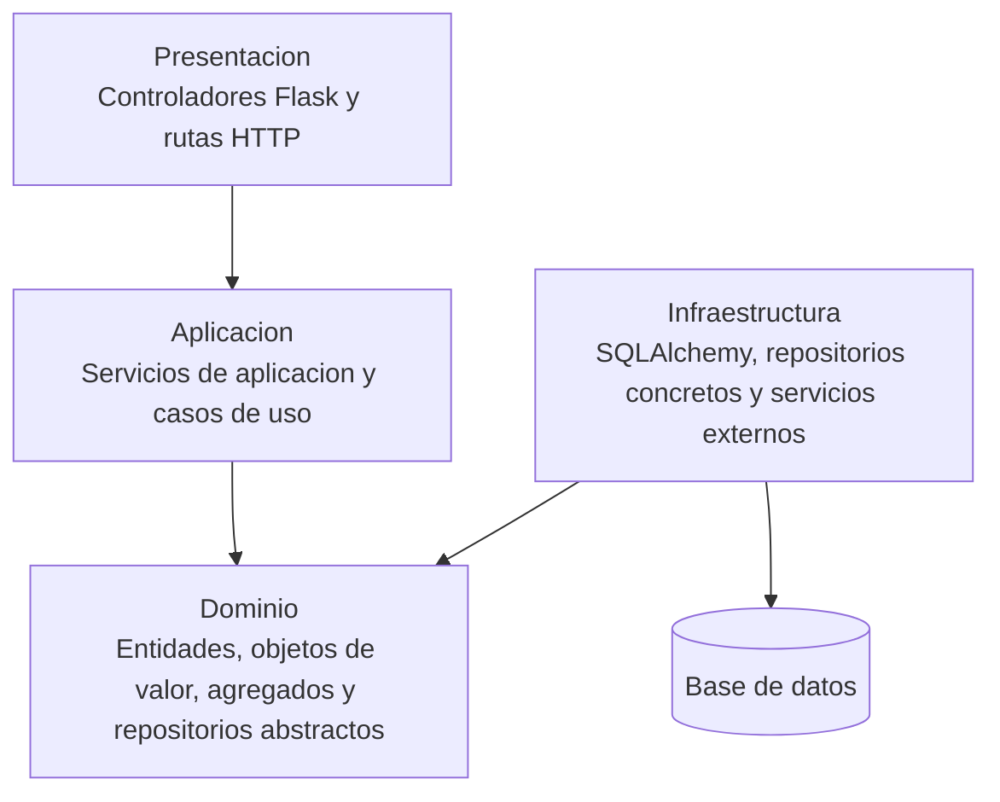
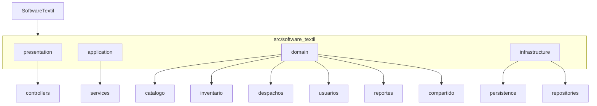
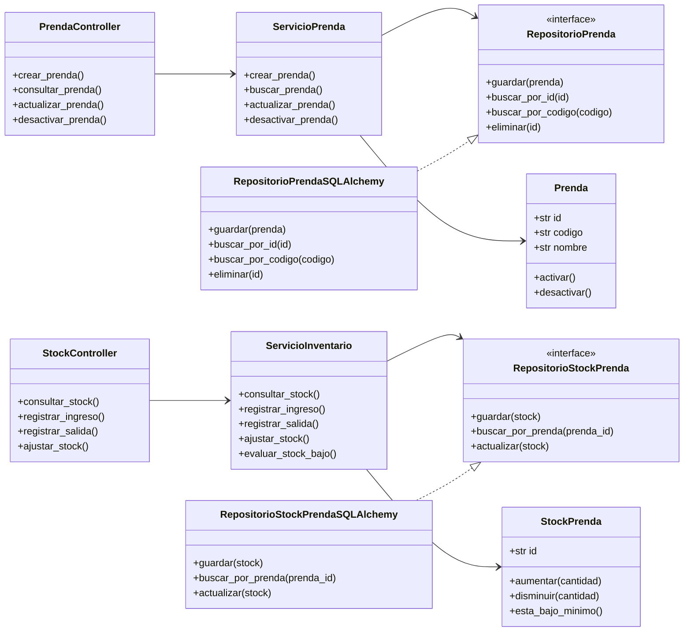

# SoftwareTextil

SoftwareTextil es una propuesta universitaria para gestionar el inventario de una empresa textil. El proyecto toma como base el modelo trabajado en `lab05.md`, especialmente el rol de encargado de inventario, el lenguaje ubicuo y los diagramas de inventario, catalogo, usuarios, despachos y reportes.

## Integrantes

| Integrante |
| --- |
| Condori Pallardel, Emilio Condori |
| Gutierrez Castilla, Carlos Enrique |
| Huayhua Perez, Lizzy Arlette |
| Peñalva Humire, Javier Alonzo |
| Quispe Suarez, Angelo Josué |

## Proposito

El proposito de SoftwareTextil es apoyar el control diario del almacen de una empresa textil. El sistema permite registrar prendas, controlar stock, registrar ingresos y salidas, preparar despachos, detectar stock bajo y consultar reportes utiles para tomar decisiones.

El proyecto aplica Desarrollo Guiado por Dominio, conocido como DDD, junto con una arquitectura en capas. La regla principal es separar el negocio textil de los detalles tecnicos. Por eso, las reglas sobre prendas, stock, movimientos y despachos viven en la capa de dominio, mientras que Flask, SQLAlchemy y la base de datos quedan fuera del centro del sistema.

## Fuente Base Del Dominio

El modelo parte de los elementos definidos en `lab05.md`:

| Elemento de `lab05.md` | Uso en este proyecto |
| --- | --- |
| Encargado de inventario | Actor principal del sistema. |
| Prenda | Producto textil terminado, como polo, pantalon o uniforme. |
| Stock | Cantidad disponible de una prenda en almacen. |
| Nivel minimo | Umbral que permite detectar stock bajo. |
| Ingreso | Entrada de prendas al almacen por produccion, compra o devolucion. |
| Salida | Egreso de prendas por venta, despacho, merma o ajuste. |
| Movimiento | Registro inmutable de un ingreso, salida o ajuste. |
| Despacho | Preparacion y envio de prendas a un cliente. |
| Guia de remision | Documento que acompania el traslado fisico de prendas. |
| Alerta de stock bajo | Aviso cuando el stock actual esta por debajo del nivel minimo. |
| Categoria | Agrupacion de prendas por tipo comercial o uso. |

## Funcionalidades De Alto Nivel

| Funcionalidad | Descripcion |
| --- | --- |
| Gestionar prendas | Registrar, actualizar, consultar y desactivar prendas del catalogo. |
| Organizar categorias | Agrupar prendas por lineas como uniformes, ropa casual o ropa deportiva. |
| Controlar stock | Consultar la cantidad disponible de cada prenda en almacen. |
| Registrar ingresos | Registrar entradas por produccion propia, compra o devolucion. |
| Registrar salidas | Registrar egresos por venta, despacho, merma o ajuste. |
| Ajustar stock | Corregir diferencias por conteo fisico, deterioro o regularizacion. |
| Generar alertas | Detectar prendas cuyo stock esta por debajo del nivel minimo. |
| Preparar despachos | Registrar la salida fisica de prendas hacia un cliente. |
| Consultar movimientos | Revisar el historial de ingresos, salidas y ajustes. |
| Generar reportes | Consultar stock, movimientos, alertas y despachos. |
| Administrar usuarios | Gestionar usuarios, roles y permisos de acceso. |

## Diagrama De Casos De Uso UML



## Prototipo O GUI

El prototipo esta pensado para uso interno. La pantalla principal muestra alertas, movimientos recientes y accesos rapidos a las funciones de inventario.

```text
+--------------------------------------------------------------------------------+
| SoftwareTextil                                                                  |
| Gestion de inventario textil                                                    |
+-------------------------+------------------------------------------------------+
| Menu                    | Panel principal                                      |
|                         |                                                      |
| Inicio                  | Stock bajo: 8 prendas                               |
| Catalogo                | Movimientos del dia: 15                             |
| Inventario              | Despachos pendientes: 4                             |
| Movimientos             |                                                      |
| Despachos               | Ultimos movimientos                                 |
| Reportes                | +------------+----------+----------+---------------+ |
| Usuarios                | | Prenda     | Tipo     | Cantidad | Fecha         | |
|                         | +------------+----------+----------+---------------+ |
|                         | | Polo azul  | Salida   | 12       | 2026-06-15    | |
|                         | | Uniforme   | Ingreso  | 30       | 2026-06-15    | |
|                         | +------------+----------+----------+---------------+ |
+-------------------------+------------------------------------------------------+
```

Pantallas principales:

| Pantalla | Uso |
| --- | --- |
| Inicio de sesion | Permite el ingreso de usuarios registrados. |
| Panel principal | Resume stock bajo, movimientos y despachos pendientes. |
| Catalogo de prendas | Lista prendas con filtros por categoria, talla y color. |
| Registro de prenda | Permite crear o actualizar datos de una prenda. |
| Inventario | Muestra stock actual, nivel minimo y estado de alerta. |
| Movimiento de stock | Registra ingresos, salidas y ajustes. |
| Despachos | Prepara y confirma la salida fisica de prendas. |
| Reportes | Consulta stock, movimientos, alertas y despachos. |

## Modelo De Dominio

El dominio se organiza alrededor del inventario textil. La prenda pertenece al catalogo, el stock representa su disponibilidad en almacen y los movimientos dejan trazabilidad de todo ingreso, salida o ajuste. El despacho usa movimientos de salida y puede generar una guia de remision.

## Diagrama De Clases Del Dominio



## Modulos Del Dominio

Los modulos se definieron a partir de los diagramas del laboratorio 5: gestion de inventario y logistica, autenticacion y catalogo, usuarios e inventario, configuracion y reportes.



| Modulo | Responsabilidad | Agregados principales |
| --- | --- | --- |
| Catalogo | Mantiene la informacion comercial de las prendas. | `Prenda` |
| Inventario | Controla existencias, movimientos y alertas. | `StockPrenda`, `MovimientoInventario` |
| Despachos | Gestiona la salida fisica de prendas. | `Despacho` |
| Usuarios | Controla acceso y permisos. | `Usuario` |
| Reportes | Presenta informacion de consulta para el equipo. | `ReporteInventario` |
| Compartido | Centraliza objetos de valor comunes. | `Cantidad`, `Dinero`, `Talla`, `Color` |

## Vista General De Arquitectura

SoftwareTextil se plantea como un monolito modular. Esto permite trabajar con una sola aplicacion, pero con limites internos claros. La capa de dominio no depende de Flask, SQLAlchemy ni de la base de datos.



## Diagrama De Paquetes



## Diagrama De Clases Por Capas



## Estructura Del Proyecto

```text
SoftwareTextil/
├── README.md
├── docs/
│   ├── prototipo.md
│   ├── modelo_dominio.md
│   └── arquitectura.md
├── src/
│   └── software_textil/
│       ├── presentation/
│       │   └── controllers/
│       ├── application/
│       │   └── services/
│       ├── domain/
│       │   ├── catalogo/
│       │   ├── inventario/
│       │   ├── despachos/
│       │   ├── usuarios/
│       │   ├── reportes/
│       │   └── compartido/
│       └── infrastructure/
│           ├── persistence/
│           └── repositories/
└── tests/
```

## Tecnologias Elegidas

| Tecnologia | Uso |
| --- | --- |
| Python | Lenguaje principal del proyecto. |
| Flask | Construccion de controladores y rutas web. |
| SQLAlchemy | Mapeo objeto-relacional para persistencia. |
| Mermaid | Diagramas visibles directamente en GitHub. |
| StarUML | Herramienta sugerida para modelado UML formal. |
| GitHub | Control de versiones y entrega del repositorio. |

## Criterios De Disenio

| Criterio | Aplicacion en el proyecto |
| --- | --- |
| DDD | El modelo usa conceptos reales del negocio textil definidos en `lab05.md`. |
| Contextos delimitados | Catalogo, inventario, despachos, usuarios y reportes tienen limites claros. |
| Agregados | Cada grupo importante se protege mediante una raiz como `Prenda`, `StockPrenda` o `Despacho`. |
| Repositorios | El dominio define interfaces y la infraestructura las implementa. |
| Arquitectura en capas | Se separa presentacion, aplicacion, dominio e infraestructura. |
| Bajo acoplamiento | El dominio no conoce Flask, SQLAlchemy ni detalles de base de datos. |
| Escalabilidad | La estructura permite agregar nuevos modulos sin romper el nucleo del sistema. |

## Referencias

| Referencia | Uso |
| --- | --- |
| Evans, E. Domain-Driven Design | Base conceptual para entidades, objetos de valor, agregados y repositorios. |
| Citerus DDD Sample Core | Referencia para separar dominio, aplicacion e infraestructura. |
| Modern DDD Cargo Tracker | Referencia para trabajar con agregados y casos de uso por modulo. |
| `lab05.md` | Fuente original del lenguaje ubicuo y del dominio textil. |
