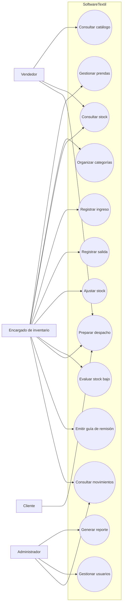
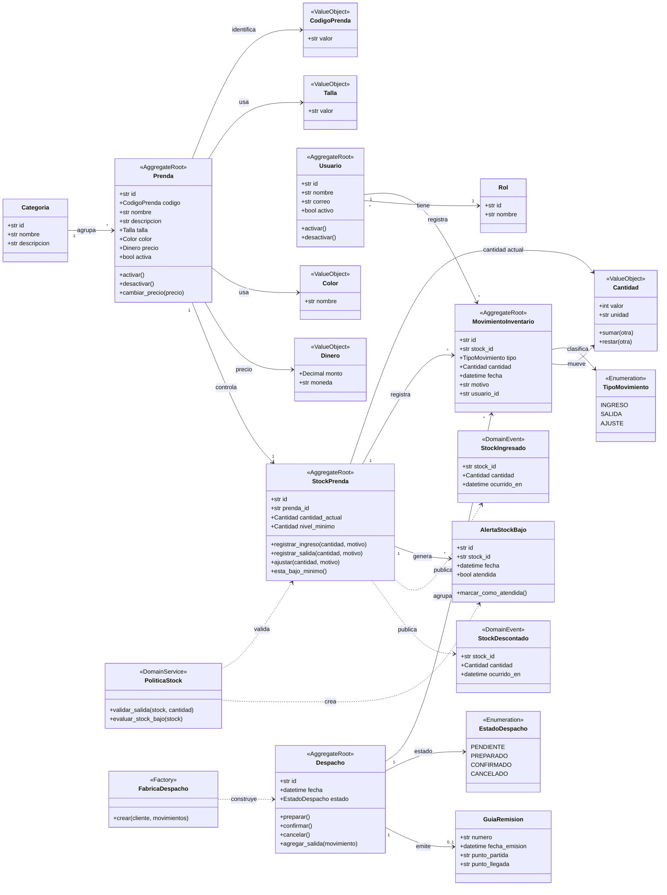
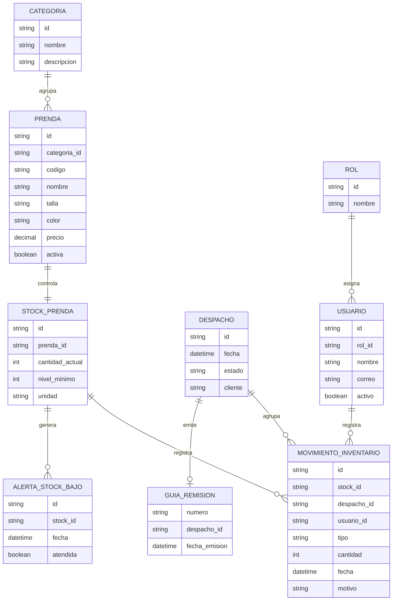
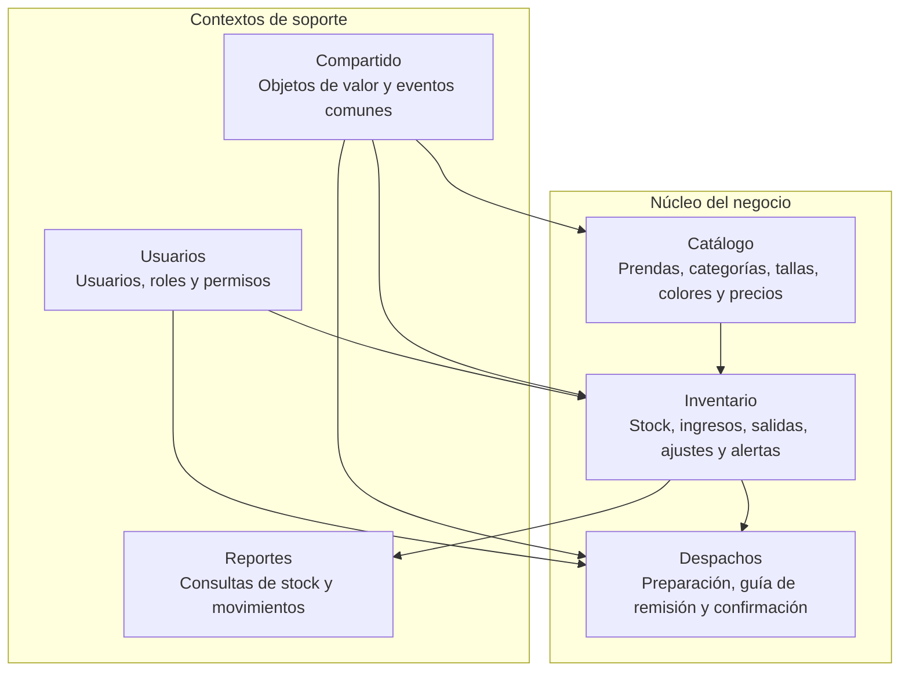
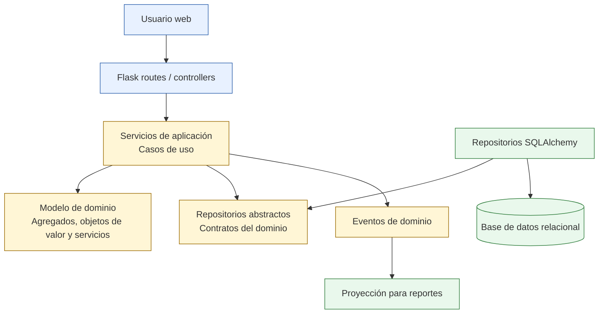
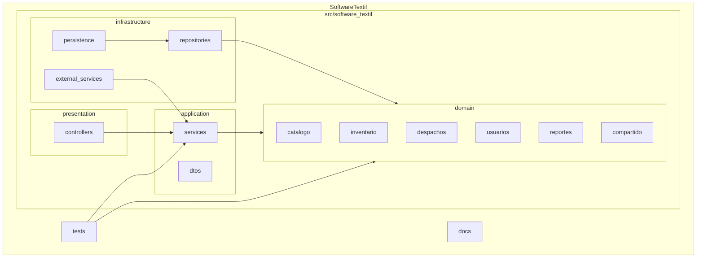
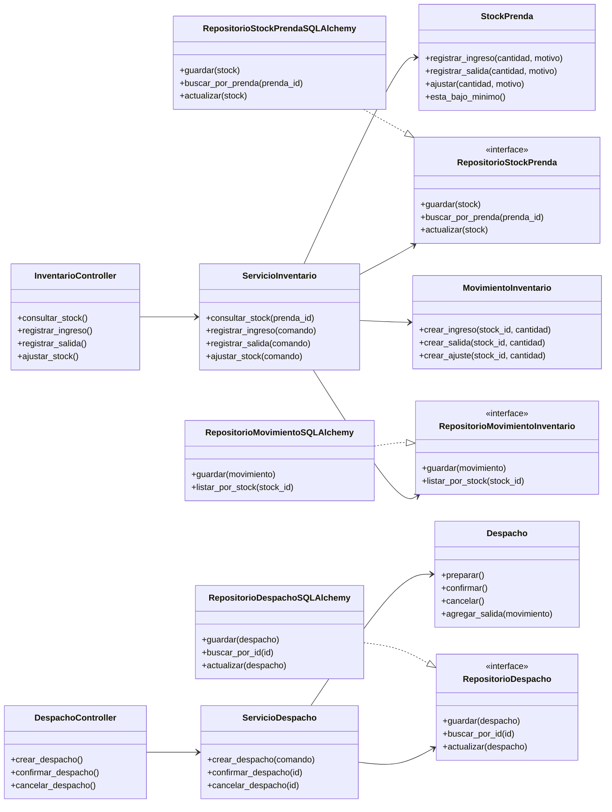
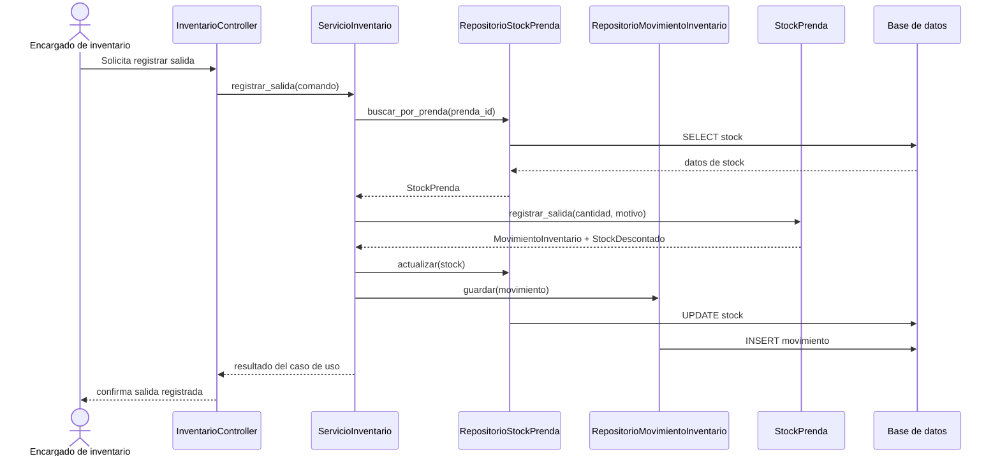

# SoftwareTextil

SoftwareTextil organiza la gestión de inventario de una empresa textil con un enfoque de Desarrollo Guiado por Dominio. El equipo modela el negocio con conceptos propios del almacén textil: prendas, stock, ingresos, salidas, ajustes, despachos, guías de remisión, alertas y reportes.

El proyecto toma como referencia el estilo de DDDSample Core: separa el dominio de la tecnología, define agregados claros, trabaja con repositorios por agregado y documenta las relaciones principales del modelo antes de implementar la lógica completa.

## Integrantes

| Integrante |
| --- |
| Condori Pallardel, Emilio Condori |
| Gutierrez Castilla, Carlos Enrique |
| Huayhua Perez, Lizzy Arlette |
| Peñalva Humire, Javier Alonzo |
| Quispe Suarez, Angelo Josué |

## Propósito

SoftwareTextil ayuda al encargado de inventario a controlar el movimiento diario de prendas en almacén. El sistema registra productos textiles, controla cantidades disponibles, guarda ingresos y salidas, prepara despachos, genera alertas de stock bajo y entrega reportes para tomar decisiones rápidas.

El equipo mantiene las reglas del negocio dentro del dominio. Flask atiende las rutas web, SQLAlchemy resuelve la persistencia y la capa de aplicación coordina los casos de uso. Esta separación permite cambiar detalles técnicos sin tocar las reglas centrales del inventario.

## Enfoque DDD

| Concepto DDD | Uso en SoftwareTextil |
| --- | --- |
| Lenguaje ubicuo | El equipo usa los mismos términos del negocio: prenda, stock, ingreso, salida, ajuste y despacho. |
| Agregado | Cada raíz protege un conjunto de reglas: `Prenda`, `StockPrenda`, `MovimientoInventario`, `Despacho` y `Usuario`. |
| Objeto de valor | El dominio modela valores como `Cantidad`, `Dinero`, `Talla`, `Color`, `CodigoPrenda` y `PeriodoReporte`. |
| Repositorio | Cada agregado expone un contrato de persistencia, por ejemplo `RepositorioStockPrenda`. |
| Servicio de dominio | El dominio concentra reglas que no pertenecen a una sola entidad, como la evaluación de stock bajo. |
| Evento de dominio | El sistema puede publicar eventos como `StockIngresado`, `StockDescontado` y `DespachoConfirmado`. |

## Lenguaje Ubicuo

| Término | Definición en el sistema |
| --- | --- |
| Prenda | Producto textil terminado, como polo, pantalón, uniforme o casaca. |
| Categoría | Grupo comercial de prendas, como uniformes, ropa casual o ropa deportiva. |
| Stock | Cantidad disponible de una prenda dentro del almacén. |
| Nivel mínimo | Cantidad límite que activa una alerta de reposición. |
| Ingreso | Entrada de prendas por producción, compra o devolución. |
| Salida | Egreso de prendas por venta, despacho, merma o ajuste. |
| Ajuste | Corrección manual por conteo físico, deterioro o regularización. |
| Movimiento | Registro inmutable de un ingreso, salida o ajuste. |
| Despacho | Preparación y entrega física de prendas a un cliente. |
| Guía de remisión | Documento que acompaña el traslado físico de las prendas. |
| Alerta de stock bajo | Aviso que aparece cuando el stock actual baja del nivel mínimo. |

## Funcionalidades De Alto Nivel

| Funcionalidad | Descripción |
| --- | --- |
| Gestionar prendas | El usuario registra, actualiza, consulta y desactiva prendas del catálogo. |
| Organizar categorías | El usuario agrupa prendas por línea comercial, uso, talla o color. |
| Controlar stock | El encargado consulta cantidades disponibles y niveles mínimos. |
| Registrar ingresos | El encargado registra entradas por producción, compra o devolución. |
| Registrar salidas | El encargado descuenta prendas por venta, despacho, merma o ajuste. |
| Ajustar stock | El encargado corrige diferencias detectadas en conteo físico. |
| Generar alertas | El sistema detecta prendas con stock por debajo del nivel mínimo. |
| Preparar despachos | El encargado arma el despacho y asocia movimientos de salida. |
| Emitir guía de remisión | El sistema registra los datos necesarios para el traslado físico. |
| Consultar movimientos | El usuario revisa el historial de ingresos, salidas y ajustes. |
| Generar reportes | El administrador consulta stock, movimientos, alertas y despachos. |
| Administrar usuarios | El administrador gestiona usuarios, roles y permisos. |

## Diagrama De Casos De Uso UML



## Prototipo O GUI

El prototipo prioriza operaciones frecuentes del almacén. La pantalla principal muestra indicadores, alertas y accesos rápidos.

```text
+--------------------------------------------------------------------------------+
| SoftwareTextil                                      Usuario: Encargado           |
| Inventario textil                                   Fecha: 2026-06-15            |
+-------------------------+------------------------------------------------------+
| Menú                    | Panel principal                                      |
|                         |                                                      |
| Inicio                  | Indicadores del día                                  |
| Catálogo                | +----------------+----------------+----------------+ |
| Inventario              | | Stock bajo: 8  | Movimientos:15 | Despachos: 4   | |
| Movimientos             | +----------------+----------------+----------------+ |
| Despachos               |                                                      |
| Reportes                | Acciones rápidas                                     |
| Usuarios                | [Registrar ingreso] [Registrar salida] [Despachar]  |
|                         |                                                      |
|                         | Últimos movimientos                                  |
|                         | +------------+----------+----------+---------------+ |
|                         | | Prenda     | Tipo     | Cantidad | Responsable   | |
|                         | +------------+----------+----------+---------------+ |
|                         | | Polo azul  | Salida   | 12       | Almacén       | |
|                         | | Uniforme   | Ingreso  | 30       | Producción    | |
|                         | +------------+----------+----------+---------------+ |
+-------------------------+------------------------------------------------------+
```

## Flujo Principal De La GUI


## Modelo De Dominio

El modelo coloca a `StockPrenda` como agregado central del inventario. `Prenda` describe el producto textil, `MovimientoInventario` registra cada cambio de cantidad y `Despacho` agrupa las salidas físicas hacia un cliente. El diseño sigue la idea de DDDSample: el dominio expresa reglas de negocio y la infraestructura solo implementa detalles técnicos.

## Diagrama De Clases Del Dominio



## Relaciones De Entidades

Este diagrama cumple la misma función que el diagrama de relaciones del proyecto DDDSample: muestra las entidades persistentes y sus vínculos principales.



## Módulos Del Dominio



| Módulo | Responsabilidad | Agregados principales |
| --- | --- | --- |
| Catálogo | Mantiene la información comercial de las prendas. | `Prenda` |
| Inventario | Controla existencias, movimientos y alertas. | `StockPrenda`, `MovimientoInventario` |
| Despachos | Gestiona la salida física de prendas y su guía de remisión. | `Despacho` |
| Usuarios | Controla acceso, roles y responsables de movimientos. | `Usuario` |
| Reportes | Consulta información del inventario sin modificar reglas de negocio. | `ReporteInventario` |
| Compartido | Comparte objetos de valor, eventos y errores del dominio. | `Cantidad`, `Dinero`, `CodigoPrenda` |

## Vista General De Arquitectura

SoftwareTextil usa un monolito modular. El proyecto mantiene una sola aplicación desplegable, pero separa responsabilidades por capas y módulos de negocio.



## Diagrama De Paquetes



## Diagrama De Clases Por Capas



## Flujo Del Caso De Uso Registrar Salida



## API Planificada

SoftwareTextil documenta sus endpoints como DDDSample documenta su API de reportes. La primera versión expone operaciones de inventario y despachos.

| Método | Ruta | Uso |
| --- | --- | --- |
| `GET` | `/api/prendas` | Lista prendas del catálogo. |
| `POST` | `/api/prendas` | Registra una prenda. |
| `GET` | `/api/inventario/stock/{prenda_id}` | Consulta stock de una prenda. |
| `POST` | `/api/inventario/movimientos` | Registra ingreso, salida o ajuste. |
| `GET` | `/api/inventario/movimientos` | Lista movimientos con filtros. |
| `POST` | `/api/despachos` | Crea un despacho. |
| `POST` | `/api/despachos/{id}/confirmacion` | Confirma un despacho. |
| `GET` | `/api/reportes/inventario` | Genera reporte de inventario. |

Ejemplo de registro de movimiento:

```json
{
  "prenda_id": "PRE-001",
  "tipo": "SALIDA",
  "cantidad": 12,
  "unidad": "unidades",
  "motivo": "Despacho a cliente",
  "usuario_id": "USR-001"
}
```

## Estructura Del Proyecto

```text
SoftwareTextil/
├── README.md
├── docs/
│   ├── prototipo.md
│   ├── modelo_dominio.md
│   └── arquitectura.md
├── src/
│   └── software_textil/
│       ├── presentation/
│       │   └── controllers/
│       ├── application/
│       │   ├── dtos/
│       │   └── services/
│       ├── domain/
│       │   ├── catalogo/
│       │   ├── inventario/
│       │   ├── despachos/
│       │   ├── usuarios/
│       │   ├── reportes/
│       │   └── compartido/
│       └── infrastructure/
│           ├── external_services/
│           ├── persistence/
│           └── repositories/
└── tests/
```

## Cómo Construir

El proyecto define dependencias para Python. Para preparar el entorno local:

```bash
python -m venv .venv
source .venv/bin/activate
pip install -r requirements.txt
```

## Cómo Ejecutar

La siguiente práctica puede agregar la aplicación Flask ejecutable. El equipo mantendrá el punto de entrada dentro de `src/software_textil` y conservará la separación entre controladores, servicios, dominio e infraestructura.

## Tecnologías Elegidas

| Tecnología | Uso |
| --- | --- |
| Python | Lenguaje principal del proyecto. |
| Flask | Framework web para controladores y rutas HTTP. |
| SQLAlchemy | Mapeo objeto-relacional para persistencia. |
| Mermaid | Diagramas visibles directamente en GitHub. |
| StarUML | Herramienta para modelado UML formal si el equipo requiere exportar diagramas. |
| GitHub | Control de versiones y entrega del repositorio. |

## Criterios De Diseño

| Criterio | Aplicación en el proyecto |
| --- | --- |
| DDD | El equipo modela reglas con conceptos del negocio textil. |
| Contextos delimitados | Catálogo, inventario, despachos, usuarios y reportes mantienen responsabilidades separadas. |
| Agregados | Cada raíz protege invariantes y evita cambios directos sobre entidades internas. |
| Repositorios | El dominio declara contratos y la infraestructura implementa persistencia. |
| Arquitectura en capas | El proyecto separa presentación, aplicación, dominio e infraestructura. |
| Bajo acoplamiento | El dominio evita dependencias con Flask, SQLAlchemy y detalles de base de datos. |
| Escalabilidad | El equipo puede agregar módulos sin romper el núcleo de inventario. |

## Referencias

| Referencia | Uso |
| --- | --- |
| Evans, E. Domain-Driven Design | Guía para entidades, objetos de valor, agregados y repositorios. |
| Citerus DDD Sample Core | Referencia para documentar relaciones de entidades, capas y API. |
| Modern DDD Cargo Tracker | Referencia para casos de uso, agregados y separación por módulos. |
