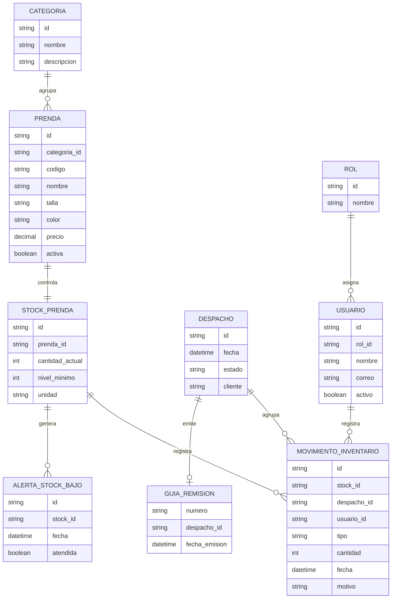
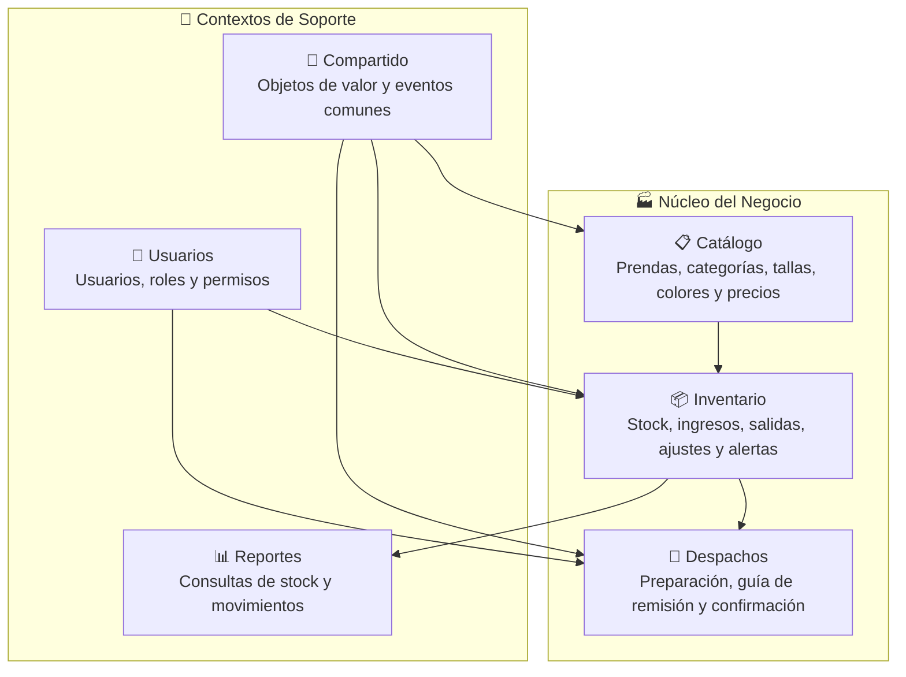
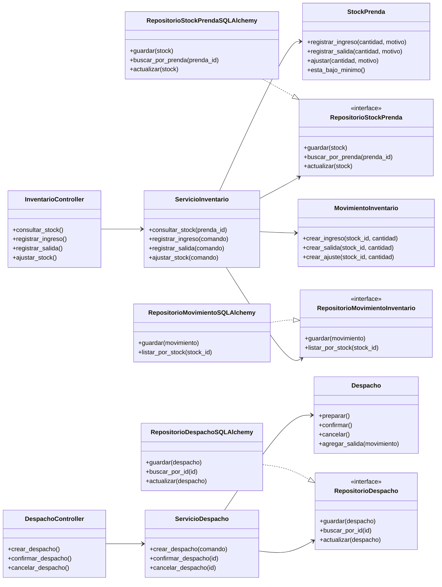
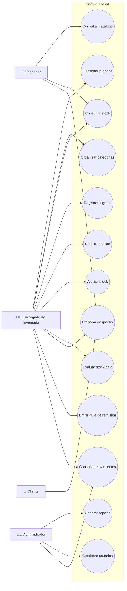
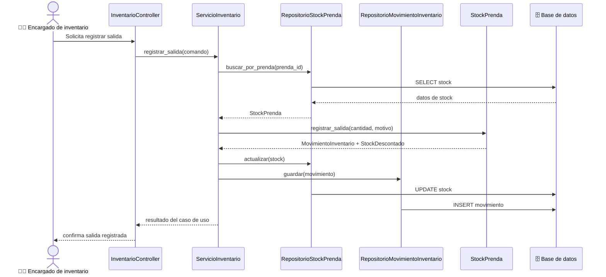
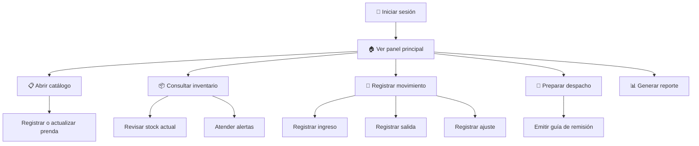
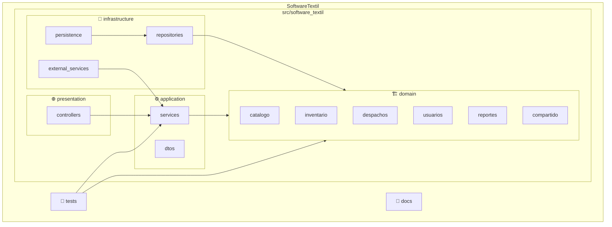

<](https://python.org)
[](https://flask.palletsprojects.com)
[](https://www.sqlalchemy.org)
[](#)

*Proyecto académico de Ingeniería de Software — Universidad Nacional de San Agustín de Arequipa*

---

</div>

## 📋 Tabla de Contenido

- [Descripción](#-descripción)
- [Equipo de Desarrollo](#-equipo-de-desarrollo)
- [Enfoque DDD](#-enfoque-domain-driven-design)
- [Lenguaje Ubicuo](#-lenguaje-ubicuo)
- [Modelo de Dominio](#-modelo-de-dominio)
- [Bounded Contexts y Módulos](#-bounded-contexts-y-módulos)
- [Arquitectura](#-arquitectura)
- [Funcionalidades](#-funcionalidades)
- [API REST](#-api-rest)
- [Estructura del Proyecto](#-estructura-del-proyecto)
- [Instalación y Ejecución](#-instalación-y-ejecución)
- [Tecnologías](#-tecnologías)
- [Referencias](#-referencias)

---

## 📖 Descripción

**SoftwareTextil** organiza la gestión de inventario de una empresa textil aplicando principios de **Domain-Driven Design (DDD)**. El sistema modela el negocio con conceptos propios del almacén textil: prendas, stock, ingresos, salidas, ajustes, despachos, guías de remisión, alertas y reportes.

El proyecto toma como referencia el estilo de [DDDSample Core](https://github.com/citerus/dddsample-core): separa el dominio de la tecnología, define agregados claros, trabaja con repositorios por agregado y documenta las relaciones del modelo antes de implementar la lógica completa.

> **Objetivo principal:** Ayudar al encargado de inventario a controlar el movimiento diario de prendas en almacén, registrando productos textiles, controlando cantidades disponibles, guardando ingresos y salidas, preparando despachos, generando alertas de stock bajo y entregando reportes para la toma de decisiones.

---

## 👥 Equipo de Desarrollo

| # | Integrante | Rol |
|---|---|---|
| 1 | **Condori Pallardel, Emilio** | Desarrollador |
| 2 | **Gutierrez Castilla, Carlos Enrique** | Desarrollador |
| 3 | **Huayhua Perez, Lizzy Arlette** | Desarrolladora |
| 4 | **Peñalva Humire, Javier Alonzo** | Desarrollador |
| 5 | **Quispe Suarez, Angelo Josué** | Desarrollador |

> **Asignatura:** Ingeniería de Software · **Docente:** Edgar Sarmiento Calisaya  
> **Universidad:** UNSA · **Escuela:** Ciencia de la Computación · **Grupo:** 3ro - A

---

## 🎯 Enfoque Domain-Driven Design

El equipo mantiene las reglas del negocio dentro del dominio. Flask atiende las rutas web, SQLAlchemy resuelve la persistencia y la capa de aplicación coordina los casos de uso. Esta separación permite cambiar detalles técnicos sin tocar las reglas centrales del inventario.

| Concepto DDD | Aplicación en SoftwareTextil |
|---|---|
| **Lenguaje ubicuo** | El equipo usa los mismos términos del negocio: prenda, stock, ingreso, salida, ajuste y despacho. |
| **Agregado** | Cada raíz protege un conjunto de reglas: `Prenda`, `StockPrenda`, `MovimientoInventario`, `Despacho` y `Usuario`. |
| **Objeto de valor** | Valores inmutables como `Cantidad`, `Dinero`, `Talla`, `Color`, `CodigoPrenda` y `PeriodoReporte`. |
| **Repositorio** | Cada agregado expone un contrato de persistencia: `RepositorioStockPrenda`, `RepositorioDespacho`, etc. |
| **Servicio de dominio** | Reglas que no pertenecen a una sola entidad, como `PoliticaStock` para evaluación de stock bajo. |
| **Evento de dominio** | El sistema publica eventos como `StockIngresado`, `StockDescontado` y `DespachoConfirmado`. |
| **Fábrica** | Construcción de agregados complejos mediante `FabricaDespacho`. |

---

## 📚 Lenguaje Ubicuo

El equipo adoptó un **vocabulario compartido** entre desarrolladores y stakeholders del negocio textil:

| Término | Definición en el dominio textil |
|---|---|
| **Prenda** | Producto textil terminado (polo, pantalón, uniforme), listo para venta. |
| **Categoría** | Agrupación comercial de prendas: uniformes, ropa casual, ropa deportiva. |
| **Stock** | Cantidad disponible de una prenda en almacén. |
| **Nivel mínimo** | Umbral de stock que dispara una alerta de reposición. |
| **Ingreso** | Entrada de prendas al almacén por producción, compra o devolución. |
| **Salida** | Egreso de prendas del almacén por venta, despacho, merma o ajuste. |
| **Ajuste** | Corrección manual de stock por conteo físico o deterioro. |
| **Movimiento** | Registro inmutable de un ingreso, salida o ajuste; permite trazabilidad completa. |
| **Despacho** | Proceso de preparación y envío de prendas a un cliente. |
| **Guía de remisión** | Documento que acompaña el despacho físico (requerido por SUNAT). |
| **Alerta de stock bajo** | Notificación automática cuando `stockActual < nivelMinimo`. |

---

## 🏗️ Modelo de Dominio

El modelo de dominio es el corazón de SoftwareTextil. Fue diseñado como un **Diagrama de Clases UML** siguiendo las prácticas de DDD, identificando entidades, objetos de valor, agregados, servicios de dominio y sus relaciones.

### Visión General del Modelo

El siguiente diagrama muestra un ejemplo de cómo se organiza un modelo de dominio con paquetes UML, bounded contexts y las relaciones entre módulos:

<div align="center">


*Figura 1 — Ejemplo de organización del Modelo de Dominio con paquetes UML*

</div>

### Gestión de Inventario y Logística

El modelo principal organiza el dominio textil alrededor de **inventario**, **movimientos**, **despachos** y **facturación electrónica** como contexto de soporte:

<div align="center">


*Figura 2 — Modelo de dominio: inventario, movimientos, despachos y facturación*

</div>

### Diagrama de Clases del Dominio (Mermaid)

El modelo coloca a `StockPrenda` como **agregado central** del inventario. `Prenda` describe el producto textil, `MovimientoInventario` registra cada cambio de cantidad y `Despacho` agrupa las salidas físicas hacia un cliente.


### Relaciones de Entidades Persistentes



---

## 📦 Bounded Contexts y Módulos

El dominio se divide en **contextos delimitados** que agrupan modelos con responsabilidades claramente definidas, siguiendo las prácticas de DDD.

### Módulos de Autenticación y Catálogo

Agrupa entidades y servicios relacionados con autenticación, credenciales, sesiones, catálogo, prendas, tipos de producto y categorías:

<div align="center">


*Figura 3 — Bounded contexts: autenticación y catálogo de productos*

</div>

### Módulos de Usuarios e Inventario

Muestra módulos para gestión de usuarios, roles, permisos, inventario, stock, movimientos y alertas:

<div align="center">


*Figura 4 — Bounded contexts: usuarios, roles e inventario*

</div>

### Módulos de Configuración y Reportes

Configuración general del sistema, parámetros y reportes de inventario o ventas:

<div align="center">


*Figura 5 — Bounded contexts: configuración del sistema y reportes*

</div>

### Sistema Contable Textil

Contextos delimitados para autenticación, gestión de ingresos y egresos, inventario, facturación SUNAT, impuestos/declaraciones y cierre/auditoría:

<div align="center">


*Figura 6 — Mapa de contextos delimitados del sistema contable textil*

</div>

### Dominio E-Commerce Textil

Agregados y relaciones para usuarios, carrito de compras, historial, pedidos, catálogo de productos, pagos y entregas:

<div align="center">


*Figura 7 — Modelo de dominio del e-commerce textil*

</div>

### Mapa de Módulos (Mermaid)



| Módulo | Responsabilidad | Agregados principales |
|---|---|---|
| **Catálogo** | Mantiene la información comercial de las prendas | `Prenda` |
| **Inventario** | Controla existencias, movimientos y alertas | `StockPrenda`, `MovimientoInventario` |
| **Despachos** | Gestiona la salida física de prendas y su guía de remisión | `Despacho` |
| **Usuarios** | Controla acceso, roles y responsables de movimientos | `Usuario` |
| **Reportes** | Consulta información del inventario sin modificar reglas de negocio | `ReporteInventario` |
| **Compartido** | Comparte objetos de valor, eventos y errores del dominio | `Cantidad`, `Dinero`, `CodigoPrenda` |

---

## 🏛️ Arquitectura

SoftwareTextil usa un **monolito modular** con arquitectura en capas. El proyecto mantiene una sola aplicación desplegable pero separa responsabilidades por capas y módulos de negocio.

### Vista General


### Diagrama de Clases por Capas



### Código Generado desde el Modelo (StarUML → Python)

El modelo de dominio fue diseñado en StarUML y se generó código fuente para Python:

<div align="center">


*Figura 8 — Evidencia de generación de código Python desde StarUML*

</div>

---

## ⚙️ Funcionalidades

### Funcionalidades de Alto Nivel

| Funcionalidad | Descripción |
|---|---|
| 📋 **Gestionar prendas** | Registrar, actualizar, consultar y desactivar prendas del catálogo. |
| 🏷️ **Organizar categorías** | Agrupar prendas por línea comercial, uso, talla o color. |
| 📦 **Controlar stock** | Consultar cantidades disponibles y niveles mínimos. |
| ➕ **Registrar ingresos** | Registrar entradas por producción, compra o devolución. |
| ➖ **Registrar salidas** | Descontar prendas por venta, despacho, merma o ajuste. |
| 🔧 **Ajustar stock** | Corregir diferencias detectadas en conteo físico. |
| 🔔 **Generar alertas** | Detectar prendas con stock por debajo del nivel mínimo. |
| 🚚 **Preparar despachos** | Armar el despacho y asociar movimientos de salida. |
| 📄 **Emitir guía de remisión** | Registrar datos necesarios para el traslado físico. |
| 🔍 **Consultar movimientos** | Revisar historial de ingresos, salidas y ajustes. |
| 📊 **Generar reportes** | Consultar stock, movimientos, alertas y despachos. |
| 👤 **Administrar usuarios** | Gestionar usuarios, roles y permisos. |

### Diagrama de Casos de Uso



### Flujo: Registrar Salida de Inventario



### Prototipo de Interfaz

```text
+--------------------------------------------------------------------------------+
| SoftwareTextil                                      Usuario: Encargado           |
| Inventario textil                                   Fecha: 2026-06-15            |
+-------------------------+------------------------------------------------------+
| Menú                    | Panel principal                                      |
|                         |                                                      |
| 🏠 Inicio               | Indicadores del día                                  |
| 📋 Catálogo              | +----------------+----------------+----------------+ |
| 📦 Inventario            | | Stock bajo: 8  | Movimientos:15 | Despachos: 4   | |
| 🔄 Movimientos           | +----------------+----------------+----------------+ |
| 🚚 Despachos             |                                                      |
| 📊 Reportes              | Acciones rápidas                                     |
| 👤 Usuarios              | [Registrar ingreso] [Registrar salida] [Despachar]  |
|                         |                                                      |
|                         | Últimos movimientos                                  |
|                         | +------------+----------+----------+---------------+ |
|                         | | Prenda     | Tipo     | Cantidad | Responsable   | |
|                         | +------------+----------+----------+---------------+ |
|                         | | Polo azul  | Salida   | 12       | Almacén       | |
|                         | | Uniforme   | Ingreso  | 30       | Producción    | |
|                         | +------------+----------+----------+---------------+ |
+-------------------------+------------------------------------------------------+
```

### Flujo Principal de la GUI



---

## 🌐 API REST

SoftwareTextil expone una API RESTful para operaciones de inventario y despachos:

| Método | Ruta | Descripción |
|---|---|---|
| `GET` | `/api/prendas` | Lista prendas del catálogo |
| `POST` | `/api/prendas` | Registra una prenda nueva |
| `GET` | `/api/inventario/stock/{prenda_id}` | Consulta stock de una prenda |
| `POST` | `/api/inventario/movimientos` | Registra ingreso, salida o ajuste |
| `GET` | `/api/inventario/movimientos` | Lista movimientos con filtros |
| `POST` | `/api/despachos` | Crea un despacho |
| `POST` | `/api/despachos/{id}/confirmacion` | Confirma un despacho |
| `GET` | `/api/reportes/inventario` | Genera reporte de inventario |

<details>
<summary>📝 Ejemplo de registro de movimiento</summary>

```json
{
  "prenda_id": "PRE-001",
  "tipo": "SALIDA",
  "cantidad": 12,
  "unidad": "unidades",
  "motivo": "Despacho a cliente",
  "usuario_id": "USR-001"
}
```

</details>

---

## 📁 Estructura del Proyecto

### Diagrama de Paquetes



### Árbol de Directorios

```text
SoftwareTextil/
├── 📄 README.md
├── 📄 pyproject.toml
├── 📄 requirements.txt
├── 🖼️ assets/
│   └── lab05/              # Diagramas UML del modelo de dominio
├── 📚 docs/
│   ├── prototipo.md        # Diseño del prototipo de interfaz
│   ├── modelo_dominio.md   # Documentación del modelo de dominio
│   └── arquitectura.md     # Decisiones de arquitectura
├── 🐍 src/
│   └── software_textil/
│       ├── presentation/   # Controladores Flask (rutas HTTP)
│       │   └── controllers/
│       ├── application/    # Casos de uso y DTOs
│       │   ├── dtos/
│       │   └── services/
│       ├── domain/         # Modelo de dominio puro (sin dependencias externas)
│       │   ├── catalogo/
│       │   ├── inventario/
│       │   ├── despachos/
│       │   ├── usuarios/
│       │   ├── reportes/
│       │   └── compartido/
│       └── infrastructure/ # Implementaciones técnicas
│           ├── external_services/
│           ├── persistence/
│           └── repositories/
└── 🧪 tests/
```

---

## 🚀 Instalación y Ejecución

### Prerrequisitos

- **Python** ≥ 3.11
- **pip** (gestor de paquetes)
- **Git**

### Instalación

```bash
# Clonar el repositorio
git clone git@github.com:javierRock/SoftwareTextil.git
cd SoftwareTextil

# Crear entorno virtual
python -m venv .venv
source .venv/bin/activate   # Linux/macOS
# .venv\Scripts\activate    # Windows

# Instalar dependencias
pip install -r requirements.txt
```

### Ejecución

> ⚠️ **Nota:** La aplicación Flask ejecutable se implementará en próximas iteraciones. El punto de entrada estará dentro de `src/software_textil` y conservará la separación entre controladores, servicios, dominio e infraestructura.

---

## 🛠️ Tecnologías

| Tecnología | Uso |
|---|---|
|  | Lenguaje principal del proyecto |
|  | Framework web para controladores y rutas HTTP |
|  | Mapeo objeto-relacional para persistencia |
|  | Diagramas visibles directamente en GitHub |
|  | Modelado UML formal y generación de código |
|  | Control de versiones y entrega del repositorio |

---

## 📐 Criterios de Diseño

| Criterio | Aplicación en el proyecto |
|---|---|
| **DDD** | El equipo modela reglas con conceptos del negocio textil |
| **Contextos delimitados** | Catálogo, inventario, despachos, usuarios y reportes mantienen responsabilidades separadas |
| **Agregados** | Cada raíz protege invariantes y evita cambios directos sobre entidades internas |
| **Repositorios** | El dominio declara contratos y la infraestructura implementa persistencia |
| **Arquitectura en capas** | Presentación, aplicación, dominio e infraestructura separados |
| **Bajo acoplamiento** | El dominio no depende de Flask, SQLAlchemy ni detalles de base de datos |
| **Escalabilidad** | Se pueden agregar módulos sin romper el núcleo de inventario |

---

## 📚 Referencias

| Referencia | Uso en el proyecto |
|---|---|
| Evans, E. *Domain-Driven Design* | Guía para entidades, objetos de valor, agregados y repositorios |
| [Citerus DDD Sample Core](https://github.com/citerus/dddsample-core) | Referencia para documentar relaciones de entidades, capas y API |
| [Modern DDD Cargo Tracker](https://github.com/eclipse-ee4j/cargotracker) | Referencia para casos de uso, agregados y separación por módulos |

---

<div align="center">

**Universidad Nacional de San Agustín de Arequipa**  
Facultad de Ingeniería de Producción y Servicios  
Escuela Profesional de Ciencia de la Computación  

*Ingeniería de Software — 2026*

</div>
]]>
