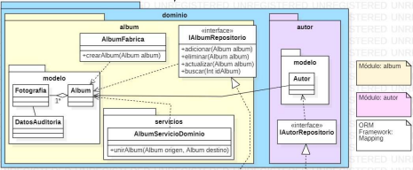
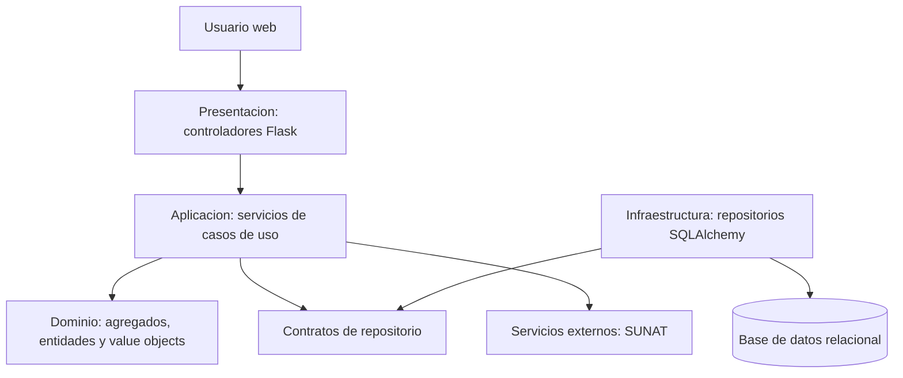
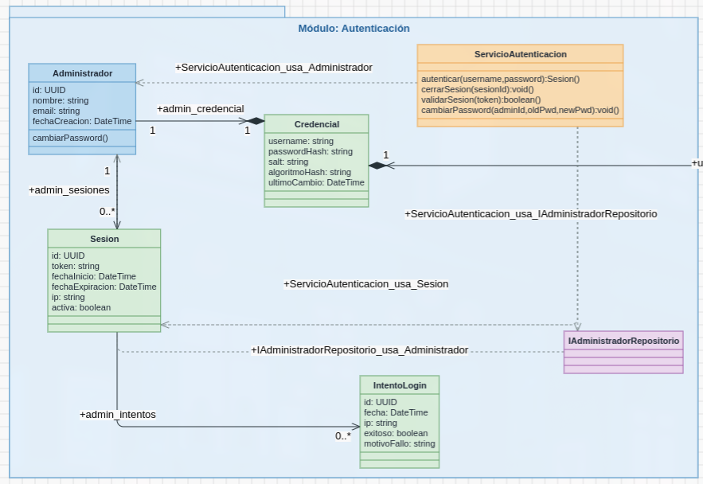
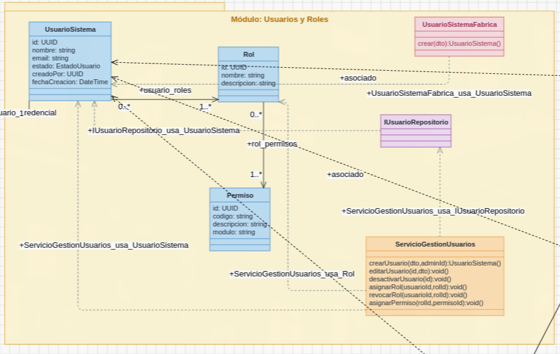
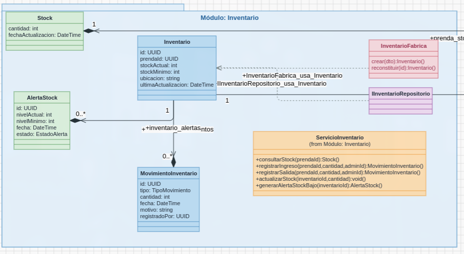
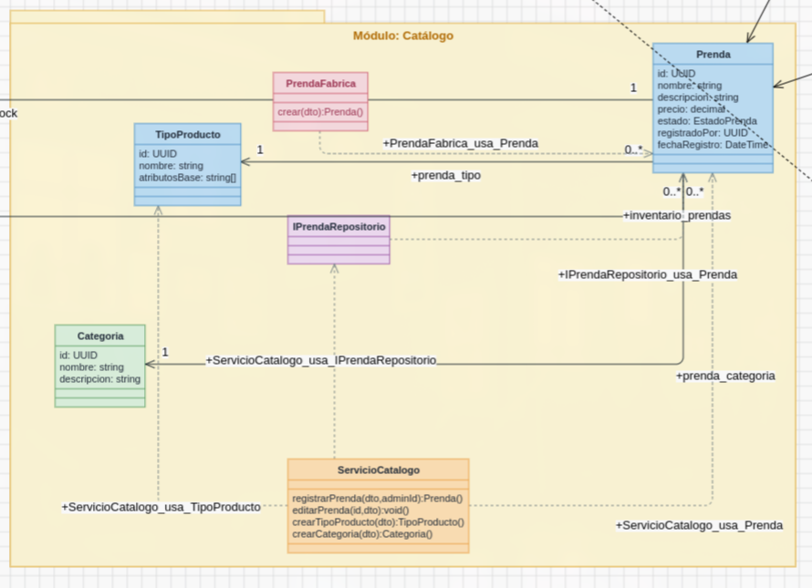
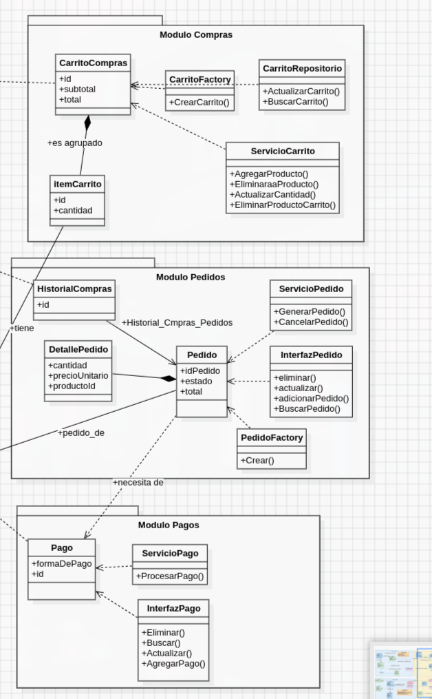
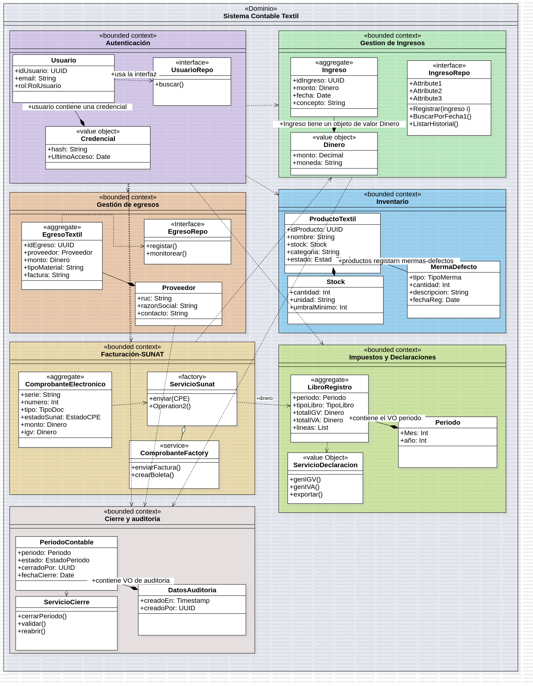
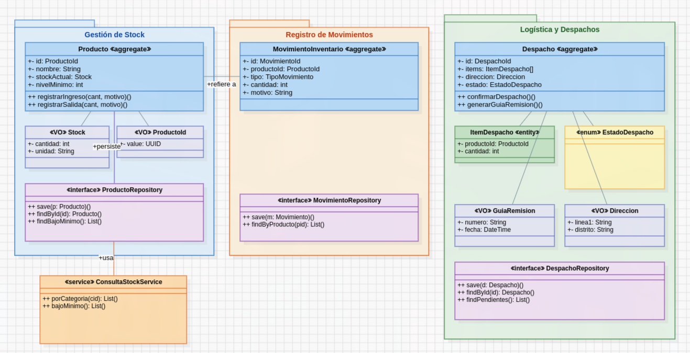

# 1. Tabla de Contenido
- [1. Tabla de Contenido](#1-tabla-de-contenido)
- [2. SoftwareTextil](#2-softwaretextil)
  - [](#)
  - [2.1. Integrantes](#21-integrantes)
  - [2.2. Alcance](#22-alcance)
  - [2.3. Arquitectura](#23-arquitectura)
  - [2.4. Módulos Del Dominio](#24-módulos-del-dominio)
  - [2.5. Modelo de Dominio](#25-modelo-de-dominio)
    - [2.5.1. Autenticación](#251-autenticación)
    - [2.5.2. Usuarios y Roles](#252-usuarios-y-roles)
    - [2.5.3. Inventario](#253-inventario)
    - [2.5.4. Catálogo](#254-catálogo)
    - [2.5.5. Compras, Pedidos y Pagos](#255-compras-pedidos-y-pagos)
    - [2.5.6. Sistema Contable Textil](#256-sistema-contable-textil)
    - [2.5.7. Encargado de Inventario y Logística](#257-encargado-de-inventario-y-logística)
  - [2.6. Estructura Del Proyecto](#26-estructura-del-proyecto)
  - [2.7. Instalación](#27-instalación)
    - [2.7.1. Instalar uv](#271-instalar-uv)
    - [2.7.2. Preparar el entorno](#272-preparar-el-entorno)
    - [2.7.3. Ejecutar la aplicación](#273-ejecutar-la-aplicación)
    - [2.7.4. Ver rutas disponibles](#274-ver-rutas-disponibles)
  - [2.8. API Principal](#28-api-principal)
  - [2.9. Documentación Complementaria](#29-documentación-complementaria)
  - [2.10. Tecnologías](#210-tecnologías)
  - [2.11. Referencias](#211-referencias)


# 2. SoftwareTextil

Sistema web para la gestión integral de una operación textil. El proyecto cubre catálogo de prendas, inventario, carrito de compras, pedidos, pagos, despachos, facturación electrónica, ingresos, egresos y cierre contable.

El sistema fue modelado con UML en StarUML y organizado en Python con **Domain-Driven Design (DDD)**, arquitectura en capas, Flask, SQLAlchemy y `uv` como gestor de entorno y dependencias.

Ejemplo de uso del Diagrama de Modelo Dominio

---

## 2.1. Integrantes

| Integrante                         |
| ---------------------------------- |
| Condori Pallardel, Emilio          |
| Gutierrez Castilla, Carlos Enrique |
| Huayhua Perez, Lizzy Arlette       |
| Peñalva Humire, Javier Alonzo      |
| Quispe Suarez, Angelo Josué        |

---

## 2.2. Alcance

SoftwareTextil permite administrar el flujo principal de una empresa textil desde la publicación de prendas hasta el registro contable de la operación.

| Área           | Alcance                                                       |
| -------------- | ------------------------------------------------------------- |
| Catálogo       | Registro de prendas, categorías y tipos de producto           |
| Inventario     | Control de stock, movimientos, alertas y despachos            |
| E-commerce     | Carrito de compras, pedidos, historial y pagos                |
| Administración | Usuarios, roles, permisos, sesiones y configuración           |
| Contabilidad   | Ingresos, egresos, impuestos, declaraciones y cierre contable |
| Facturación    | Comprobantes electrónicos y comunicación con SUNAT            |

---

## 2.3. Arquitectura

El proyecto usa un monolito modular. Cada módulo conserva sus reglas de negocio dentro del dominio y se comunica con las demás capas mediante servicios y contratos de repositorio.



| Capa            | Responsabilidad                                                     |
| --------------- | ------------------------------------------------------------------- |
| Presentación    | Expone rutas HTTP con Flask                                         |
| Aplicación      | Coordina casos de uso y DTOs                                        |
| Dominio         | Contiene reglas de negocio, agregados, objetos de valor y contratos |
| Infraestructura | Implementa persistencia, repositorios y servicios externos          |

---

## 2.4. Módulos Del Dominio

| Módulo           | Responsabilidad principal                             |
| ---------------- | ----------------------------------------------------- |
| Autenticación    | Credenciales, sesiones e intentos de inicio de sesión |
| Usuarios y roles | Usuarios del sistema, roles y permisos                |
| Catálogo         | Prendas, categorías y tipos de producto               |
| Inventario       | Stock, movimientos, alertas y consulta de existencias |
| Compras          | Carrito de compras e items seleccionados              |
| Pedidos          | Generación, detalle e historial de pedidos            |
| Pagos            | Métodos de pago y procesamiento                       |
| Despachos        | Preparación, confirmación y guía de remisión          |
| Contabilidad     | Ingresos, egresos, impuestos y cierre contable        |
| Facturación      | Comprobantes electrónicos y envío a SUNAT             |
| Compartido       | Enums, objetos de valor y conceptos comunes           |

---

## 2.5. Modelo de Dominio
El modelo de dominio fue diseñado como un diagrama de clases UML siguiendo las prácticas de DDD: entidades, objetos de valor, agregados, servicios de dominio y sus relaciones.

### 2.5.1. Autenticación

[](www.google.com)

### 2.5.2. Usuarios y Roles



### 2.5.3. Inventario



### 2.5.4. Catálogo



### 2.5.5. Compras, Pedidos y Pagos

 

### 2.5.6. Sistema Contable Textil



### 2.5.7. Encargado de Inventario y Logística



---

## 2.6. Estructura Del Proyecto

```text
SoftwareTextil/
├── assets/
│   ├── Diagramas_uml/          # Archivos fuente StarUML (.mdj)
│   ├── figuras_uml/            # Exportaciones de diagramas UML
│   ├── figuras_casos_uso/      # Diagramas de casos de uso
│   ├── figuras_prototipo/      # Capturas del prototipo
│   └── starUML_codigo/         # Codigo generado por StarUML como referencia
├── docs/
│   ├── arquitectura.md
│   ├── modelo_dominio.md
│   └── prototipo.md
├── src/software_textil/
│   ├── presentation/           # Controladores Flask
│   ├── application/            # Servicios de aplicación y DTOs
│   ├── domain/                 # Modelo de dominio puro
│   └── infrastructure/         # Persistencia, repositorios y servicios externos
├── tests/
├── pyproject.toml
├── uv.lock
└── README.md
```

---

## 2.7. Instalación

El proyecto usa `uv` para gestionar Python, el entorno virtual y las dependencias. `pyproject.toml` define las dependencias y `uv.lock` fija versiones reproducibles.

### 2.7.1. Instalar uv

```bash
curl -LsSf https://astral.sh/uv/install.sh | sh
```

En Windows PowerShell:

```powershell
irm https://astral.sh/uv/install.ps1 | iex
```

### 2.7.2. Preparar el entorno

```bash
git clone git@github.com:javierRock/SoftwareTextil.git
cd SoftwareTextil
uv sync
```

### 2.7.3. Ejecutar la aplicación

```bash
uv run flask --app "software_textil:create_app()" run --debug
```

### 2.7.4. Ver rutas disponibles

```bash
uv run flask --app "software_textil:create_app()" routes
```

---

## 2.8. API Principal

| Método | Ruta                                 | Uso                                 |
| ------ | ------------------------------------ | ----------------------------------- |
| `GET`  | `/health`                            | Verifica que la aplicación responda |
| `POST` | `/auth/login`                        | Inicia sesión                       |
| `POST` | `/auth/logout`                       | Cierra sesión                       |
| `POST` | `/catalogo/prendas`                  | Registra una prenda                 |
| `POST` | `/catalogo/categorias`               | Crea una categoría                  |
| `POST` | `/catalogo/tipos-producto`           | Crea un tipo de producto            |
| `POST` | `/inventario/stock`                  | Crea stock inicial de una prenda    |
| `GET`  | `/inventario/stock/<prenda_id>`      | Consulta stock por prenda           |
| `POST` | `/inventario/ingresos`               | Registra ingreso de stock           |
| `POST` | `/inventario/salidas`                | Registra salida de stock            |
| `POST` | `/inventario/ajustes`                | Ajusta stock                        |
| `POST` | `/despachos`                         | Crea un despacho                    |
| `POST` | `/despachos/<despacho_id>/confirmar` | Confirma un despacho                |
| `POST` | `/contabilidad/ingresos`             | Registra ingreso contable           |
| `POST` | `/contabilidad/egresos`              | Registra egreso contable            |
| `POST` | `/facturacion/comprobantes`          | Emite comprobante electrónico       |

---

## 2.9. Documentación Complementaria

| Documento                                          | Contenido                                          |
| -------------------------------------------------- | -------------------------------------------------- |
| [`docs/modelo_dominio.md`](docs/modelo_dominio.md) | Lenguaje ubicuo, contextos delimitados y agregados |
| [`docs/arquitectura.md`](docs/arquitectura.md)     | Capas, dependencias y estructura técnica           |
| [`docs/prototipo.md`](docs/prototipo.md)           | Pantallas del prototipo y flujo de interfaz        |

---

## 2.10. Tecnologías

| Tecnología   | Uso                               |
| ------------ | --------------------------------- |
| Python 3.11+ | Lenguaje principal                |
| Flask        | Framework web                     |
| SQLAlchemy   | Persistencia ORM                  |
| uv           | Gestión de entorno y dependencias |
| StarUML      | Modelado UML                      |
| Mermaid      | Diagramas en Markdown             |

---

## 2.11. Referencias

- Evans, E. *Domain-Driven Design*.
- [Citerus DDD Sample Core](https://github.com/citerus/dddsample-core).
- [Modern DDD Cargo Tracker](https://github.com/eclipse-ee4j/cargotracker).
