# SoftwareTextil

Sistema web académico para gestionar una operación textil de extremo a extremo. El producto integra una API Django/DRF, una **SPA React** y PostgreSQL en un único despliegue modular.


> **Estado documental:** este README describe el código ejecutable del repositorio. Los diagramas UML y prototipos históricos se conservan como evidencia del proceso; cuando difieren, prevalecen el modelo *as-built*, las migraciones y las pruebas.

<a id="indice"></a>
## Índice

- [1. Equipo de trabajo](#equipo)
- [2. Propósito del proyecto](#proposito)
- [3. Funcionalidades](#funcionalidades)
- [4. Modelo de dominio](#modelo-dominio)
- [5. Arquitectura](#arquitectura)
- [6. Prácticas de desarrollo](#practicas)
- [7. DDD - Elementos implementados](#ddd-implementacion)
- [8. Gestión del proyecto con Jira](#gestion)
- [9. Repositorio y flujo Git](#repositorio)
- [10. Instalación y ejecución](#instalacion)
- [11. Pruebas y calidad](#calidad)
- [12. Tecnologías](#tecnologias)
- [13. Referencias](#referencias)

<!-- ### Matriz de evidencia para la evaluación

| Criterio | Evidencia directa en este README | Cobertura documentada |
| --- | --- | --- |
| Estilos de programación | [Estilos de programación](#estilos-de-programación) | 6 estilos con fragmentos reales |
| Clean Code | [Clean Code](#clean-code) | 8 prácticas con código y rutas |
| Principios SOLID | [Principios SOLID](#principios-solid) | SRP, OCP, LSP, ISP y DIP |
| Domain-Driven Design | [DDD - Elementos implementados](#ddd-implementacion) | Entidades, VO, servicios, agregados, módulos, fábricas y repositorios |
| Arquitectura | [Arquitectura](#arquitectura) | Presentación, aplicación, dominio e infraestructura/repositorios |
| Repositorio | [Repositorio y flujo Git](#repositorio) | `main`, `dev`, `feature/*` y Pull Requests |
| Gestión del proyecto | [Gestión con Jira](#gestion) | Epics, historias, subtareas, responsables, estados y capturas |
| Calidad | [Pruebas y calidad](#calidad) | Pruebas, integridad PostgreSQL, Ruff, ESLint y build reproducible |

<a id="equipo"></a> --->

## 1. Equipo de trabajo

**Nombre del equipo:** SoftwareTextil

**Curso:** Ingeniería de Software I (2026-B)

| Integrante | Módulo asignado | Rama de trabajo |
| --- | --- | --- |
| Gutierrez Castilla, Carlos Enrique | Autenticación y Roles | `feature/autenticacion-carlos` |
| Huayhua Perez, Lizzy Arlette | Catálogo | `feature/catalogo-lizzy` |
| Condori Pallardel, Alejandro | Inventario | `feature/inventario-alejandro` |
| Quispe Suarez, Angelo Josué | Pedidos | `feature/pedidos-angelo` |
| Peñalva Humire, Javier Alonzo | Pagos | `feature/pagos-javier` |

La asignación se materializa en apps Django por contexto y se documenta en [`docs/guias/`](docs/guias/). Las ramas se integran mediante Pull Request (PR) hacia `dev`; `main` representa la versión estable.

<a id="proposito"></a> 
## 2. Propósito del proyecto

### Objetivo y problema

SoftwareTextil centraliza información que, en una operación textil fragmentada, suele quedar dispersa entre registros de productos, saldos de almacén y seguimiento manual de ventas. Su objetivo es mantener trazabilidad desde la publicación de una prenda hasta su reserva, pago y despacho, con reglas de negocio consistentes y una única fuente de verdad en PostgreSQL.

### Usuarios objetivo

| Usuario | Necesidad cubierta |
| --- | --- |
| Cliente | Registrarse, consultar catálogo y detalle, seleccionar variantes, comprar, pagar y consultar sus operaciones. |
| Administrador | Gestionar usuarios, roles, catálogo, variantes, pagos y supervisar la operación. |
| Encargado de inventario | Consultar existencias, registrar movimientos, priorizar stock bajo y gestionar despachos. |

### Alcance actual verificable

- Usuarios, roles, inicio/cierre de sesión, perfil, cambio de contraseña y cierre de otras sesiones.
- Catálogo público y administrativo con categorías, tipos de producto, prendas, variantes por talla/color/SKU e imágenes.
- Inventario por `VariantePrenda`, stock actual, reservado y disponible; ingresos, salidas, ajustes, movimientos, alertas y reportes PDF/XLSX.
- Carrito por cliente con precios resueltos en servidor y selección de variantes.
- Pedidos creados desde el carrito, reserva atómica de existencias, cancelación y liberación de reservas.
- Registro de pago total por pedido, consulta por propietario, aprobación/rechazo administrativo y actualización atómica del pedido.
- Programación, preparación y confirmación de despachos; generación de `GuiaRemision` y descuento de la reserva confirmada.
- SPA React responsive con rutas públicas y protegidas por rol, compilada con Vite y servida por Django.
- Persistencia PostgreSQL para desarrollo y ejecución de pruebas dependientes de bloqueos, restricciones e índices parciales.

<a id="funcionalidades"></a>
## 3. Funcionalidades

### Vista *as-built* por roles

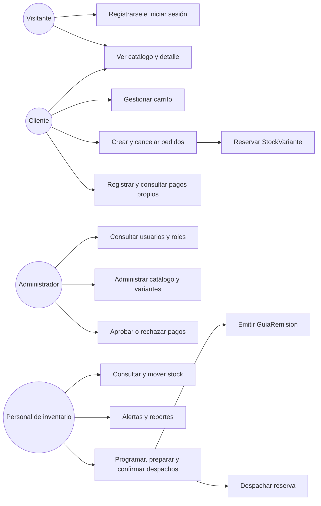
```mermaid
flowchart LR
    Visitante((Visitante)) --> Registro[Registrarse e iniciar sesión]
    Visitante --> Catalogo[Ver catálogo y detalle]
    Cliente((Cliente)) --> Catalogo
    Cliente --> Carrito[Gestionar carrito]
    Cliente --> Pedido[Crear y cancelar pedidos]
    Cliente --> Pago[Registrar y consultar pagos propios]
    Admin((Administrador)) --> Usuarios[Consultar usuarios y roles]
    Admin --> CatalogoAdmin[Administrar catálogo y variantes]
    Admin --> PagoAdmin[Aprobar o rechazar pagos]
    Personal((Personal de inventario)) --> Stock[Consultar y mover stock]
    Personal --> Reportes[Alertas y reportes]
    Personal --> Despachos[Programar, preparar y confirmar despachos]
    Pedido --> Reserva[Reservar StockVariante]
    Despachos --> Guia[Emitir GuiaRemision]
    Despachos --> Salida[Despachar reserva]
```

### Módulos y funciones

| Módulo | Funciones implementadas | API o interfaz principal | Evidencia |
| --- | --- | --- | --- |
| Usuarios y roles | Registro, login por token de sesión, logout, perfil, actualización, contraseña, cierre de sesiones, consulta de usuarios/roles y activación | `/api/auth/*`, `/api/usuarios/`, `/api/roles/`, `/login`, `/perfil`, `/usuarios` | `apps/usuarios/`, `frontend/inventario/src/auth/`, `frontend/inventario/src/pages/AuthPages.jsx` |
| Catálogo | Gestión controlada de categorías, tipos, prendas y variantes; publicación; búsqueda; filtros; detalle; precio heredado; imagen | `/api/prendas/`, `/api/variantes/`, `/api/categorias/`, `/api/tipos-producto/`, `/catalogo`, `/catalogo-admin` | `apps/catalogo/`, `frontend/inventario/src/pages/CatalogPages.jsx` |
| Inventario | Alta de stock, ingresos, salidas, ajustes, reservas, movimientos, agrupación por categoría, stock bajo y reporte PDF/XLSX | `/api/stock/`, acciones de stock, `/api/movimientos/`, `/inventario`, `/stock-bajo`, `/movimientos` | `apps/inventario/`, `frontend/inventario/src/pages/InventoryPages.jsx` |
| Carrito | Crear/listar carrito, agregar o retirar variante, validar propiedad, acumular cantidades y calcular total | `/api/ventas/carritos/`, `/carrito` | `apps/ventas/carrito/`, `frontend/inventario/src/pages/CustomerPages.jsx` |
| Pedidos y reservas | Convertir carrito, copiar detalles/precios, reservar stock, listar, consultar, cancelar y liberar reservas | `/api/ventas/pedidos/`, `/pedidos` | `apps/ventas/pedidos/` |
| Pagos | Pago total único, métodos y referencias, listado paginado, propiedad, aprobación/rechazo y atomicidad con Pedido | `/api/ventas/pagos/`, `/pagos`, `/pagos-admin` | `apps/ventas/pagos/`, `tests/pagos/` |
| Despachos | Programar pedido pagado, preparar, confirmar con guía, cancelar y descontar reservas | `/api/ventas/despachos/`, `/despachos` | `apps/ventas/despachos/`, `tests/ventas/test_api_despachos.py` |
| SPA e integración | Enrutamiento cliente, protección por roles, cliente HTTP común, estados de carga/error/vacío y fallback Django | Rutas de `frontend/inventario/src/App.jsx` | `frontend/inventario/`, `config/urls.py` |

### Evidencia de casos de uso

Los PNG siguientes son artefactos de análisis previos a la implementación y permiten contrastar actores y alcance con el diagrama *as-built*.

| Cliente | Administrador del sistema | Administrador de inventario |
| --- | --- | --- |
|  |  |  |

### Evidencia de prototipado

| Acceso | Catálogo | Carrito | Operación de almacén |
| --- | --- | --- | --- |
|  |  |  | 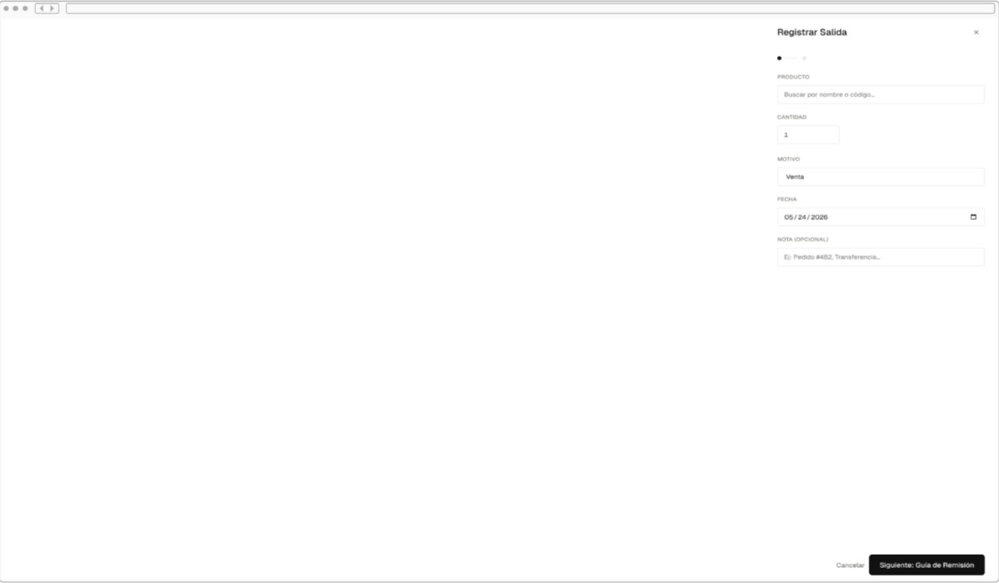 |

| Ingreso | Guía de remisión | Pedidos | Panel administrativo |
| --- | --- | --- | --- |
| 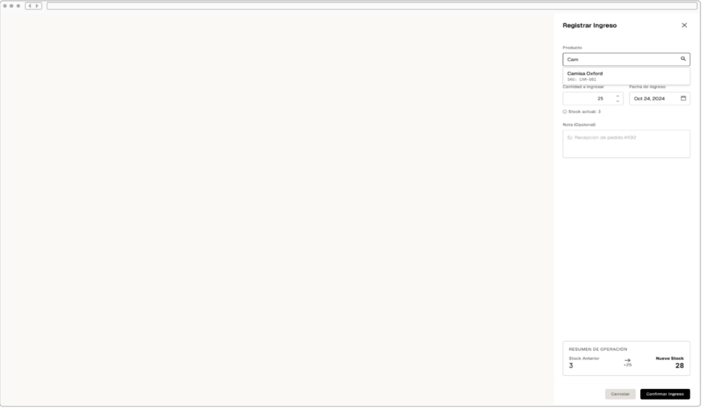 | 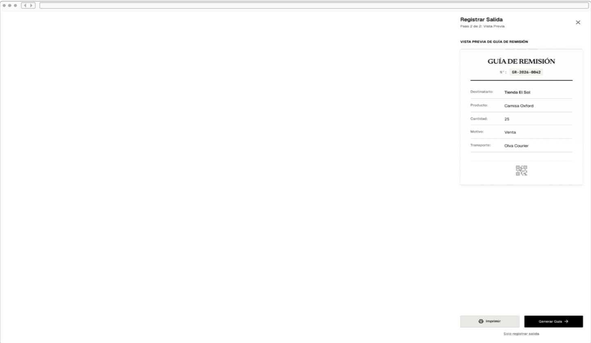 |  | 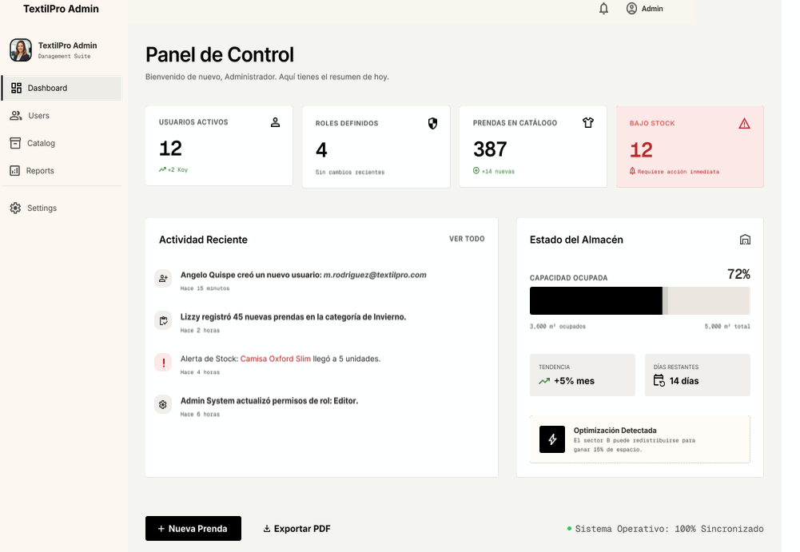 |

La SPA actual no es una colección de HTML aislados: `BrowserRouter` mantiene navegación cliente y `config/urls.py` entrega `index.html` para toda ruta visual no reservada. React consume `/api` y Django sirve también `/media` para imágenes.

<a id="modelo-dominio"></a>
## 4. Modelo de dominio

### Modelo de clases *as-built*

El inventario opera sobre **`StockVariante`**, no sobre la prenda genérica. `VariantePrenda` representa la unidad vendible (talla, color y SKU); carrito, pedido e inventario referencian esa variante. `Despacho` gobierna su ciclo de vida y contiene opcionalmente una `GuiaRemision`.

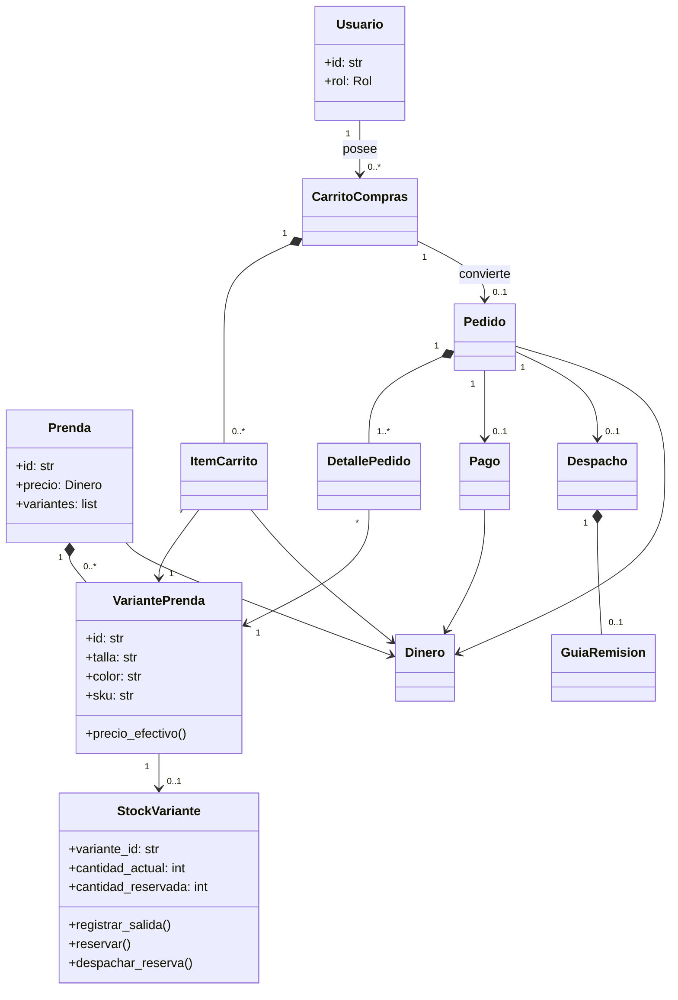
```mermaid
classDiagram
    class Usuario {
      +id: str
      +rol: Rol
    }
    class Prenda {
      +id: str
      +precio: Dinero
      +variantes: list
    }
    class VariantePrenda {
      +id: str
      +talla: str
      +color: str
      +sku: str
      +precio_efectivo()
    }
    class StockVariante {
      +variante_id: str
      +cantidad_actual: int
      +cantidad_reservada: int
      +registrar_salida()
      +reservar()
      +despachar_reserva()
    }
    class CarritoCompras
    class ItemCarrito
    class Pedido
    class DetallePedido
    class Pago
    class Despacho
    class GuiaRemision
    class Dinero

    Usuario "1" --> "0..*" CarritoCompras : posee
    Prenda "1" *-- "0..*" VariantePrenda
    VariantePrenda "1" --> "0..1" StockVariante
    CarritoCompras "1" *-- "0..*" ItemCarrito
    ItemCarrito "*" --> "1" VariantePrenda
    Pedido "1" *-- "1..*" DetallePedido
    DetallePedido "*" --> "1" VariantePrenda
    CarritoCompras "1" --> "0..1" Pedido : convierte
    Pedido "1" --> "0..1" Pago
    Pedido "1" --> "0..1" Despacho
    Despacho "1" *-- "0..1" GuiaRemision
    Prenda --> Dinero
    ItemCarrito --> Dinero
    Pedido --> Dinero
    Pago --> Dinero
```

### Contextos y relaciones

| Contexto/módulo | Modelo central | Invariante o responsabilidad | Colaboración principal |
| --- | --- | --- | --- |
| Usuarios | `Usuario`, `Rol`, `Sesion` | Identidad activa, rol y sesiones válidas | Autoriza operaciones en todos los contextos |
| Catálogo | `Prenda`, `VariantePrenda`, `Categoria`, `TipoProducto` | Datos comerciales válidos; SKU/variante como unidad vendible | Provee variante y precio a compras e inventario |
| Inventario | `StockVariante`, `MovimientoInventario`, `AlertaStock` | No retirar/reservar más que lo disponible | Recibe reservas de Pedidos y confirma salidas de Despachos |
| Carrito | `CarritoCompras`, `ItemCarrito` | Solo se modifica abierto; total en una moneda | Usa variante/precio y origina Pedido |
| Pedidos | `Pedido`, `DetallePedido` | Detalles no vacíos; estados válidos | Reserva/libera inventario y habilita Pago/Despacho |
| Pagos | `Pago`, `ValidadorMetodoPago` | Pago total único, referencia válida y transición final irreversible | Marca Pedido como pagado en una unidad de trabajo |
| Despachos | `Despacho`, `GuiaRemision` | Solo pedido pagado; confirmar requiere preparación y guía | Descuenta reservas y registra movimientos |
| Compartido | `Dinero`, enums y mapeos | Conceptos transversales estables | Dependencia compartida por los módulos |

### UML histórico conservado

Estos diagramas documentan la evolución del análisis. Algunas denominaciones fueron refinadas en código; en particular, la unidad vigente es `StockVariante`.

<details>
<summary>Ver todos los PNG UML que formaban parte del README</summary>

**Modelo base**


**Autenticación**


**Usuarios y roles**


**Inventario**


**Catálogo**


**Compras, pedidos y pagos**


**Artefacto UML histórico 09**


</details>

<a id="arquitectura"></a>
## 5. Arquitectura


SoftwareTextil es un **monolito modular Django**: existe una aplicación desplegable y una base PostgreSQL, pero los límites internos siguen contextos del dominio. Aplica DDD táctico y una separación de dependencias **inspirada en Clean Architecture**. No se afirma una Clean Architecture estricta: hay decisiones pragmáticas, como ensamblar adaptadores en presentación y usar `IntegrityError` en el servicio de despachos.

### Capas y paquetes

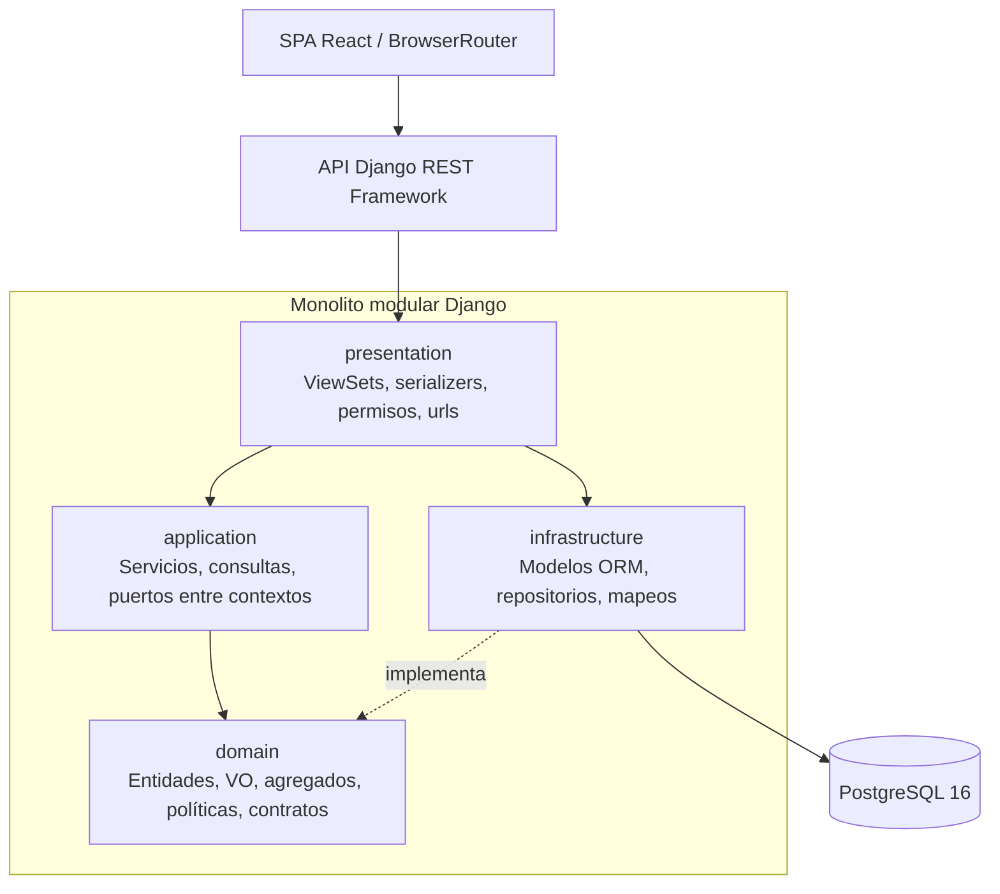
```mermaid
flowchart TB
    SPA[SPA React / BrowserRouter] --> HTTP[API Django REST Framework]
    subgraph Monolito[Monolito modular Django]
      P["presentation\nViewSets, serializers, permisos, urls"]
      A["application\nServicios, consultas, puertos entre contextos"]
      D["domain\nEntidades, VO, agregados, políticas, contratos"]
      I["infrastructure\nModelos ORM, repositorios, mapeos"]
      P --> A
      A --> D
      I -. implementa .-> D
      P --> I
    end
    HTTP --> P
    I --> PG[(PostgreSQL 16)]
```

| Capa | Responsabilidad | Clases/artefactos reales | Ubicación |
| --- | --- | --- | --- |
| `presentation` | Adaptar HTTP, autenticar/autorizar, validar entrada y serializar salida | `PrendaViewSet`, `StockViewSet`, `PagoViewSet`, `SerializerEstricto` | `apps/*/presentation/`, `apps/ventas/*/presentation/` |
| `application` | Orquestar casos de uso, transacciones y colaboración entre contextos | `ServicioCatalogo`, `ServicioInventario`, `ConsultaCarritos`, `ServicioCompras`, `ServicioPedidos`, `ServicioPagos`, `ServicioDespachos` | `apps/*/application/`, `apps/ventas/*/application/` |
| `domain` | Expresar invariantes sin depender de Django/DRF | `Prenda`, `StockVariante`, `CarritoCompras`, `Pedido`, `Pago`, `Despacho`, `Dinero`, contratos ABC | `apps/*/domain/`, `apps/ventas/*/domain/` |
| `infrastructure` | Persistir, bloquear filas, mapear dominio/ORM e implementar puertos | `DjangoRepositorioCarrito`, `DjangoRepositorioInventario`, `DjangoRepositorioPago`, modelos Django | `apps/*/infrastructure/`, `apps/ventas/*/infrastructure/` |

### Decisiones arquitectónicas

| Decisión | Justificación y efecto |
| --- | --- |
| Dominio independiente del framework | Las entidades son `dataclass`; las reglas pueden probarse sin una petición HTTP. |
| Puertos de repositorio | La aplicación recibe contratos y puede ejecutarse con adaptadores Django o en memoria. |
| Unidad de trabajo inyectada | `transaction.atomic` protege carrito, reservas, pagos y despachos sin importarse dentro de `ServicioPagos`. |
| Bloqueo pesimista | `select_for_update()` serializa cambios concurrentes sobre carrito, pedido, pago, despacho y stock. |
| Integridad en profundidad | Dominio, serializers y restricciones PostgreSQL protegen invariantes en fronteras complementarias. |
| SPA compilada dentro del despliegue | Vite produce `frontend/inventario/dist`; Django sirve sus estáticos y el fallback de `BrowserRouter`. |

### Estructura ejecutable

```text
apps/
├── usuarios/{presentation,application,domain,infrastructure}
├── catalogo/{presentation,application,domain,infrastructure}
├── inventario/{presentation,application,domain,infrastructure}
├── compartido/{domain,infrastructure}
└── ventas/
    ├── carrito/{presentation,application,domain,infrastructure}
    ├── pedidos/{presentation,application,domain,infrastructure}
    ├── pagos/{presentation,application,domain,infrastructure}
    └── despachos/{presentation,application,domain,infrastructure}
frontend/inventario/
├── src/{auth,components,hooks,pages,services}
└── dist/                         # salida de npm run build
```

<a id="practicas"></a>
## 6. Prácticas de desarrollo

### Estilos de programación

Se identifican seis estilos aplicados de forma concreta, no como etiquetas globales del sistema.

<details>
<summary><strong>1. OOP / Things</strong>: el objeto protege su estado e invariantes</summary>

`StockVariante` reúne datos y comportamiento; una salida inválida no puede dejar saldo negativo.

```python
def registrar_salida(self, cantidad: int, motivo: str, usuario_id: str):
    self._validar_cantidad(cantidad)
    if cantidad > self.cantidad_disponible:
        raise StockInsuficienteError("No hay stock suficiente para la salida")
    self.cantidad_actual -= cantidad
    self.ultima_actualizacion = _ahora()
    return self._crear_movimiento(
        TipoMovimiento.SALIDA, cantidad, motivo, usuario_id
    )
```

Referencia: `apps/inventario/domain/stock_prenda.py`, método `StockVariante.registrar_salida`.
</details>

<details>
<summary><strong>2. Pipeline</strong>: la petición atraviesa etapas explícitas</summary>

La misma tubería valida, resuelve responsable, aplica el caso de uso, traduce errores y serializa los tres movimientos.

```python
def _registrar_movimiento(request, clase_serializer, aplicar):
    """Las tres acciones comparten validar, aplicar y devolver 201."""
    serializer = clase_serializer(data=request.data)
    serializer.is_valid(raise_exception=True)
    try:
        responsable = _responsable(request)
        movimiento = aplicar(_servicio(), serializer.validated_data, responsable)
    except InventarioError as error:
        return respuesta_de_error_inventario(error)
    return Response(
        MovimientoSerializer(movimiento).data,
        status=status.HTTP_201_CREATED,
    )
```

Referencia: `apps/inventario/presentation/views.py`, función `_registrar_movimiento`.
</details>

<details>
<summary><strong>3. Error/Exception Handling</strong>: errores de negocio centralizados</summary>

Los casos de uso de pagos comparten una frontera que convierte `ErrorPago` en una respuesta uniforme.

```python
def _ejecutar_caso_uso(caso_uso, estado_exitoso=status.HTTP_200_OK):
    try:
        resultado = caso_uso()
    except ErrorPago as error:
        return _respuesta_error(error)
    return Response(
        PagoSerializer(resultado).data,
        status=estado_exitoso,
    )
```

Referencia: `apps/ventas/pagos/presentation/views.py`, función `_ejecutar_caso_uso`.
</details>

<details>
<summary><strong>4. Persistent Tables</strong>: estado durable y concurrencia relacional</summary>

La lectura bloqueada evita que dos operaciones consuman el mismo saldo.

```python
model = (
    StockVarianteModel.objects.select_for_update()
    .filter(variante_id=variante_id)
    .first()
)
return _stock_from_model(model) if model else None
```

Referencia: `apps/inventario/infrastructure/repositories.py`, método `buscar_por_variante_bloqueada`; requiere PostgreSQL y una transacción activa.
</details>

<details>
<summary><strong>5. Declarativo React</strong>: las rutas expresan UI y permisos como datos</summary>

```jsx
<Routes>
  <Route path="/catalogo" element={<CatalogPage/>}/>
  <Route path="/carrito" element={
    <Protected roles={['cliente']}><CartPage/></Protected>
  }/>
  <Route path="/inventario" element={
    <Protected roles={STAFF}><InventoryPage/></Protected>
  }/>
</Routes>
```

Referencia: `frontend/inventario/src/App.jsx`.
</details>

<details>
<summary><strong>6. Rasgos funcionales</strong>: datos inmutables y agregación sin mutación</summary>

```python
@dataclass(frozen=True)
class ReporteInventario:
    categorias: list[ReporteInventarioCategoria] = field(default_factory=list)

    @property
    def cantidad_total(self) -> int:
        return sum(categoria.cantidad_total for categoria in self.categorias)
```

Referencia: `apps/inventario/domain/consultas.py`, clase `ReporteInventario`.
</details>

### Convenciones de código

| Ámbito | Convención aplicada | Ejemplo real |
| --- | --- | --- |
| Python | PEP 8 verificado por Ruff; línea de 88 caracteres | `[tool.ruff]` en `pyproject.toml` |
| Identificadores | `snake_case` para funciones/variables; `PascalCase` para clases | `registrar_salida`, `StockVariante` |
| Constantes | Mayúsculas descriptivas, sin números mágicos | `LONGITUD_MAXIMA_REFERENCIA`, `TAMANO_PAGINA_MAXIMO` |
| Tipado | Type hints en entradas, retornos, uniones y colecciones | `Dinero | None`, `list[Pago]` |
| Documentación | Docstrings breves para intención, invariantes o límites | módulos y clases de `apps/*/domain/` |
| Lenguaje ubicuo | Vocabulario de negocio en español | `Prenda`, `Pedido`, `Pago`, `Despacho`, `GuiaRemision` |
| React | Componentes `PascalCase`, hooks `useX`, variables/funciones `camelCase` | `InventoryPage`, `useApi`, `sessionToken` |
| JavaScript/JSX | ESLint recomendado y reglas de hooks | `frontend/inventario/eslint.config.js` |

Fragmento real de configuración Python:

```toml
[tool.ruff]
target-version = "py311"
line-length = 88

[tool.ruff.lint]
select = ["E", "W", "F", "I", "N", "UP", "B", "S"]
```

Fragmento real de componentes y hooks React:

```jsx
useEffect(() => {
  const controller = new AbortController();
  setState((current) => ({ ...current, loading: true, error: '' }));
  load(controller.signal)
    .then((data) => setState({ data, loading: false, error: '' }))
    .catch((error) => {
      if (error.name !== 'AbortError') {
        setState({ data: null, loading: false, error: error.message });
      }
    });
  return () => controller.abort();
}, [...dependencies, revision]);
```

Referencias: `pyproject.toml`, `frontend/inventario/src/hooks/useApi.js` y `frontend/inventario/eslint.config.js`.

### Clean Code

Las prácticas se aplican donde reducen un riesgo concreto; no se presentan como cumplimiento absoluto de todo el repositorio.

<details>
<summary><strong>1. Nombres que expresan intención</strong></summary>

`Despacho`, `preparar`, `confirmar`, `direccion_entrega` y `GuiaRemision` describen el proceso sin abreviaturas técnicas.

```python
@dataclass
class Despacho:
    pedido_id: str
    direccion_entrega: str
    estado: EstadoDespacho = EstadoDespacho.PENDIENTE
    guia: GuiaRemision | None = None
```

Ruta: `apps/ventas/despachos/domain/despacho.py`.
</details>

<details>
<summary><strong>2. Guard clauses</strong></summary>

El carrito falla o retorna temprano antes de ejecutar la rama principal.

```python
self._validar_abierto()
if cantidad <= 0:
    raise CantidadInvalidaError
existente = self._buscar_item(variante_id)
if existente is None:
    nuevo_item = ItemCarrito(
        str(uuid4()),
        variante_id,
        cantidad,
        precio_unitario,
    )
    self.items.append(nuevo_item)
    return
```

Ruta: `apps/ventas/carrito/domain/carrito.py`, método `agregar_item`.
</details>

<details>
<summary><strong>3. Constantes en lugar de valores mágicos</strong></summary>

```python
LONGITUD_MAXIMA_REFERENCIA = 120

if len(referencia_normalizada) > LONGITUD_MAXIMA_REFERENCIA:
    raise LongitudDatoPagoInvalida(
        "referencia", LONGITUD_MAXIMA_REFERENCIA
    )
```

Ruta: `apps/ventas/pagos/domain/politicas.py`.
</details>

<details>
<summary><strong>4. DRY en el cliente HTTP</strong></summary>

Una fábrica evita repetir CRUD, construcción de URL, autorización y manejo de errores.

```javascript
const endpoint = (path) => ({
  list: (query, options = {}) => request(path, { ...options, query }),
  get: (id, options = {}) => request(`${path}${id}/`, options),
  create: (body) => request(path, { method: 'POST', body }),
  update: (id, body) => request(`${path}${id}/`, { method: 'PATCH', body }),
  remove: (id) => request(`${path}${id}/`, { method: 'DELETE' }),
});
```

Ruta: `frontend/inventario/src/services/api.js`.
</details>

<details>
<summary><strong>5. Objeto de valor para dinero</strong></summary>

```python
@dataclass(frozen=True)
class Dinero:
    monto: Decimal
    moneda: str = "PEN"

    def sumar(self, otro: "Dinero") -> "Dinero":
        self._validar_moneda(otro)
        return Dinero(self.monto + otro.monto, self.moneda)
```

Ruta: `apps/compartido/domain/dinero.py`.
</details>

<details>
<summary><strong>6. Traducción centralizada de errores</strong></summary>

```python
def _respuesta_error(error: ErrorPago) -> Response:
    estado_http = status.HTTP_400_BAD_REQUEST
    if isinstance(error, ERRORES_NO_ENCONTRADOS):
        estado_http = status.HTTP_404_NOT_FOUND
    elif isinstance(error, ERRORES_CONFLICTO):
        estado_http = status.HTTP_409_CONFLICT
    return Response({"codigo": error.codigo, "detalle": str(error)}, status=estado_http)
```

Ruta: `apps/ventas/pagos/presentation/views.py`.
</details>

<details>
<summary><strong>7. Entrada estricta</strong></summary>

`SerializerEstricto` rechaza campos desconocidos en vez de ignorarlos silenciosamente.

```python
class SerializerEstricto(serializers.Serializer):
    def validate(self, atributos):
        campos_desconocidos = set(self.initial_data) - set(self.fields)
        if campos_desconocidos:
            nombres = ", ".join(sorted(campos_desconocidos))
            raise serializers.ValidationError(f"Campos no permitidos: {nombres}.")
        return atributos
```

Ruta: `apps/ventas/pagos/presentation/serializers.py`.
</details>

<details>
<summary><strong>8. Comentario de seguridad responsable</strong></summary>

El comentario explica el riesgo y la razón de la decisión, no repite el código.

```python
def _responsable(request) -> str:
    """El responsable del movimiento sale de la sesion autenticada.

    Tomarlo del cuerpo de la peticion permitiria que cualquiera registrara
    movimientos a nombre de otro usuario.
    """
    usuario = getattr(request, "user", None)
```

Ruta: `apps/inventario/presentation/views.py`.
</details>

### Principios SOLID

La aplicación de SOLID es **localizada, no universal**: se evidencia con límites que necesitan sustitución o separación, sin forzar interfaces para cada clase.

<details>
<summary><strong>S - Single Responsibility Principle</strong></summary>

Las consultas y escrituras del carrito cambian por motivos distintos. `ConsultaCarritos` lee y `ServicioCompras` modifica.

```python
class ConsultaCarritos:
    def __init__(self, lector: LectorCarrito, catalogo: CatalogoCarritos) -> None:
        self._lector = lector
        self._catalogo = catalogo

class ServicioCompras:
    def __init__(
        self,
        lector: LectorCarrito,
        escritor: EscritorCarrito,
        resolver_precio: Callable[[str, int], Dinero] | None = None,
        unidad_trabajo: Callable[[], AbstractContextManager] = nullcontext,
    ) -> None:
        self._lector = lector
        self._escritor = escritor
```

Rutas: `apps/ventas/carrito/application/consultas.py` y `apps/ventas/carrito/application/services.py`.
</details>

<details>
<summary><strong>O - Open/Closed Principle</strong></summary>

Una política nueva de referencia se registra sin modificar `Pago` ni `ServicioPagos`.

```python
class PoliticaReferenciaPago(ABC):
    @property
    @abstractmethod
    def metodos(self) -> frozenset[MetodoPago]:
        """Metodos a los que se aplica la politica."""
        raise NotImplementedError

    @abstractmethod
    def validar(self, metodo: MetodoPago, referencia: str) -> str:
        """Valida y normaliza una referencia."""
        raise NotImplementedError
```

Ruta: `apps/ventas/pagos/domain/politicas.py`; prueba extensible en `tests/pagos/test_pago_dominio.py`.
</details>

<details>
<summary><strong>L - Liskov Substitution Principle</strong></summary>

Los adaptadores en memoria y Django implementan `RepositorioCarrito`; el servicio recibe cualquiera sin cambiar su contrato observable.

```python
class MemoriaRepositorioCarrito(RepositorioCarrito):
    def buscar_por_id(self, carrito_id: str) -> CarritoCompras | None:
        carrito = self._carritos.get(carrito_id)
        return deepcopy(carrito) if carrito is not None else None

class DjangoRepositorioCarrito(RepositorioCarrito):
    def buscar_por_id(self, carrito_id: str) -> CarritoCompras | None:
        if uuid_valido(carrito_id) is None:
            return None
        model = self._consulta().filter(id=carrito_id).first()
        return _carrito_from_model(model) if model else None
```

Rutas: `apps/ventas/carrito/infrastructure/memoria.py`, `apps/ventas/carrito/infrastructure/repositories.py` y `tests/ventas/test_carrito_solid.py`.
</details>

<details>
<summary><strong>I - Interface Segregation Principle</strong></summary>

Los consumidores dependen solo del rol requerido: lectura puntual, catálogo de consultas o escritura.

```python
class LectorCarrito(ABC):
    @abstractmethod
    def buscar_por_id(self, carrito_id: str) -> CarritoCompras | None:
        raise NotImplementedError

class CatalogoCarritos(ABC):
    @abstractmethod
    def listar_por_cliente(self, cliente_id: str) -> list[CarritoCompras]:
        raise NotImplementedError

class EscritorCarrito(ABC):
    @abstractmethod
    def guardar(self, carrito: CarritoCompras) -> None:
        raise NotImplementedError
```

Ruta: `apps/ventas/carrito/domain/repositorios.py`.
</details>

<details>
<summary><strong>D - Dependency Inversion Principle</strong></summary>

`ServicioPagos` recibe puertos y una fábrica de unidad de trabajo; no importa modelos Django.

```python
class ServicioPagos:
    def __init__(
        self,
        repositorio_pago: RepositorioPago,
        repositorio_pedido: RepositorioPedidoPago,
        unidad_trabajo: FabricaUnidadTrabajo = nullcontext,
    ) -> None:
```

Rutas: `apps/ventas/pagos/application/services.py` y composición en `apps/ventas/pagos/presentation/views.py`.
</details>

<a id="ddd-implementacion"></a>
## 7. DDD - Elementos implementados

El diseño utiliza lenguaje ubicuo en español, módulos por contexto y patrones tácticos donde aportan reglas o desacoplamiento.

| Elemento DDD | Implementación real | Función en el modelo | Evidencia |
| --- | --- | --- | --- |
| Entidades | `Usuario`, `Prenda`, `VariantePrenda`, `MovimientoInventario`, `DetallePedido` | Tienen identidad y ciclo de vida | `apps/*/domain/`, `apps/ventas/*/domain/` |
| Objetos de valor | `Dinero`, `Stock`, `GuiaRemision`, DTOs `frozen=True` | Igualdad por atributos, validación e inmutabilidad cuando corresponde | `apps/compartido/domain/dinero.py`, `apps/inventario/domain/stock_prenda.py`, `apps/ventas/despachos/domain/despacho.py` |
| Servicio de dominio | `ValidadorMetodoPago` y políticas | Selecciona reglas que no pertenecen a una única entidad | `apps/ventas/pagos/domain/politicas.py` |
| Servicios de aplicación | `ServicioCatalogo`, `ServicioInventario`, `ServicioCompras`, `ServicioPedidos`, `ServicioPagos`, `ServicioDespachos` | Orquestan casos de uso, repositorios y transacciones | `apps/*/application/`, `apps/ventas/*/application/` |
| Agregados | `Prenda`, `StockVariante`, `CarritoCompras`, `Pedido`, `Pago`, `Despacho` | Protegen invariantes y transiciones desde una raíz | archivos `domain/*.py` de cada contexto |
| Módulos | `usuarios`, `catalogo`, `inventario`, `carrito`, `pedidos`, `pagos`, `despachos`, `compartido` | Delimitan vocabulario y responsabilidad | `apps/` |
| Fábricas | `UsuarioSistemaFabrica`, `PrendaFabrica`, `VarianteFabrica`, `InventarioFabrica`, `CarritoFactory`, `PedidoFactory`, `PagoFactory`, `DespachoFabrica` | Crean agregados con identidad y estado inicial válidos | clases de fábrica en `domain/` |
| Contratos de repositorio | `RepositorioPrenda`, `RepositorioInventario`, roles de carrito, `RepositorioPedido`, `RepositorioPago`, `RepositorioDespacho` | Puertos abstractos para persistencia | `apps/*/domain/repositorios.py`, `apps/ventas/*/domain/repositorios.py` |
| Implementaciones | `DjangoRepositorioPrenda`, `DjangoRepositorioInventario`, `DjangoRepositorioCarrito`, `DjangoRepositorioPedido`, `DjangoRepositorioPago`, `DjangoRepositorioDespacho` | Adaptan el dominio a Django ORM/PostgreSQL | `apps/*/infrastructure/repositories.py`, `apps/ventas/*/infrastructure/repositories.py` |
| Arquitectura en capas | `presentation` → `application` → `domain`; `infrastructure` implementa puertos | Mantiene reglas separadas de HTTP y persistencia | estructura repetida por módulo |

### Fragmentos tácticos

**Entidad/agregado:** `Pago` protege una transición final.

```python
def aprobar(self) -> None:
    if self.estado != EstadoPago.PENDIENTE:
        raise PagoYaProcesado()
    self.estado = EstadoPago.APROBADO
```

**Objeto de valor:** `GuiaRemision` valida sus datos al construirse.

```python
@dataclass(frozen=True)
class GuiaRemision:
    serie: str
    numero: str

    @property
    def codigo(self) -> str:
        return f"{self.serie}-{self.numero}"
```

**Servicio de dominio:** selección de política por método.

```python
def validar(self, metodo: MetodoPago, referencia: str) -> str:
    if not isinstance(metodo, MetodoPago):
        raise MetodoPagoNoSoportado(metodo)
    politica = self._politicas.get(metodo)
    if politica is None:
        raise MetodoPagoNoSoportado(metodo)
    return politica.validar(metodo, referencia)
```

**Servicio de aplicación:** pago y pedido comparten unidad de trabajo.

```python
def aprobar(self, pago_id: str) -> Pago:
    with self._unidad_trabajo():
        pago = self._obtener_existente(pago_id, para_actualizar=True)
        pago.aprobar()
        pedido = self._obtener_pedido(pago.pedido_id, para_actualizar=True)
        self._validar_pedido_creado(pedido)
        self._pagos.actualizar_estado(pago)
        self._pedidos.marcar_pagado(pedido.id)
    return pago
```

**Fábrica:** identidad y estado inicial quedan centralizados.

```python
class DespachoFabrica:
    @staticmethod
    def crear(pedido_id: str, direccion_entrega: str) -> Despacho:
        return Despacho(
            id=str(uuid4()),
            pedido_id=pedido_id,
            direccion_entrega=direccion_entrega,
        )
```

**Contrato e implementación:** el dominio define el puerto y el adaptador ORM lo satisface.

```python
class RepositorioPago(ABC):
    @abstractmethod
    def crear(self, pago: Pago) -> None:
        """Persiste un pago nuevo."""
        raise NotImplementedError

class DjangoRepositorioPago(RepositorioPago):
    def crear(self, pago: Pago) -> None:
        monto, moneda = de_dinero(pago.monto)
        try:
            modelo = PagoModel.objects.create(
                id=pago.id,
                pedido_id=pago.pedido_id,
                monto_monto=monto,
                monto_moneda=moneda,
                metodo=pago.metodo.value,
                referencia=pago.referencia,
                estado=pago.estado.value,
            )
        except IntegrityError as error:
            raise PagoPedidoDuplicado() from error
```

<a id="gestion"></a>
## 8. Gestión del proyecto con Jira

**Tablero:** [SDGT - Sistema de Gestión Textil y Ventas Online](https://chunsa-team.atlassian.net/jira/software/c/projects/SDGT/boards/2)

Jira organiza el trabajo con **epics** para capacidades mayores, **historias** para valor observable, **tareas/subtareas** para implementación y prueba, responsables individuales y sprints. Los estados visibles son `Por hacer`, `En progreso`, `Bloqueado` y `Completado`. Las subtareas funcionan como equivalente operativo de un checklist: descomponen cada criterio en UI, backend y validación, pero conservan responsable, estado y trazabilidad propios.

### Evidencia visual del tablero

| Catálogo | Pagos |
| --- | --- |
| 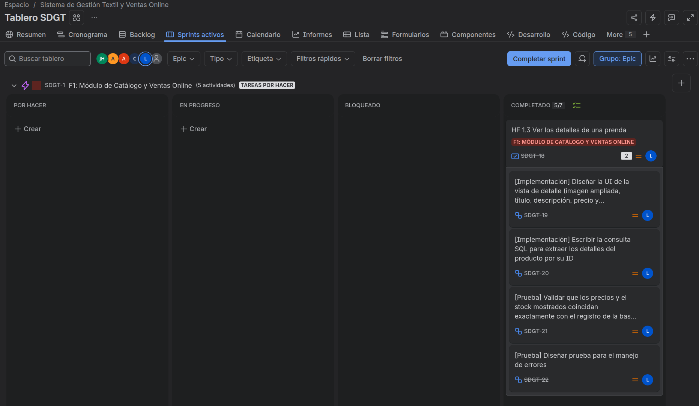 | 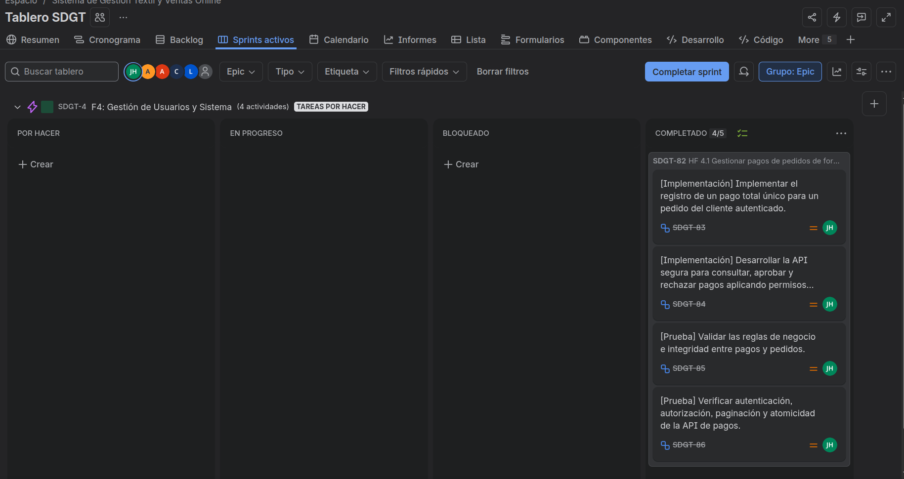 |
| 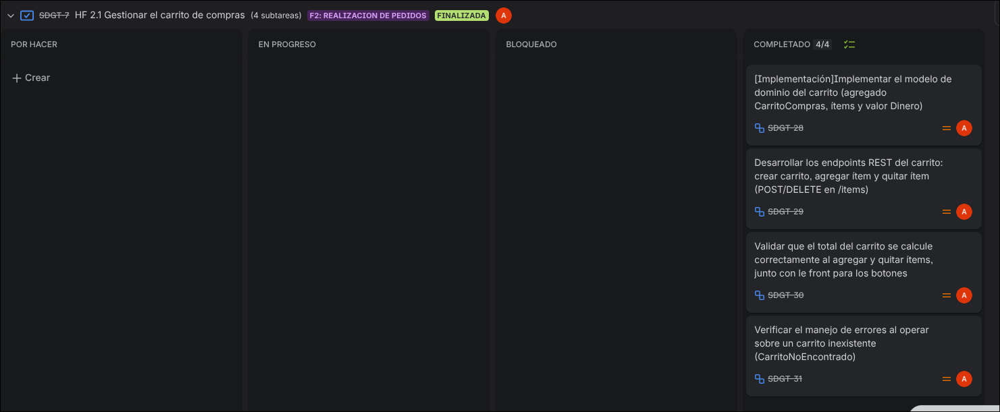| 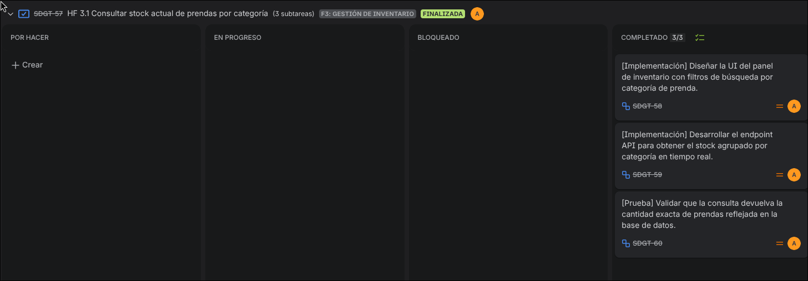|
| 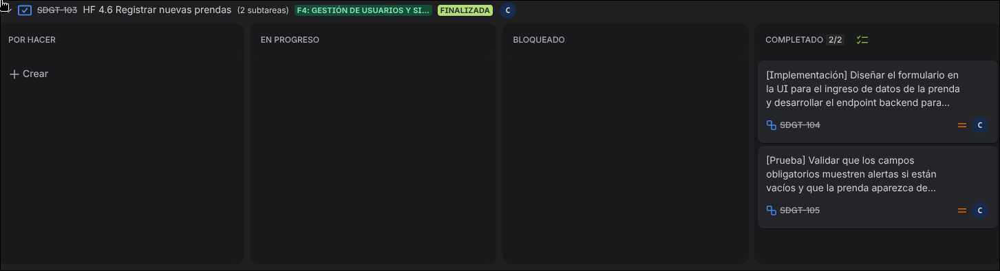| 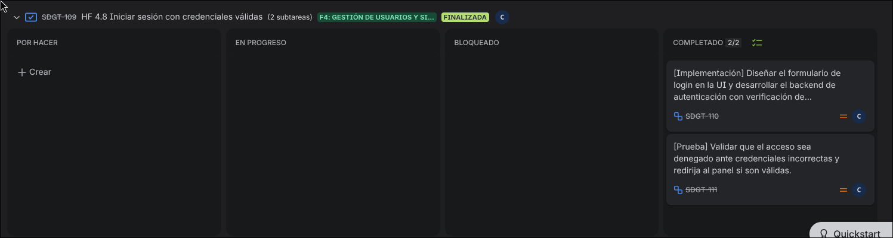|
### Mapa de tickets a evidencia

| Tickets | Nivel y alcance | Evidencia verificable en el repositorio |
| --- | --- | --- |
| `SDGT-18` | Historia: detalle de una prenda | `PrendaViewSet.retrieve`, `ProductPage` y `apps/catalogo/tests/test_consultar_detalle_prenda_api.py` |
| `SDGT-19` | Subtarea UI del detalle | `frontend/inventario/src/pages/CatalogPages.jsx`, ruta `/catalogo/:id` |
| `SDGT-20` | Subtarea consulta por identificador | `apps/catalogo/application/services.py`, repositorios y `PrendaViewSet.retrieve` |
| `SDGT-21` | Subtarea de exactitud de precio/stock | `apps/catalogo/tests/test_catalogo_seguro_api.py` y serialización de variantes |
| `SDGT-22` | Subtarea de errores | `apps/catalogo/tests/test_consultar_detalle_prenda_api.py`, `test_errores_catalogo.py` |
| `SDGT-82` | Historia: gestión de pagos | Agregado `Pago`, `ServicioPagos`, API y guía `docs/guias/javier-pagos.md` |
| `SDGT-83` | Registro de pago total único | `ServicioPagos.registrar_pago`, restricción por pedido y pruebas de servicio/API |
| `SDGT-84` | Consulta/aprobación/rechazo con permisos | `PagoViewSet.get_permissions`, acciones DRF y páginas React de pagos |
| `SDGT-85` | Reglas e integridad Pago-Pedido | `tests/pagos/test_pago_dominio.py`, `test_servicio_pagos.py`, `test_repositorio_pagos.py` |
| `SDGT-86` | Autenticación, paginación y atomicidad | `tests/pagos/test_api_pagos.py`, `select_for_update` y `transaction.atomic` inyectado |
| `SDGT-58` | Panel React | `frontend/inventario/`, ruta `/panel` y `docs/historias/SDGT-58-panel-inventario-react.md` |
| `SDGT-59` | Stock agrupado por categoría | Acción `por-categoria`, repositorio agrupado y `docs/historias/SDGT-59-stock-agrupado-categoria.md` |
| `SDGT-60` | Exactitud de stock agrupado | `apps/inventario/tests/test_stock_por_categoria.py` y `docs/historias/SDGT-60-pruebas-stock-agrupado.md` |
| `SDGT-61` | Actualización visual tras operar | `resource.reload()` en páginas React y `docs/historias/SDGT-61-actualizacion-panel.md` como trazabilidad histórica |
| `SDGT-62` a `SDGT-66` | Historia y subtareas de stock bajo | `StockVariante.esta_bajo_minimo`, endpoint, `LowStockPage`, reconciliación y `apps/inventario/tests/test_alertas_api.py`; detalle en `docs/guias/inventario/SDGT-62-alertas-stock-bajo.md` |
| `SDGT-67` a `SDGT-71` | Historia y subtareas de reporte | `ServicioReporteInventario`, descargas PDF/XLSX desde `InventoryPage` y `apps/inventario/tests/test_reportes_api.py`; detalle en `docs/guias/inventario/SDGT-67-reporte-inventario.md` |
| `SDGT-121` a `SDGT-123` | Historia y subtareas de actualización de stock | `ServicioInventario.registrar_ingreso/registrar_salida`, bloqueo de fila y pruebas; detalle en `docs/guias/inventario/SDGT-121-actualizacion-stock.md` |
| `SDGT-23` | Historia HF 1.4: realizar el pedido (F1 Módulo de catálogo y ventas) | `ServicioPedidos.generar_desde_carrito` en `apps/ventas/pedidos/application/services.py`, endpoint `/api/ventas/pedidos/` y `tests/ventas/test_api_carrito_pedidos.py::test_generar_pedido_reserva_y_cancelar_libera` |
| `SDGT-24` | Subtarea UI del carrito y botón de confirmación | `CartPage` en `frontend/inventario/src/pages/CustomerPages.jsx`, ruta protegida `/carrito` en `frontend/inventario/src/App.jsx` y botón «Confirmar pedido» que invoca `api.orders.create({ carrito_id })` |
| `SDGT-28` | Subtarea modelo de dominio del carrito (agregado `CarritoCompras`, ítems y valor `Dinero`) | `apps/ventas/carrito/domain/carrito.py` (`CarritoCompras`, `ItemCarrito`, `CarritoFactory`) y objeto de valor `apps/compartido/domain/dinero.py`; contratos en `apps/ventas/carrito/domain/repositorios.py` |
| `SDGT-29` | Subtarea endpoints REST del carrito: crear carrito, agregar y quitar ítem (`POST`/`DELETE` en `/items/`) | `CarritoViewSet.create` y la acción única `items` en `apps/ventas/carrito/presentation/views.py`, router en `presentation/urls.py`, casos de uso `ServicioCompras.crear_carrito/agregar_item/quitar_item` y cliente `api.carts.add/remove` en `frontend/inventario/src/services/api.js` |
| `SDGT-30` | Subtarea de validación del total al agregar y quitar ítems, con el front de los botones | `CarritoCompras.total()` e `ItemCarrito.subtotal()`, `tests/ventas/test_carrito_solid.py::test_agregar_item_acumula_cantidad_y_totaliza`, `tests/ventas/test_api_carrito_pedidos.py::test_precio_externo_se_ignora_y_se_usa_el_efectivo` y el resumen con botón «Quitar» de `CartPage` que recarga con `resource.reload()` |
| `SDGT-31` | Subtarea de manejo de errores sobre carrito inexistente (`CarritoNoEncontrado`) | `CarritoNoEncontradoError` en `apps/ventas/carrito/domain/errors.py`, guardas en `ServicioCompras._obtener_carrito` y `ConsultaCarritos.obtener`, mapeo a HTTP 404 en `presentation/errores.py` y `tests/ventas/test_carrito_solid.py::test_operar_sobre_carrito_inexistente_lanza_error_de_dominio` |

La captura demuestra agrupación por epic, sprint activo, responsables y finalización. El código y las pruebas constituyen la evidencia técnica; Jira constituye la evidencia de planificación y seguimiento.

<a id="repositorio"></a>
## 9. Repositorio y flujo Git

- HTTPS: [https://github.com/javierRock/SoftwareTextil](https://github.com/javierRock/SoftwareTextil)
- Clonado HTTPS: `https://github.com/javierRock/SoftwareTextil.git`
- Clonado SSH: `git@github.com:javierRock/SoftwareTextil.git`

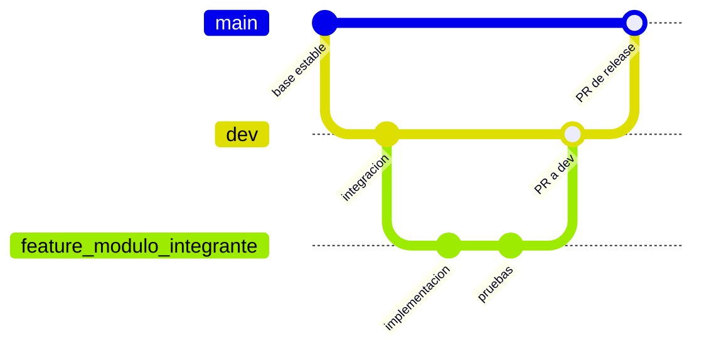
```mermaid
gitGraph
    commit id: "base estable"
    branch dev
    checkout dev
    commit id: "integracion"
    branch feature_modulo_integrante
    checkout feature_modulo_integrante
    commit id: "implementacion"
    commit id: "pruebas"
    checkout dev
    merge feature_modulo_integrante id: "PR a dev"
    checkout main
    merge dev id: "PR de release"
```

| Rama | Propósito | Regla |
| --- | --- | --- |
| `main` | Entrega estable | Recibe PR desde `dev` |
| `dev` | Integración del equipo | Recibe PR revisados desde `feature/*` |
| `feature/<modulo>-<integrante>` | Trabajo aislado por funcionalidad | Commits pequeños; sincronización previa con `dev` |

Flujo recomendado:

```bash
git switch feature/<modulo>-<integrante>
git fetch origin
git rebase origin/dev
git push origin feature/<modulo>-<integrante>
```

Cada PR debe enlazar el ticket, describir comportamiento y pruebas, ser revisado por otro integrante y no mezclar cambios ajenos. La convención de commit es `<tipo>: <descripción en infinitivo>`, con tipos `feat`, `fix`, `refactor`, `test` y `docs`. Detalle: [`docs/flujo_git.md`](docs/flujo_git.md).

<a id="instalacion"></a>
## 10. Instalación y ejecución

### Requisitos

- Git.
- Python 3.11 o superior y [`uv`](https://docs.astral.sh/uv/).
- Docker con Docker Compose para PostgreSQL 16.
- Node.js compatible con Vite 7 y `npm` con soporte para `npm ci`.

### Backend y base de datos

```bash
git clone https://github.com/javierRock/SoftwareTextil.git
cd SoftwareTextil
git switch dev
cp .env.example .env
uv sync
docker compose up -d db
uv run python manage.py migrate
uv run python manage.py sembrar_demo
```

`.env.example` apunta por defecto a `software_textil`, usuario `postgres`, contraseña `postgres`, host `localhost` y puerto `5432`. Estas credenciales son exclusivamente locales; deben sustituirse junto con `DJANGO_SECRET_KEY` en cualquier entorno no local.

### Frontend SPA

La instalación reproducible usa el lockfile existente y genera los archivos que Django sirve:

```bash
cd frontend/inventario
npm ci
npm run build
cd ../..
uv run python manage.py runserver
```

Aplicación integrada: `http://127.0.0.1:8000/`.

Para desarrollo con recarga de Vite, en otra terminal:

```bash
cd frontend/inventario
npm run dev
```

Vite queda en `http://127.0.0.1:5173/` y redirige `/api` y `/media` a Django.

### Usuarios de demostración

| Usuario | Rol | Contraseña predeterminada |
| --- | --- | --- |
| `admin` | Administrador | `Zuren2026!` |
| `inventario` | Encargado de inventario | `Zuren2026!` |
| `cliente` | Cliente | `Zuren2026!` |

> **Advertencia:** son credenciales públicas de demostración y solo deben usarse en desarrollo. `sembrar_demo --password '<otra-clave>'` permite reemplazarlas; el comando es idempotente.

### Validación de instalación

```bash
uv run python manage.py check
uv run python manage.py makemigrations --check --dry-run
uv run pytest
uv run ruff check .
cd frontend/inventario
npm test
npm run lint
npm run build
```

<a id="calidad"></a>
## 11. Pruebas y calidad

Los resultados registrados corresponden a la verificación local del 27-07-2026. Deben volver a ejecutarse y asociarse al commit final antes de la evaluación; las filas pendientes no se presentan como aprobadas.

| Control | Comando reproducible | Alcance | Resultado |
| --- | --- | --- | --- |
| Configuración Django | `uv run python manage.py check` | Settings, registro de apps y configuración del framework | Sin incidencias (27-07-2026) |
| Migraciones | `uv run python manage.py makemigrations --check --dry-run` | Diferencias entre modelos y migraciones | Sin cambios pendientes (27-07-2026) |
| Suite Python | `uv run pytest` | Dominio, aplicación, infraestructura, API e integración | 271 pruebas aprobadas (27-07-2026) |
| Pagos con cobertura | `uv run pytest tests/pagos --cov=apps/ventas/pagos --cov-branch` | Solo `apps/ventas/pagos` | Resultado a registrar por commit |
| Lint Python | `uv run ruff check .` | Reglas de `pyproject.toml` | Resultado a registrar por commit |
| Formato Python | `uv run ruff format --check .` | Formato reproducible | Resultado a registrar por commit |
| Pruebas cliente HTTP | `npm test` en `frontend/inventario` | Servicios JavaScript | 4 pruebas aprobadas (27-07-2026) |
| Lint React | `npm run lint` en `frontend/inventario` | JavaScript, JSX y reglas de hooks | Aprobado (27-07-2026) |
| Build SPA | `npm run build` en `frontend/inventario` | Compilación de producción Vite | Aprobado (27-07-2026) |

La cobertura con `fail_under = 85` está configurada en `pyproject.toml` **solo para `apps/ventas/pagos`**. No representa una cobertura global del repositorio. El análisis del IDE tampoco debe declararse sin ejecutar y adjuntar evidencia de la versión analizada.

### Restricción PostgreSQL

La suite usa `DJANGO_SETTINGS_MODULE = "config.settings.dev"` y el backend configurado es PostgreSQL. Las pruebas de `select_for_update`, `CheckConstraint`, índices parciales, unicidad y transacciones deben ejecutarse contra PostgreSQL; sustituirlo por SQLite cambia semántica y no valida los mismos riesgos de concurrencia e integridad.

### Estrategia de pruebas

| Nivel | Ejemplos |
| --- | --- |
| Dominio | Invariantes de `Prenda`, `StockVariante`, `CarritoCompras`, `Pedido`, `Pago` y `Despacho` |
| Aplicación | Reservas, propiedad, pago total, transacciones y coordinación entre contextos |
| Infraestructura | Mapeo ORM, restricciones SQL, bloqueo de filas y repositorios |
| API | Autenticación, roles, códigos HTTP, filtros, paginación y payloads estrictos |
| Frontend | Cliente HTTP, lint de hooks/componentes y build de producción |

<a id="tecnologias"></a>
## 12. Tecnologías

| Tecnología | Uso en el proyecto | Fuente de versión/configuración |
| --- | --- | --- |
| Python 3.11+ | Dominio y backend | `pyproject.toml` |
| Django 5+ | Aplicación web, configuración, ORM y migraciones | `pyproject.toml`, `config/` |
| Django REST Framework 3.15+ | API, serializers, ViewSets y permisos | `pyproject.toml` |
| PostgreSQL 16 | Persistencia relacional y concurrencia | `docker-compose.yml` |
| React 19 | SPA declarativa por componentes | `frontend/inventario/package.json` |
| React Router 7 | Rutas públicas/protegidas y navegación SPA | `frontend/inventario/src/App.jsx` |
| Vite 7 | Desarrollo y build del frontend | `frontend/inventario/package.json` |
| uv | Entorno, lock y ejecución Python | `uv.lock`, `pyproject.toml` |
| pytest / pytest-django / pytest-cov | Pruebas y cobertura localizada | `pyproject.toml`, `tests/`, `apps/*/tests/` |
| Ruff | PEP 8, lint de errores/seguridad y formato | `pyproject.toml` |
| ESLint | Calidad de JavaScript, JSX y hooks | `frontend/inventario/eslint.config.js` |
| Docker Compose | PostgreSQL local reproducible | `docker-compose.yml` |
| Mermaid | Diagramas *as-built* versionados como texto | `README.md` |
| StarUML | Evidencia UML histórica | `assets/figuras_uml/`, `assets/starUML_codigo/` |
| Jira | Planificación y seguimiento SDGT | tablero enlazado en este README |
| Git/GitHub | Versionado, ramas y Pull Requests | repositorio y `docs/flujo_git.md` |

<a id="referencias"></a>
## 13. Referencias

### Bibliografía y documentación técnica

- Evans, E. (2003). *Domain-Driven Design: Tackling Complexity in the Heart of Software*. Addison-Wesley.
- Martin, R. C. (2017). *Clean Architecture: A Craftsman's Guide to Software Structure and Design*. Prentice Hall.
- Martin, R. C. (2008). *Clean Code*. Prentice Hall.
- [Django documentation](https://docs.djangoproject.com/).
- [Django REST Framework documentation](https://www.django-rest-framework.org/).
- [PostgreSQL documentation](https://www.postgresql.org/docs/16/).
- [React documentation](https://react.dev/).
- [Vite documentation](https://vite.dev/guide/).
- [uv documentation](https://docs.astral.sh/uv/).
- [Mermaid documentation](https://mermaid.js.org/).
- [Citerus DDD Sample Core](https://github.com/citerus/dddsample-core).
- [Eclipse Cargo Tracker](https://github.com/eclipse-ee4j/cargotracker).

### Mapa de evidencias locales

| Documento/artefacto | Contenido |
| --- | --- |
| [`docs/modelo_dominio.md`](docs/modelo_dominio.md) | Lenguaje ubicuo, contextos y trazabilidad UML histórica |
| [`docs/arquitectura.md`](docs/arquitectura.md) | Capas, dependencias y decisiones arquitectónicas |
| [`docs/modelo_datos.md`](docs/modelo_datos.md) | Diseño PostgreSQL, restricciones y diccionario |
| [`docs/prototipo.md`](docs/prototipo.md) | Proceso de prototipado de interfaz |
| [`docs/guias/`](docs/guias/) | Evidencia técnica por integrante |
| [`docs/historias/`](docs/historias/) | Historias de inventario y criterios verificables |
| [`docs/flujo_git.md`](docs/flujo_git.md) | Política de ramas, commits y PR |
| [`assets/figuras_uml/`](assets/figuras_uml/) | Diagramas UML preservados |
| [`assets/figuras_casos_uso/`](assets/figuras_casos_uso/) | Casos de uso por actor |
| [`assets/figuras_prototipo/`](assets/figuras_prototipo/) | Capturas del prototipo |

---

La trazabilidad completa sigue la cadena **Jira → rama/PR → caso de uso → dominio/servicio → prueba → evidencia documental**.
