# 1. Tabla de Contenido

- [1. Tabla de Contenido](#1-tabla-de-contenido)
- [2. SoftwareTextil](#2-softwaretextil)
  - [2.1. Equipo e Integrantes](#21-equipo-e-integrantes)
  - [2.2. Propósito del Proyecto](#22-propósito-del-proyecto)
  - [2.3. Funcionalidades: Casos de Uso y Prototipo](#23-funcionalidades-casos-de-uso-y-prototipo)
  - [2.4. Modelo de Dominio](#24-modelo-de-dominio)
    - [2.4.1. Módulos del Dominio](#241-módulos-del-dominio)
    - [2.4.2. Diagramas de Clases por Módulo](#242-diagramas-de-clases-por-módulo)
  - [2.5. Visión General de Arquitectura](#25-visión-general-de-arquitectura)
    - [2.5.1. Arquitectura en Capas](#251-arquitectura-en-capas)
    - [2.5.2. DDD Táctico en el Código](#252-ddd-táctico-en-el-código)
    - [2.5.3. Estructura del Proyecto](#253-estructura-del-proyecto)
  - [2.6. Prácticas de Desarrollo Aplicadas](#26-prácticas-de-desarrollo-aplicadas)
    - [2.6.1. API de Pagos](#261-api-de-pagos)
  - [2.7. Flujo de Trabajo Git](#27-flujo-de-trabajo-git)
  - [2.8. Instalación](#28-instalación)
    - [2.8.1. Instalar uv](#281-instalar-uv)
    - [2.8.2. Preparar el entorno](#282-preparar-el-entorno)
    - [2.8.3. Ejecutar la aplicación](#283-ejecutar-la-aplicación)
    - [2.8.4. Verificar el estado del proyecto](#284-verificar-el-estado-del-proyecto)
  - [2.9. Tecnologías](#29-tecnologías)
  - [2.10. Documentación Complementaria](#210-documentación-complementaria)
  - [2.11. Trabajo Futuro](#211-trabajo-futuro)
  - [2.12. Referencias](#212-referencias)

# 2. SoftwareTextil

Sistema web para la gestión integral de una operación textil: catálogo de prendas, inventario, carrito de compras, pedidos y pagos, con administración de usuarios y roles.

El sistema fue modelado con UML en StarUML y está implementado en Python con **Domain-Driven Design (DDD)**, **arquitectura en capas**, **Django** como framework web MVC, **Django ORM** para persistencia, **Django REST Framework** para la API y `uv` como gestor de entorno y dependencias.

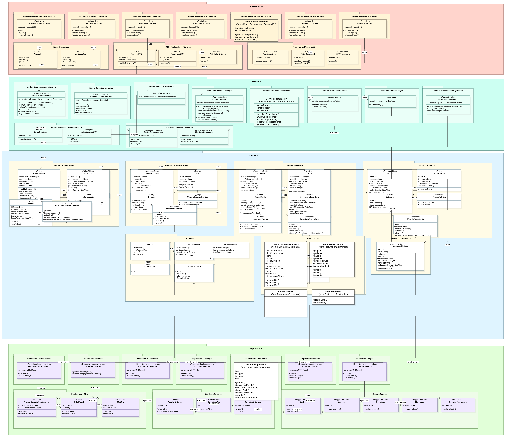

---

## 2.1. Equipo e Integrantes

**Equipo:** SoftwareTextil — Ingeniería de Software I (2026-B)

| Integrante                         | Módulo asignado       | Rama de trabajo                 |
| ---------------------------------- | --------------------- | ------------------------------- |
| Gutierrez Castilla, Carlos Enrique | Autenticación y Roles | `feature/autenticacion-carlos`  |
| Huayhua Perez, Lizzy Arlette       | Catálogo              | `feature/catalogo-lizzy`        |
| Condori Pallardel, Alejandro       | Inventario            | `feature/inventario-alejandro`  |
| Quispe Suarez, Angelo Josué        | Pedidos               | `feature/pedidos-angelo`        |
| Peñalva Humire, Javier Alonzo      | Pagos                 | `feature/pagos-javier`          |

Cada integrante desarrolla su módulo en su rama feature siguiendo su guía en [`docs/guias/`](docs/guias/). Ver [2.6. Prácticas de Desarrollo Aplicadas](#26-prácticas-de-desarrollo-aplicadas).

---

## 2.2. Propósito del Proyecto

SoftwareTextil permite administrar el flujo principal de una empresa textil, desde la publicación de prendas hasta el pago de los pedidos.

| Área           | Alcance                                             |
| -------------- | --------------------------------------------------- |
| Catálogo       | Registro de prendas, categorías y tipos de producto |
| Inventario     | Control de stock, movimientos y alertas             |
| E-commerce     | Carrito de compras, pedidos, historial y pagos      |
| Administración | Usuarios, roles, permisos y sesiones                |

---

## 2.3. Funcionalidades: Casos de Uso y Prototipo

Diagramas de casos de uso por actor:

| Actor                       | Diagrama                                                                     |
| --------------------------- | ---------------------------------------------------------------------------- |
| Cliente                     | 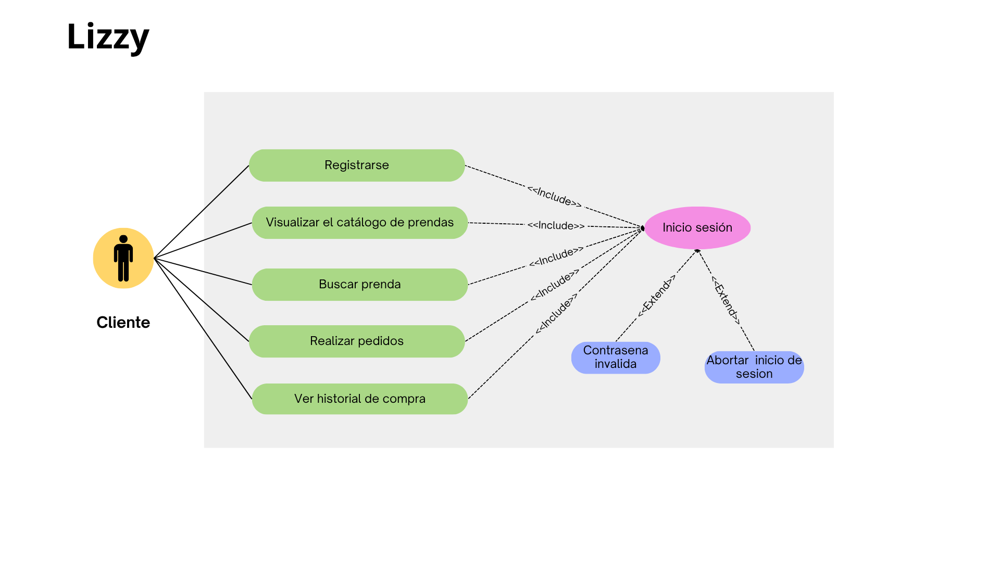                             |
| Administrador del sistema   | 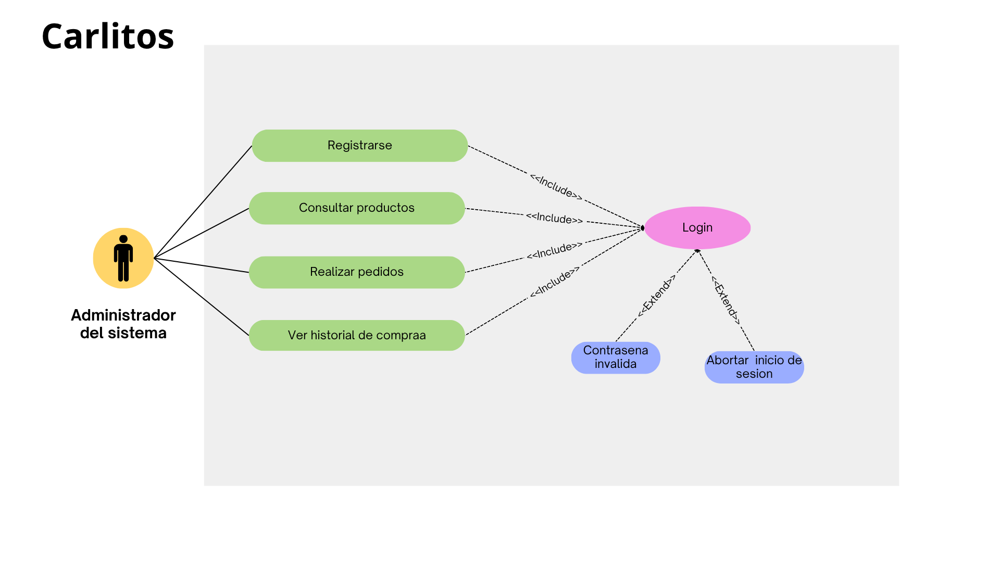         |
| Administrador de inventario | 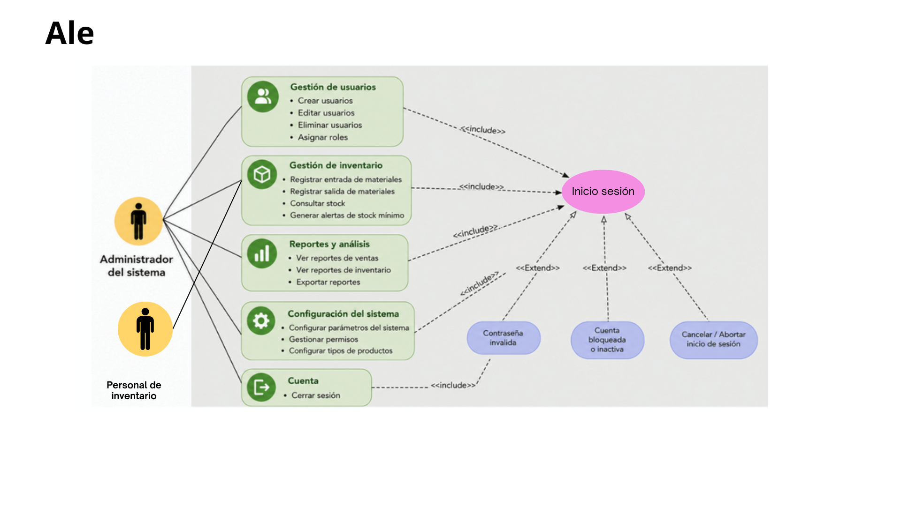    |

Prototipo de interfaz (capturas completas en [`docs/prototipo.md`](docs/prototipo.md)):

| Pantalla             | Captura                                                          |
| -------------------- | ---------------------------------------------------------------- |
| Login                | 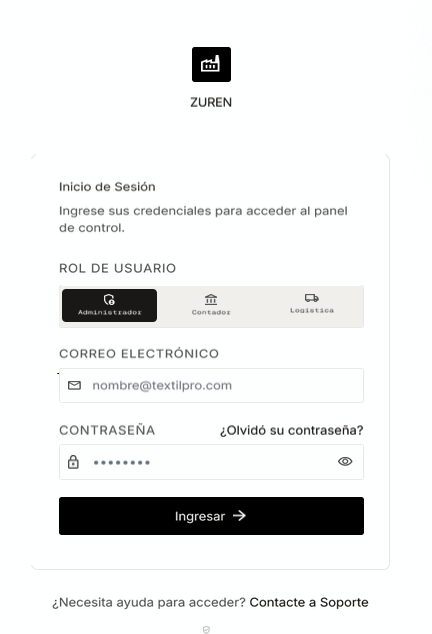                  |
| Catálogo de prendas  | 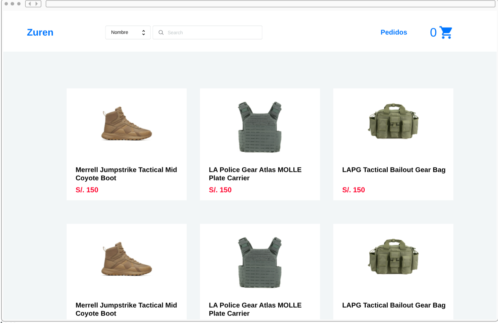  |
| Carrito de compras   | 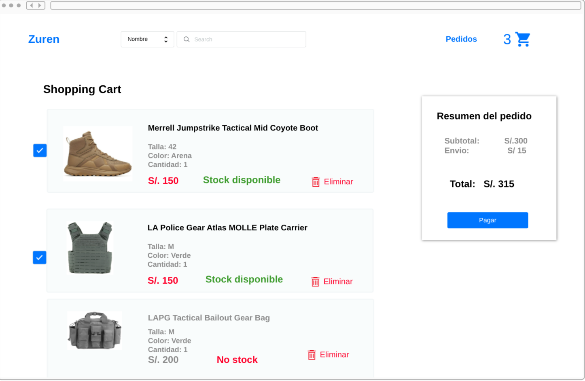      |
| Gestión de pedidos   | 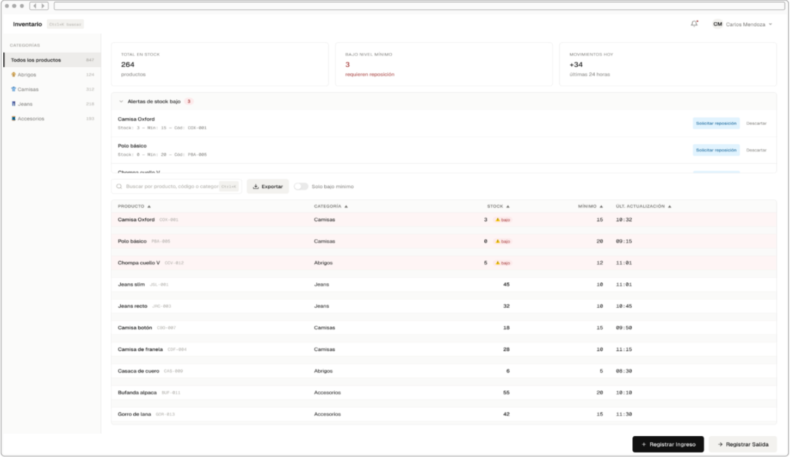 |

---

## 2.4. Modelo de Dominio

El modelo de dominio fue diseñado como diagramas de clases UML siguiendo las prácticas de DDD: entidades, objetos de valor, agregados, servicios de dominio, fábricas y repositorios. El lenguaje ubicuo y los contextos delimitados están en [`docs/modelo_dominio.md`](docs/modelo_dominio.md).

### 2.4.1. Módulos del Dominio

| Módulo                | Responsabilidad principal                             | App                    |
| --------------------- | ----------------------------------------------------- | ---------------------- |
| Autenticación y Roles | Credenciales, sesiones, usuarios, roles y permisos    | `apps/usuarios`        |
| Catálogo              | Prendas, categorías y tipos de producto               | `apps/catalogo`        |
| Inventario            | Stock, movimientos, alertas y consulta de existencias | `apps/inventario`      |
| Compras (carrito)     | Carrito de compras e items seleccionados              | `apps/ventas/carrito`  |
| Pedidos               | Generación, detalle e historial de pedidos            | `apps/ventas/pedidos`  |
| Pagos                 | Métodos de pago y procesamiento                       | `apps/ventas/pagos`    |
| Compartido            | Enums, objetos de valor y conceptos comunes           | `apps/compartido`      |

### 2.4.2. Diagramas de Clases por Módulo

**Autenticación**

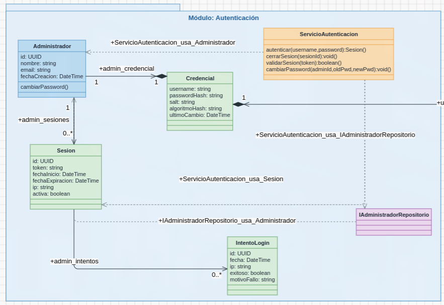

**Usuarios y Roles**

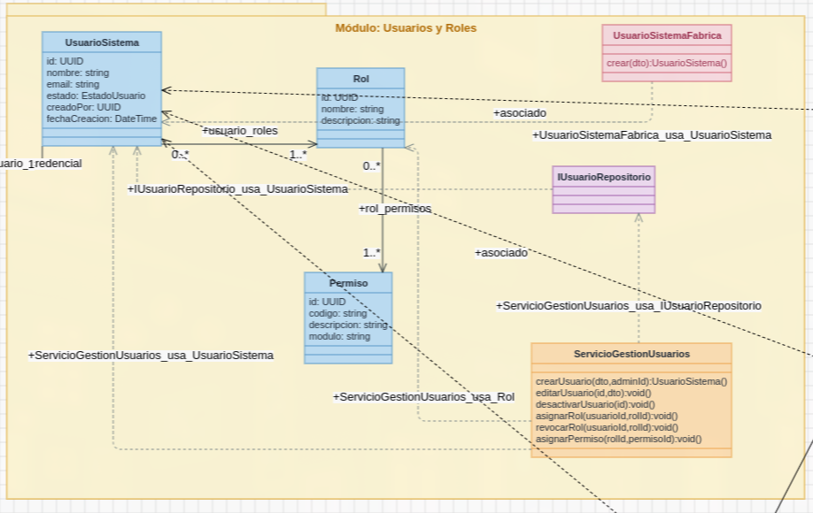

**Inventario**

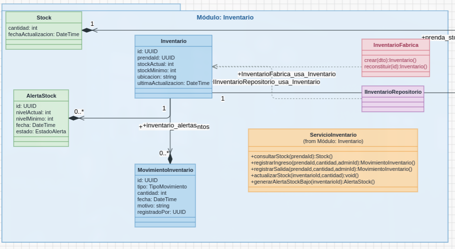

**Catálogo**

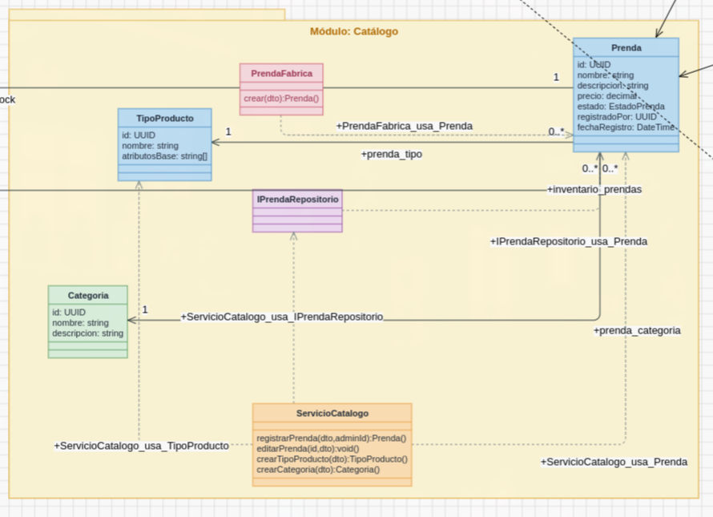

**Compras, Pedidos y Pagos**

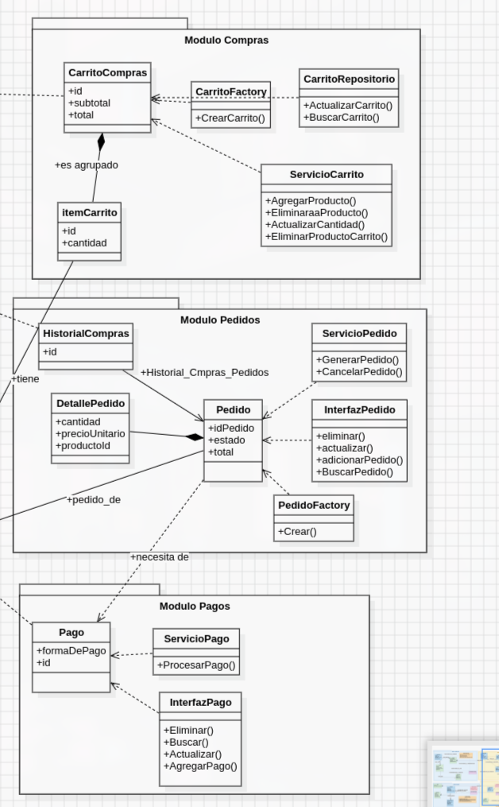

---

## 2.5. Visión General de Arquitectura

### 2.5.1. Arquitectura en Capas

El proyecto es un monolito modular con **Django** y **DDD**. Cada módulo conserva sus reglas de negocio en la capa de dominio y se comunica con las demás capas mediante servicios de aplicación y contratos de repositorio.

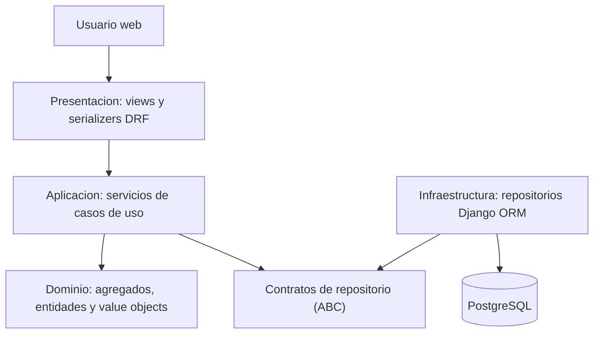
```mermaid
flowchart TD
    Web["Usuario web"] --> Controllers["Presentacion: views y serializers DRF"]
    Controllers --> Services["Aplicacion: servicios de casos de uso"]
    Services --> Domain["Dominio: agregados, entidades y value objects"]
    Services --> Ports["Contratos de repositorio (ABC)"]
    Repositories["Infraestructura: repositorios Django ORM"] --> Ports
    Repositories --> DB[("PostgreSQL")]
```

| Capa            | Responsabilidad                                                           | Carpeta por app   |
| --------------- | ------------------------------------------------------------------------- | ----------------- |
| Presentación    | Expone la API REST con Django REST Framework (views, serializers, urls)   | `presentation/`   |
| Aplicación      | Coordina casos de uso y orquesta el dominio                               | `application/`    |
| Dominio         | Reglas de negocio: entidades, agregados, objetos de valor y contratos     | `domain/`         |
| Infraestructura (Repositorio) | Persistencia con Django ORM y repositorios concretos        | `infrastructure/` |

### 2.5.2. DDD Táctico en el Código

| Elemento DDD          | Ejemplo en el código                                                              |
| --------------------- | --------------------------------------------------------------------------------- |
| Entidad               | `Usuario`, `Prenda`, `Rol` (`apps/*/domain/`)                                     |
| Objeto de Valor       | `Dinero`, `Periodo` (`apps/compartido/domain/`), `Stock` (`apps/inventario/domain/stock_prenda.py`) |
| Agregado              | `StockPrenda`, `CarritoCompras`, `Pedido`, `Pago`                                 |
| Servicio de Dominio/Aplicación | `ServicioAutenticacion`, `ServicioInventario`, `ServicioPedidos` (`apps/*/application/services.py`) |
| Fábrica               | `UsuarioSistemaFabrica`, `PrendaFabrica`, `PedidoFactory`, `PagoFactory`          |
| Repositorio           | Contratos ABC en `apps/*/domain/repositorios.py`; implementaciones Django ORM en `apps/*/infrastructure/repositories.py` |
| Módulos               | Una app Django por contexto: `usuarios`, `catalogo`, `inventario`, `ventas/{carrito,pedidos,pagos}`, `compartido` |

### 2.5.3. Estructura del Proyecto

```text
SoftwareTextil/
├── manage.py                      # Entry point de Django
├── config/                        # Proyecto Django
│   ├── settings/
│   │   ├── base.py                # PostgreSQL + INSTALLED_APPS + REST_FRAMEWORK
│   │   ├── dev.py                 # SQLite temporal para desarrollo
│   │   └── prod.py
│   ├── urls.py                    # Rutas raíz
│   ├── wsgi.py
│   └── asgi.py
├── apps/                          # Apps Django por módulo DDD
│   ├── usuarios/                  # Login, autenticación, roles
│   │   ├── domain/                # Entidades, agregados, VO, repositorios abstractos
│   │   ├── application/           # Servicios de aplicación y casos de uso
│   │   ├── infrastructure/        # Modelos Django ORM y repositorios concretos
│   │   └── presentation/          # Serializers, views y urls DRF
│   ├── catalogo/                  # Prendas, categorías, tipos
│   ├── inventario/                # Stock, movimientos, alertas
│   ├── ventas/                    # Flujo de venta
│   │   ├── carrito/               # Carrito de compras
│   │   ├── pedidos/               # Pedidos
│   │   └── pagos/                 # Pagos
│   └── compartido/                # Enums, VO y conceptos comunes
├── templates/                     # Plantillas Django
├── assets/                        # Diagramas UML, casos de uso y prototipo
├── docs/
│   ├── arquitectura.md
│   ├── modelo_dominio.md
│   ├── prototipo.md
│   ├── flujo_git.md               # Flujo de ramas del equipo
│   └── guias/                     # Guía de trabajo por integrante
├── tests/
├── pyproject.toml
├── uv.lock
└── README.md
```

---

## 2.6. Prácticas de Desarrollo Aplicadas

El Laboratorio 10 exige evidenciar **por lo menos cuatro estilos de programación**. Cada integrante documenta en su guía los requisitos que haya implementado, junto con sus prácticas de Clean Code y principios SOLID; no se presume el avance de módulos que no han sido verificados.

| Integrante | Módulo                | Guía de trabajo y evidencia                                            | Estilo de programación |
| ---------- | --------------------- | ---------------------------------------------------------------------- | ---------------------- |
| Carlos     | Autenticación y Roles | [`docs/guias/carlos-autenticacion.md`](docs/guias/carlos-autenticacion.md) | *(a declarar)*     |
| Lizzy      | Catálogo              | [`docs/guias/lizzy-catalogo.md`](docs/guias/lizzy-catalogo.md)         | *(a declarar)*         |
| Alejandro  | Inventario            | [`docs/guias/alejandro-inventario.md`](docs/guias/alejandro-inventario.md) | *(a declarar)*     |
| Angelo     | Pedidos               | [`docs/guias/angelo-pedidos.md`](docs/guias/angelo-pedidos.md)         | *(a declarar)*         |
| Javier     | Pagos                 | [`docs/guias/javier-pagos.md`](docs/guias/javier-pagos.md)             | Things, Error/Exception Handling, Persistent-Tables y RESTful |

Convenciones de codificación comunes a todo el equipo: PEP 8, nombres en español del lenguaje ubicuo, type hints y docstrings de módulo.

### 2.6.1. API de Pagos

El módulo de Javier registra un pago total por pedido. El cliente solo puede crear y consultar pagos propios; el administrador puede consultarlos y aprobarlos o rechazarlos. Aprobar un pago y marcar el pedido como pagado forman una sola transacción. El módulo no integra pasarelas ni acepta datos de tarjetas.

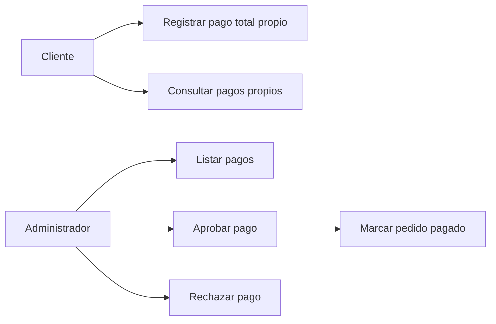
```mermaid
flowchart LR
    Cliente --> Registrar[Registrar pago total propio]
    Cliente --> Consultar[Consultar pagos propios]
    Administrador --> Listar[Listar pagos]
    Administrador --> Aprobar[Aprobar pago]
    Administrador --> Rechazar[Rechazar pago]
    Aprobar --> Pedido[Marcar pedido pagado]
```

| Método | Endpoint | Resultado |
| --- | --- | --- |
| `GET` | `/api/ventas/pagos/` | Lista paginada; acepta `pedido_id`, `pagina` y `tamano` |
| `POST` | `/api/ventas/pagos/` | Cliente: registra el pago total de un pedido propio |
| `GET` | `/api/ventas/pagos/<id>/` | Cliente propietario o administrador: obtiene un pago |
| `POST` | `/api/ventas/pagos/<id>/aprobar/` | Administrador: aprueba y marca el pedido pagado |
| `POST` | `/api/ventas/pagos/<id>/rechazar/` | Administrador: rechaza un pago pendiente |

La API requiere `Authorization: Bearer <token>`. Devuelve `401` sin autenticación, `403` sin autorización, `404` para recursos inexistentes y `409` para pagos duplicados o transiciones inválidas.

#### Modelo y paquetes de Pagos

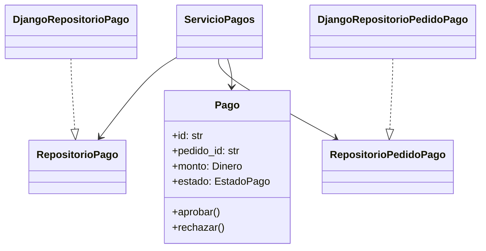
```mermaid
classDiagram
    class Pago {
        +id: str
        +pedido_id: str
        +monto: Dinero
        +estado: EstadoPago
        +aprobar()
        +rechazar()
    }
    class ServicioPagos
    class RepositorioPago
    class RepositorioPedidoPago
    class DjangoRepositorioPago
    class DjangoRepositorioPedidoPago
    ServicioPagos --> RepositorioPago
    ServicioPagos --> RepositorioPedidoPago
    ServicioPagos --> Pago
    DjangoRepositorioPago ..|> RepositorioPago
    DjangoRepositorioPedidoPago ..|> RepositorioPedidoPago
```

#### Convenciones y Clean Code

Se emplean nombres del lenguaje ubicuo, type hints y funciones enfocadas. La presentación no conoce modelos ORM y el contrato expresa la intención de cada operación:

```python
class RepositorioPago(ABC):
    @abstractmethod
    def crear(self, pago: Pago) -> None: ...

    @abstractmethod
    def actualizar_estado(self, pago: Pago) -> None: ...
```

Los errores esperados tienen código estable y se traducen en un solo lugar:

```python
class PagoPedidoDuplicado(ErrorPago):
    codigo = "pago_pedido_duplicado"
```

#### Principios SOLID

**SRP:** cada capa posee una razón de cambio; `PagoViewSet` adapta HTTP, `ServicioPagos` coordina y `DjangoRepositorioPago` persiste.

```python
def __init__(
    self,
    repositorio_pago: RepositorioPago,
    repositorio_pedido: RepositorioPedidoPago,
    unidad_trabajo: FabricaUnidadTrabajo,
) -> None:
```

**OCP:** una política nueva se registra sin modificar el agregado ni el servicio.

```python
class PoliticaReferenciaPago(ABC):
    @abstractmethod
    def validar(self, metodo: MetodoPago, referencia: str) -> str: ...
```

**LSP:** los adaptadores Django y los fakes de pruebas implementan los mismos contratos y son sustituibles.

```python
class DjangoRepositorioPago(RepositorioPago):
    def crear(self, pago: Pago) -> None: ...
```

**DIP:** el caso de uso depende de `RepositorioPago` y `RepositorioPedidoPago`, nunca del ORM. La infraestructura concreta se ensambla únicamente en presentación.

La evidencia completa de los Laboratorios 9, 10, 11 y 12 está en la [guía de pagos de Javier](docs/guias/javier-pagos.md). El estado verificable y los pasos manuales de SonarLint están en el [reporte de pagos](docs/reportes/sonarlint-pagos.md).

---

## 2.7. Flujo de Trabajo Git

El equipo sigue el flujo de ramas del proyecto final (ver detalle en [`docs/flujo_git.md`](docs/flujo_git.md)):

```text
main  ←  dev  ←  feature/<modulo>-<integrante>
```

- Cada integrante trabaja **solo** en su rama `feature/*`.
- Los cambios se integran a `dev` mediante Pull Request revisado por otro integrante.
- `dev` se sincroniza hacia las ramas feature con merge o rebase.
- `main` solo recibe merges desde `dev` (releases estables).

---

## 2.8. Instalación

El proyecto usa `uv` para gestionar Python, el entorno virtual y las dependencias. `pyproject.toml` define las dependencias y `uv.lock` fija versiones reproducibles.

### 2.8.1. Instalar uv

```bash
curl -LsSf https://astral.sh/uv/install.sh | sh
```

En Windows PowerShell:

```powershell
irm https://astral.sh/uv/install.ps1 | iex
```

### 2.8.2. Preparar el entorno

```bash
git clone git@github.com:javierRock/SoftwareTextil.git
cd SoftwareTextil
git checkout dev
uv sync
```

### 2.8.3. Ejecutar la aplicación

```bash
uv run python manage.py migrate
uv run python manage.py runserver
```

La aplicación queda disponible en `http://127.0.0.1:8000/`.

### 2.8.4. Verificar el estado del proyecto

```bash
uv run python manage.py check
uv run python manage.py makemigrations
```

> **Nota sobre la base de datos:** `config/settings/base.py` usa **PostgreSQL** como motor de producción. Para desarrollo, `config/settings/dev.py` usa **SQLite** como fallback temporal hasta que PostgreSQL esté disponible en el entorno local.

---

## 2.9. Tecnologías

| Tecnología              | Uso                               |
| ----------------------- | --------------------------------- |
| Python 3.11+            | Lenguaje principal                |
| VS Code                 | IDE                               |
| Django 5.2+             | Framework web MVC                 |
| Django REST Framework   | API REST (serializers, viewsets)  |
| Django ORM              | Persistencia y mapeo ORM          |
| PostgreSQL              | Base de datos relacional          |
| uv                      | Gestión de entorno y dependencias |
| pytest + pytest-django + pytest-cov | Pruebas y cobertura       |
| Ruff                    | Lint y formato                    |
| StarUML                 | Modelado UML                      |
| Mermaid                 | Diagramas en Markdown             |

---

## 2.10. Documentación Complementaria

| Documento                                          | Contenido                                          |
| -------------------------------------------------- | -------------------------------------------------- |
| [`docs/modelo_dominio.md`](docs/modelo_dominio.md) | Lenguaje ubicuo, contextos delimitados y agregados |
| [`docs/arquitectura.md`](docs/arquitectura.md)     | Capas, dependencias y estructura técnica           |
| [`docs/prototipo.md`](docs/prototipo.md)           | Pantallas del prototipo y flujo de interfaz        |
| [`docs/flujo_git.md`](docs/flujo_git.md)           | Flujo de ramas, convenciones de commits y PRs      |
| [`docs/guias/`](docs/guias/)                       | Guía de trabajo y evidencia por integrante         |
| [`docs/reportes/sonarlint-pagos.md`](docs/reportes/sonarlint-pagos.md) | Estado y pasos de análisis SonarLint de pagos |

---

## 2.11. Trabajo Futuro

Módulos modelados en UML pero fuera del alcance de esta entrega: **Despachos** (guías de remisión), **Contabilidad** (ingresos, egresos, cierre contable) y **Facturación electrónica** (SUNAT). Sus diagramas de referencia:

- 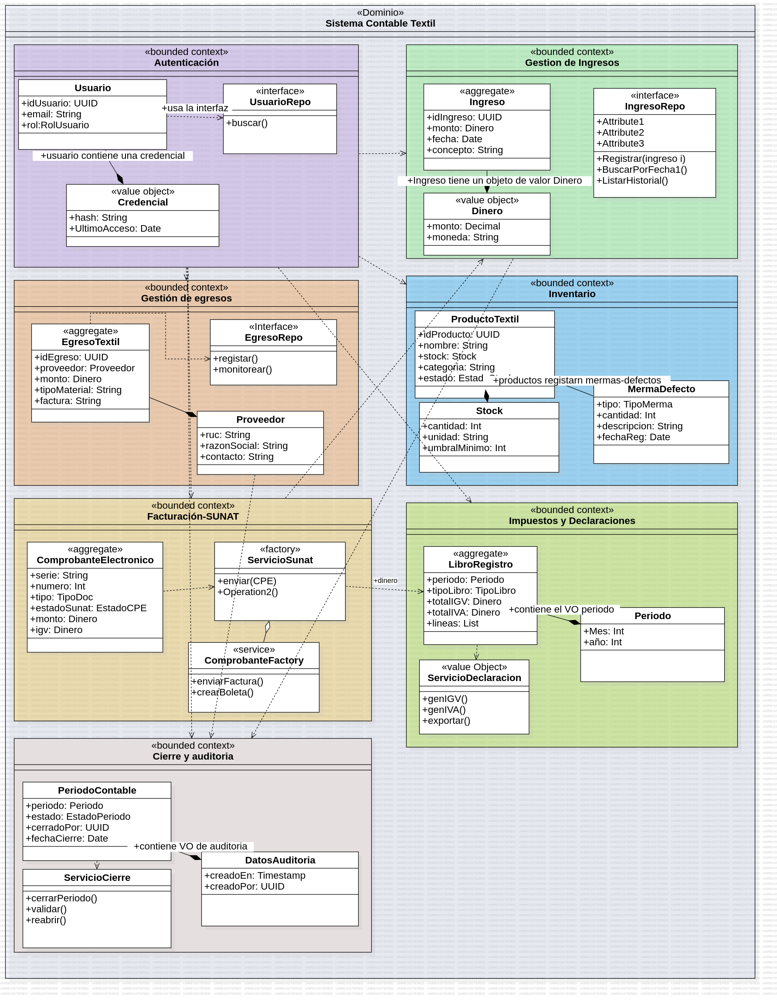
- 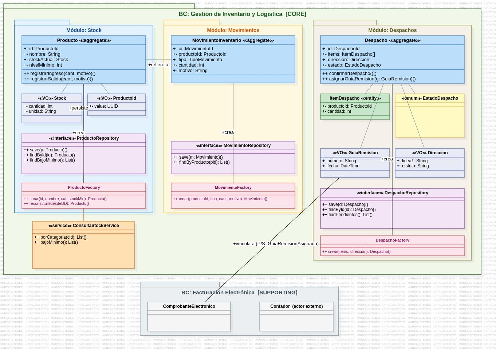

---

## 2.12. Referencias

- Evans, E. _Domain-Driven Design_.
- [Citerus DDD Sample Core](https://github.com/citerus/dddsample-core).
- [Modern DDD Cargo Tracker](https://github.com/eclipse-ee4j/cargotracker).
