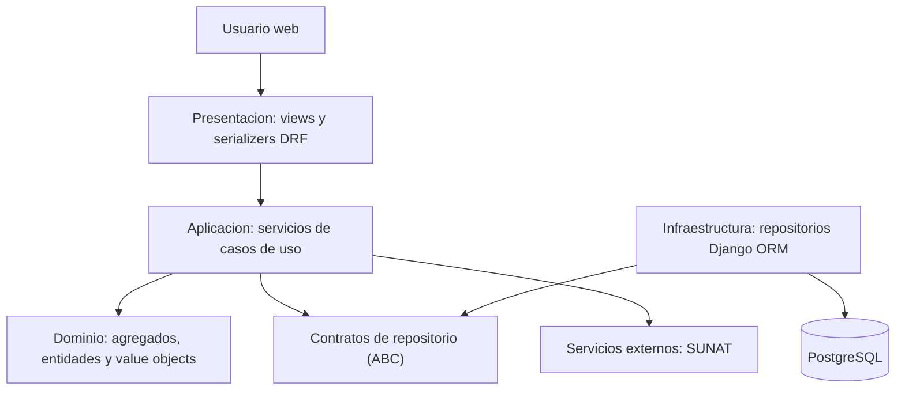

# 1. Tabla de Contenido

- [1. Tabla de Contenido](#1-tabla-de-contenido)
- [2. SoftwareTextil](#2-softwaretextil)
  - [2.1. Integrantes](#21-integrantes)
  - [2.2. Alcance](#22-alcance)
  - [2.3. Arquitectura](#23-arquitectura)
  - [2.4. Módulos Del Dominio](#24-módulos-del-dominio)
  - [2.5. Modelo de Dominio](#25-modelo-de-dominio)
    - [2.5.1. Autenticación](#251-autenticación)
    - [2.5.2. Usuarios y Roles](#252-usuarios-y-roles)
    - [2.5.3. Inventario](#253-inventario)
    - [2.5.4. Catálogo](#254-catálogo)
    - [2.5.5. Compras, Pedidos y Pagos](#255-compras-pedidos-y-pagos)
    - [2.5.6. Sistema Contable Textil](#256-sistema-contable-textil)
    - [2.5.7. Encargado de Inventario y Logística](#257-encargado-de-inventario-y-logística)
  - [2.6. Estructura Del Proyecto](#26-estructura-del-proyecto)
  - [2.7. Instalación](#27-instalación)
    - [2.7.1. Instalar uv](#271-instalar-uv)
    - [2.7.2. Preparar el entorno](#272-preparar-el-entorno)
    - [2.7.3. Ejecutar la aplicación](#273-ejecutar-la-aplicación)
    - [2.7.4. Verificar el estado del proyecto](#274-verificar-el-estado-del-proyecto)
  - [2.8. Tecnologías](#28-tecnologías)
  - [2.9. Documentación Complementaria](#29-documentación-complementaria)
  - [2.10. Referencias](#210-referencias)

# 2. SoftwareTextil

Sistema web para la gestión integral de una operación textil. El proyecto cubre catálogo de prendas, inventario, pedidos, despachos, ingresos, egresos y cierre contable.

El sistema fue modelado con UML en StarUML y organizado en Python con **Domain-Driven Design (DDD)**, arquitectura en capas, **Django** como framework web MVC, **Django ORM** para persistencia, **Django REST Framework** para la API y `uv` como gestor de entorno y dependencias.


---

## 2.1. Integrantes

| Integrante                         |
| ---------------------------------- |
| Condori Pallardel, Emilio          |
| Gutierrez Castilla, Carlos Enrique |
| Huayhua Perez, Lizzy Arlette       |
| Peñalva Humire, Javier Alonzo      |
| Quispe Suarez, Angelo Josué        |

---

## 2.2. Alcance

SoftwareTextil permite administrar el flujo principal de una empresa textil desde la publicación de prendas hasta el registro contable de la operación.

| Área           | Alcance                                                       |
| -------------- | ------------------------------------------------------------- |
| Catálogo       | Registro de prendas, categorías y tipos de producto           |
| Inventario     | Control de stock, movimientos, alertas y despachos            |
| E-commerce     | Carrito de compras, pedidos, historial y pagos                |
| Administración | Usuarios, roles, permisos, sesiones y configuración           |
| Contabilidad   | Ingresos, egresos, impuestos, declaraciones y cierre contable |
| Facturación    | Comprobantes electrónicos y comunicación con SUNAT            |

---

## 2.3. Arquitectura

El proyecto usa un monolito modular con **Django** y **Domain-Driven Design (DDD)**. Cada módulo conserva sus reglas de negocio dentro del dominio y se comunica con las demás capas mediante servicios y contratos de repositorio.


```mermaid
flowchart TD
    Web["Usuario web"] --> Controllers["Presentacion: views y serializers DRF"]
    Controllers --> Services["Aplicacion: servicios de casos de uso"]
    Services --> Domain["Dominio: agregados, entidades y value objects"]
    Services --> Ports["Contratos de repositorio (ABC)"]
    Repositories["Infraestructura: repositorios Django ORM"] --> Ports
    Repositories --> DB[("PostgreSQL")]
    Services --> External["Servicios externos: SUNAT"]
```

| Capa            | Responsabilidad                                                           |
| --------------- | ------------------------------------------------------------------------- |
| Presentación    | Expone la API REST con Django REST Framework (views, serializers)         |
| Aplicación      | Coordina casos de uso y DTOs                                              |
| Dominio         | Contiene reglas de negocio, agregados, objetos de valor y contratos       |
| Infraestructura | Implementa persistencia con Django ORM, repositorios y servicios externos |

---

## 2.4. Módulos Del Dominio

| Módulo           | Responsabilidad principal                             |
| ---------------- | ----------------------------------------------------- |
| Autenticación    | Credenciales, sesiones e intentos de inicio de sesión |
| Usuarios y roles | Usuarios del sistema, roles y permisos                |
| Catálogo         | Prendas, categorías y tipos de producto               |
| Inventario       | Stock, movimientos, alertas y consulta de existencias |
| Compras          | Carrito de compras e items seleccionados              |
| Pedidos          | Generación, detalle e historial de pedidos            |
| Pagos            | Métodos de pago y procesamiento                       |
| Despachos        | Preparación, confirmación y guía de remisión          |
| Contabilidad     | Ingresos, egresos, impuestos y cierre contable        |
| Facturación      | Comprobantes electrónicos y envío a SUNAT             |
| Compartido       | Enums, objetos de valor y conceptos comunes           |

---

## 2.5. Modelo de Dominio

El modelo de dominio fue diseñado como un diagrama de clases UML siguiendo las prácticas de DDD: entidades, objetos de valor, agregados, servicios de dominio y sus relaciones.

### 2.5.1. Autenticación


### 2.5.2. Usuarios y Roles


### 2.5.3. Inventario


### 2.5.4. Catálogo


### 2.5.5. Compras, Pedidos y Pagos


### 2.5.6. Sistema Contable Textil


### 2.5.7. Encargado de Inventario y Logística


---

## 2.6. Estructura Del Proyecto

```text
SoftwareTextil/
├── manage.py                      # Entry point de Django
├── config/                        # Proyecto Django
│   ├── settings/
│   │   ├── base.py                # PostgreSQL + INSTALLED_APPS + REST_FRAMEWORK
│   │   ├── dev.py                 # SQLite temporal para desarrollo
│   │   └── prod.py
│   ├── urls.py                    # Rutas raíz
│   ├── wsgi.py
│   └── asgi.py
├── apps/                          # Apps Django por módulo DDD (MVP)
│   ├── usuarios/                  # Login, autenticación, roles
│   │   ├── domain/                # Entidades, agregados, VO, repositorios abstractos
│   │   ├── application/           # Servicios de aplicación y casos de uso
│   │   ├── infrastructure/        # Modelos Django ORM y repositorios concretos
│   │   └── presentation/          # Serializers, views y urls DRF
│   ├── catalogo/                  # Prendas, categorías, tipos
│   ├── inventario/                # Stock, movimientos, alertas
│   ├── ventas/                    # Flujo de venta
│   │   ├── carrito/               # Carrito de compras
│   │   ├── pedidos/               # Pedidos
│   │   └── pagos/                 # Pagos
│   └── compartido/                # Enums, VO y conceptos comunes
├── templates/                     # Plantillas Django
├── assets/
│   ├── Diagramas_uml/             # Archivos fuente StarUML (.mdj)
│   ├── figuras_uml/               # Exportaciones de diagramas UML
│   ├── figuras_casos_uso/         # Diagramas de casos de uso
│   ├── figuras_prototipo/         # Capturas del prototipo
│   └── starUML_codigo/            # Codigo generado por StarUML como referencia
├── docs/
│   ├── arquitectura.md
│   ├── modelo_dominio.md
│   └── prototipo.md
├── tests/
├── pyproject.toml
├── uv.lock
└── README.md
```

Cada app contiene las 4 capas DDD:

| Capa              | Contenido                                                     |
| ----------------- | ------------------------------------------------------------- |
| `domain/`         | Entidades, agregados, value objects y repositorios abstractos |
| `application/`    | Servicios de aplicación y casos de uso                        |
| `infrastructure/` | Modelos Django ORM y repositorios concretos                   |
| `presentation/`   | Serializers, views y urls de Django REST Framework            |

---

## 2.7. Instalación

El proyecto usa `uv` para gestionar Python, el entorno virtual y las dependencias. `pyproject.toml` define las dependencias y `uv.lock` fija versiones reproducibles.

### 2.7.1. Instalar uv

```bash
curl -LsSf https://astral.sh/uv/install.sh | sh
```

En Windows PowerShell:

```powershell
irm https://astral.sh/uv/install.ps1 | iex
```

### 2.7.2. Preparar el entorno

```bash
git clone git@github.com:javierRock/SoftwareTextil.git
cd SoftwareTextil
git checkout angel_back-end
uv sync
```

### 2.7.3. Ejecutar la aplicación

```bash
uv run python manage.py migrate
uv run python manage.py runserver
```

La aplicación queda disponible en `http://127.0.0.1:8000/`.

### 2.7.4. Verificar el estado del proyecto

```bash
uv run python manage.py check
uv run python manage.py makemigrations
```

> **Nota sobre la base de datos:** `config/settings/base.py` usa **PostgreSQL** como motor de producción. Para desarrollo, `config/settings/dev.py` usa **SQLite** como fallback temporal hasta que PostgreSQL esté disponible en el entorno local.

---

## 2.8. Tecnologías

| Tecnología             | Uso                               |
| ---------------------- | --------------------------------- |
| Python 3.11+           | Lenguaje principal                |
| VS Code                | IDE                               |
| Django 5.0             | Framework web MVC                 |
| Django REST Framework  | API REST (serializers, viewsets)  |
| Django ORM             | Persistencia y mapeo ORM          |
| PostgreSQL             | Base de datos relacional          |
| uv                     | Gestión de entorno y dependencias |
| pytest + pytest-django | Pruebas                           |
| StarUML                | Modelado UML                      |
| Mermaid                | Diagramas en Markdown             |

---

## 2.9. Documentación Complementaria

| Documento                                          | Contenido                                          |
| -------------------------------------------------- | -------------------------------------------------- |
| [`docs/modelo_dominio.md`](docs/modelo_dominio.md) | Lenguaje ubicuo, contextos delimitados y agregados |
| [`docs/arquitectura.md`](docs/arquitectura.md)     | Capas, dependencias y estructura técnica           |
| [`docs/prototipo.md`](docs/prototipo.md)           | Pantallas del prototipo y flujo de interfaz        |

---

## 2.10. Referencias

- Evans, E. _Domain-Driven Design_.
- [Citerus DDD Sample Core](https://github.com/citerus/dddsample-core).
- [Modern DDD Cargo Tracker](https://github.com/eclipse-ee4j/cargotracker).
