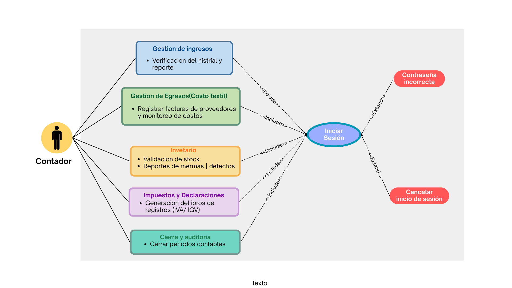
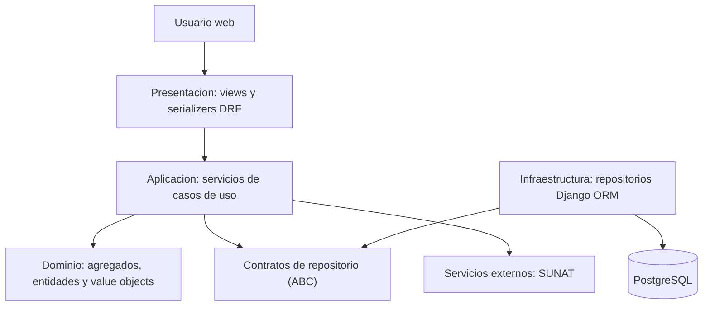

# 1. Tabla de Contenido

- [1. Tabla de Contenido](#1-tabla-de-contenido)
- [2. SoftwareTextil](#2-softwaretextil)
  - [2.1. Integrantes](#21-integrantes)
  - [2.2. Alcance](#22-alcance)
    - [2.2.1. Funcionalidades de Alto Nivel (Casos de Uso)](#221-funcionalidades-de-alto-nivel-casos-de-uso)
    - [2.2.2. Prototipo (GUI)](#222-prototipo-gui)
  - [2.3. Arquitectura](#23-arquitectura)
  - [2.4. Módulos Del Dominio](#24-módulos-del-dominio)
  - [2.5. Modelo de Dominio](#25-modelo-de-dominio)
    - [2.5.1. Autenticación](#251-autenticación)
    - [2.5.2. Usuarios y Roles](#252-usuarios-y-roles)
    - [2.5.3. Inventario](#253-inventario)
    - [2.5.4. Catálogo](#254-catálogo)
    - [2.5.5. Compras, Pedidos y Pagos](#255-compras-pedidos-y-pagos)
    - [2.5.6. Sistema Contable Textil](#256-sistema-contable-textil)
    - [2.5.7. Encargado de Inventario y Logística](#257-encargado-de-inventario-y-logística)
  - [2.6. Estructura Del Proyecto](#26-estructura-del-proyecto)
  - [2.7. Convenciones de Codificación](#27-convenciones-de-codificación)
  - [2.8. Estilos de Codificación](#28-estilos-de-codificación)
  - [2.9. Prácticas Clean Code](#29-prácticas-clean-code)
    - [2.9.1. Nombres](#291-nombres)
    - [2.9.2. Funciones](#292-funciones)
    - [2.9.3. Comentarios](#293-comentarios)
    - [2.9.4. Estructura del Código Fuente](#294-estructura-del-código-fuente)
    - [2.9.5. Objetos y Estructuras de Datos](#295-objetos-y-estructuras-de-datos)
    - [2.9.6. Tratamiento de Errores](#296-tratamiento-de-errores)
    - [2.9.7. Clases](#297-clases)
  - [2.10. Principios SOLID](#210-principios-solid)
    - [2.10.1. SRP — Principio de Responsabilidad Única](#2101-srp--principio-de-responsabilidad-única)
    - [2.10.2. OCP — Principio Abierto/Cerrado](#2102-ocp--principio-abiertocerrado)
    - [2.10.3. LSP — Principio de Sustitución de Liskov](#2103-lsp--principio-de-sustitución-de-liskov)
    - [2.10.4. ISP — Principio de Segregación de Interfaces](#2104-isp--principio-de-segregación-de-interfaces)
    - [2.10.5. DIP — Principio de Inversión de Dependencias](#2105-dip--principio-de-inversión-de-dependencias)
    - [2.10.6. Verificación](#2106-verificación)
  - [2.11. Instalación](#211-instalación)
    - [2.11.1. Instalar uv](#2111-instalar-uv)
    - [2.11.2. Preparar el entorno](#2112-preparar-el-entorno)
    - [2.11.3. Ejecutar la aplicación](#2113-ejecutar-la-aplicación)
    - [2.11.4. Verificar el estado del proyecto](#2114-verificar-el-estado-del-proyecto)
  - [2.12. Tecnologías](#212-tecnologías)
  - [2.13. Documentación Complementaria](#213-documentación-complementaria)
  - [2.14. Referencias](#214-referencias)

# 2. SoftwareTextil

Sistema web para la gestión integral de una operación textil. El proyecto cubre catálogo de prendas, inventario, pedidos, despachos, ingresos, egresos y cierre contable.

El sistema fue modelado con UML en StarUML y organizado en Python con **Domain-Driven Design (DDD)**, arquitectura en capas, **Django** como framework web MVC, **Django ORM** para persistencia, **Django REST Framework** para la API y `uv` como gestor de entorno y dependencias.


---

## 2.1. Integrantes

| Integrante                         |
| ---------------------------------- |
| Condori Pallardel, Emilio          |
| Gutierrez Castilla, Carlos Enrique |
| Huayhua Perez, Lizzy Arlette       |
| Peñalva Humire, Javier Alonzo      |
| Quispe Suarez, Angelo Josué        |

---

## 2.2. Alcance

SoftwareTextil permite administrar el flujo principal de una empresa textil desde la publicación de prendas hasta el registro contable de la operación.

| Área           | Alcance                                                       |
| -------------- | ------------------------------------------------------------- |
| Catálogo       | Registro de prendas, categorías y tipos de producto           |
| Inventario     | Control de stock, movimientos, alertas y despachos            |
| E-commerce     | Carrito de compras, pedidos, historial y pagos                |
| Administración | Usuarios, roles, permisos, sesiones y configuración           |
| Contabilidad   | Ingresos, egresos, impuestos, declaraciones y cierre contable |
| Facturación    | Comprobantes electrónicos y comunicación con SUNAT            |

### 2.2.1. Funcionalidades de Alto Nivel (Casos de Uso)

Los casos de uso están agrupados por actor. El módulo cubierto en esta rama —carrito y pedidos— corresponde al actor **Cliente**.

| Actor                     | Funcionalidades                                                              | Diagrama                                                                            |
| ------------------------- | ---------------------------------------------------------------------------- | ----------------------------------------------------------------------------------- |
| Cliente                   | Navegar el catálogo, gestionar su carrito, generar y seguir pedidos, pagar   |                     |
| Administrador de sistema  | Gestionar usuarios, roles, permisos y configuración                          |  |
| Administrador de inventario | Registrar ingresos y salidas, atender alertas y emitir guías de remisión   |  |
| Contador                  | Registrar ingresos y egresos, declarar impuestos y cerrar el periodo         |                   |

### 2.2.2. Prototipo (GUI)

| Pantalla            | Prototipo                                                                     |
| ------------------- | ----------------------------------------------------------------------------- |
| Catálogo de prendas |    |
| Carrito de compras  |          |
| Gestión de pedidos  |    |

El recorrido completo de pantallas está en [`docs/prototipo.md`](docs/prototipo.md).

---

## 2.3. Arquitectura

El proyecto usa un monolito modular con **Django** y **Domain-Driven Design (DDD)**. Cada módulo conserva sus reglas de negocio dentro del dominio y se comunica con las demás capas mediante servicios y contratos de repositorio.


```mermaid
flowchart TD
    Web["Usuario web"] --> Controllers["Presentacion: views y serializers DRF"]
    Controllers --> Services["Aplicacion: servicios de casos de uso"]
    Services --> Domain["Dominio: agregados, entidades y value objects"]
    Services --> Ports["Contratos de repositorio (ABC)"]
    Repositories["Infraestructura: repositorios Django ORM"] --> Ports
    Repositories --> DB[("PostgreSQL")]
    Services --> External["Servicios externos: SUNAT"]
```

| Capa            | Responsabilidad                                                           |
| --------------- | ------------------------------------------------------------------------- |
| Presentación    | Expone la API REST con Django REST Framework (views, serializers)         |
| Aplicación      | Coordina casos de uso y DTOs                                              |
| Dominio         | Contiene reglas de negocio, agregados, objetos de valor y contratos       |
| Infraestructura | Implementa persistencia con Django ORM, repositorios y servicios externos |

---

## 2.4. Módulos Del Dominio

| Módulo           | Responsabilidad principal                             |
| ---------------- | ----------------------------------------------------- |
| Autenticación    | Credenciales, sesiones e intentos de inicio de sesión |
| Usuarios y roles | Usuarios del sistema, roles y permisos                |
| Catálogo         | Prendas, categorías y tipos de producto               |
| Inventario       | Stock, movimientos, alertas y consulta de existencias |
| Compras          | Carrito de compras e items seleccionados              |
| Pedidos          | Generación, detalle e historial de pedidos            |
| Pagos            | Métodos de pago y procesamiento                       |
| Despachos        | Preparación, confirmación y guía de remisión          |
| Contabilidad     | Ingresos, egresos, impuestos y cierre contable        |
| Facturación      | Comprobantes electrónicos y envío a SUNAT             |
| Compartido       | Enums, objetos de valor y conceptos comunes           |

---

## 2.5. Modelo de Dominio

El modelo de dominio fue diseñado como un diagrama de clases UML siguiendo las prácticas de DDD: entidades, objetos de valor, agregados, servicios de dominio y sus relaciones.

### 2.5.1. Autenticación


### 2.5.2. Usuarios y Roles


### 2.5.3. Inventario


### 2.5.4. Catálogo


### 2.5.5. Compras, Pedidos y Pagos


### 2.5.6. Sistema Contable Textil


### 2.5.7. Encargado de Inventario y Logística


---

## 2.6. Estructura Del Proyecto

```text
SoftwareTextil/
├── manage.py                      # Entry point de Django
├── config/                        # Proyecto Django
│   ├── settings/
│   │   ├── base.py                # PostgreSQL + INSTALLED_APPS + REST_FRAMEWORK
│   │   ├── dev.py                 # SQLite temporal para desarrollo
│   │   └── prod.py
│   ├── urls.py                    # Rutas raíz
│   ├── wsgi.py
│   └── asgi.py
├── apps/                          # Apps Django por módulo DDD (MVP)
│   ├── usuarios/                  # Login, autenticación, roles
│   │   ├── domain/                # Entidades, agregados, VO, repositorios abstractos
│   │   ├── application/           # Servicios de aplicación y casos de uso
│   │   ├── infrastructure/        # Modelos Django ORM y repositorios concretos
│   │   └── presentation/          # Serializers, views y urls DRF
│   ├── catalogo/                  # Prendas, categorías, tipos
│   ├── inventario/                # Stock, movimientos, alertas
│   ├── ventas/                    # Flujo de venta
│   │   ├── carrito/               # Carrito de compras
│   │   ├── pedidos/               # Pedidos
│   │   └── pagos/                 # Pagos
│   └── compartido/                # Enums, VO y conceptos comunes
├── templates/                     # Plantillas Django
├── assets/
│   ├── Diagramas_uml/             # Archivos fuente StarUML (.mdj)
│   ├── figuras_uml/               # Exportaciones de diagramas UML
│   ├── figuras_casos_uso/         # Diagramas de casos de uso
│   ├── figuras_prototipo/         # Capturas del prototipo
│   └── starUML_codigo/            # Codigo generado por StarUML como referencia
├── docs/
│   ├── arquitectura.md
│   ├── modelo_dominio.md
│   ├── prototipo.md
│   └── informes/                  # Informes de cumplimiento por práctica
├── tests/
├── pyproject.toml
├── uv.lock
└── README.md
```

Cada app contiene las 4 capas DDD:

| Capa              | Contenido                                                     |
| ----------------- | ------------------------------------------------------------- |
| `domain/`         | Entidades, agregados, value objects y repositorios abstractos |
| `application/`    | Servicios de aplicación y casos de uso                        |
| `infrastructure/` | Modelos Django ORM y repositorios concretos                   |
| `presentation/`   | Serializers, views y urls de Django REST Framework            |

---

## 2.7. Convenciones de Codificación

Las convenciones están fijadas en `pyproject.toml` (`[tool.ruff.lint]`) y se verifican con `uvx ruff check .`, de modo que no dependen del criterio ni del IDE de cada integrante.

| Convención               | Regla                                                                       | Ejemplo                                                    |
| ------------------------ | --------------------------------------------------------------------------- | ---------------------------------------------------------- |
| Idioma                   | El dominio se nombra en español (lenguaje ubicuo); el framework, en inglés  | `CarritoCompras`, `marcar_convertido` / `ViewSet`, `Response` |
| Clases                   | `PascalCase`                                                                | `ServicioPedidos`, `DetallePedido`                          |
| Funciones y variables    | `snake_case`                                                                | `generar_desde_carrito`, `precio_unitario`                  |
| Constantes               | `UPPER_SNAKE_CASE`                                                          | `ESTADOS_HTTP`, `ANIO_MINIMO`                               |
| Excepciones              | Terminan en `Error` (regla `N818`)                                          | `CarritoVacioError`, `PedidoNoEncontradoError`              |
| Métodos privados         | Prefijo `_`                                                                 | `_obtener_carrito_del_cliente`                              |
| Contratos                | Clases `ABC` con `@abstractmethod`, un archivo `repositorios.py` por módulo | `RepositorioPedido`                                         |
| Tipado                   | Anotaciones de tipo en toda firma pública                                   | `def buscar_por_id(self, id: str) -> Pedido \| None:`       |
| Imports                  | Absolutos desde `apps.`, ordenados por `isort` (`I001`)                     | `from apps.compartido.domain.dinero import Dinero`          |
| Longitud de línea        | Máximo 88 caracteres (`E501`)                                               | —                                                           |
| Docstring                | Todo módulo abre con un docstring que explica su rol en la capa             | —                                                           |

**Fragmento** — `apps/ventas/pedidos/domain/repositorios.py`:

```python
class LectorPedido(ABC):
    """Lectura de un pedido puntual."""

    @abstractmethod
    def buscar_por_id(self, pedido_id: str) -> Pedido | None:
        raise NotImplementedError
```

---

## 2.8. Estilos de Codificación

| Estilo                    | Práctica                                                                              |
| ------------------------- | -------------------------------------------------------------------------------------- |
| Formateo automático       | `ruff format` (estilo Black): 4 espacios, comillas dobles, comas finales                |
| Organización vertical     | Constructor → métodos públicos → métodos privados, en el orden en que se llaman       |
| Un archivo, un propósito  | `services.py` (comandos), `consultas.py` (lecturas), `errores.py` (traducción HTTP)     |
| Argumentos con nombre     | En las llamadas de más de dos parámetros, para que la llamada se lea sola               |
| Sin código muerto         | Ni comentarios-banner, ni imports sin usar, ni parámetros no leídos                     |

Verificación:

```bash
uvx ruff format --check .   # 52 files already formatted
uvx ruff check .            # convenciones y code smells
uv run pytest tests -q      # 24 passed
```

**Fragmento** — `apps/ventas/pedidos/infrastructure/factories.py`:

```python
def construir_servicio_pedidos() -> ServicioPedidos:
    repositorio_pedido = DjangoRepositorioPedido()
    repositorio_carrito = DjangoRepositorioCarrito()
    return ServicioPedidos(
        lector_pedido=repositorio_pedido,
        escritor_pedido=repositorio_pedido,
        lector_carrito=repositorio_carrito,
        escritor_carrito=repositorio_carrito,
    )
```

---

## 2.9. Prácticas Clean Code

Una práctica por cada categoría de *Clean Code* (Martin, 2008), aplicada en `apps/ventas/carrito` y `apps/ventas/pedidos`.

### 2.9.1. Nombres

Nombres del lenguaje ubicuo, pronunciables y sin abreviaturas crípticas: el nombre dice la intención de negocio, no el mecanismo.

```python
# apps/ventas/carrito/domain/carrito.py
def marcar_convertido(self) -> None:
    self._validar_abierto()
    if not self.items:
        raise CarritoVacioError
    self.estado = EstadoCarrito.CONVERTIDO
```

### 2.9.2. Funciones

Funciones pequeñas, un solo nivel de abstracción por función: el caso de uso se lee como una lista de pasos con nombre.

```python
# apps/ventas/pedidos/application/services.py
def generar_desde_carrito(self, carrito_id: str, cliente_id: str) -> Pedido:
    carrito = self._obtener_carrito_del_cliente(carrito_id, cliente_id)
    detalles = self._construir_detalles(carrito)
    pedido = PedidoFactory.crear(
        cliente_id=cliente_id, carrito_id=carrito_id, detalles=detalles
    )
    carrito.marcar_convertido()
    self._escritor_pedido.guardar(pedido)
    self._escritor_carrito.guardar(carrito)
    return pedido
```

### 2.9.3. Comentarios

El comentario explica el *porqué* de una decisión no obvia, nunca el *qué* que el código ya dice.

```python
# apps/ventas/pedidos/application/services.py
# Cerrar el carrito antes de persistir: si ya fue convertido, esto falla aqui
# y evita generar un pedido duplicado del mismo carrito.
carrito.marcar_convertido()
```

### 2.9.4. Estructura del Código Fuente

Separación en las cuatro capas DDD y organización vertical dentro del archivo: lo público arriba, los auxiliares privados debajo, en orden de lectura.

```text
apps/ventas/pedidos/
├── domain/          pedido.py · errors.py · repositorios.py
├── application/     services.py (comandos) · consultas.py (lecturas)
├── infrastructure/  models.py · repositories.py · memoria.py · factories.py
└── presentation/    views.py · serializers.py · errores.py · urls.py
```

### 2.9.5. Objetos y Estructuras de Datos

*Tell, Don't Ask*: el servicio pide al agregado que ejecute su regla en vez de leer y mutar su estado desde afuera.

```python
# El servicio no hace: carrito.estado = EstadoCarrito.CONVERTIDO
carrito.marcar_convertido()   # el agregado valida y decide
```

### 2.9.6. Tratamiento de Errores

Excepciones de dominio con nombre en lugar de `None`, códigos de retorno o `ValueError` genérico. Cada excepción trae su propio mensaje, así el `raise` no repite texto.

```python
# apps/ventas/carrito/domain/errors.py
class CarritoError(DominioError):
    """Error base del dominio de carrito."""


class CarritoVacioError(CarritoError):
    def __init__(self) -> None:
        super().__init__("No se puede generar un pedido desde un carrito vacio")
```

### 2.9.7. Clases

Una responsabilidad por clase y contratos pequeños: `ServicioPedidos` orquesta comandos, `ConsultaPedidos` responde lecturas, `DjangoRepositorioPedido` persiste. Ninguna conoce a las otras.

```python
# apps/ventas/pedidos/application/consultas.py
class ConsultaPedidos:
    def __init__(self, lector: LectorPedido, catalogo: CatalogoPedidos) -> None:
        self._lector = lector
        self._catalogo = catalogo
```

---

## 2.10. Principios SOLID

Los cinco principios aplicados sobre los módulos `apps/ventas/carrito` y `apps/ventas/pedidos`.

### 2.10.1. SRP — Principio de Responsabilidad Única

*Una clase debe tener una sola razón para cambiar.*

La vista consultaba el ORM, decidía el filtro y armaba la respuesta: cambiaba por motivos de HTTP **y** por motivos de persistencia. Ahora sólo traduce HTTP ↔ caso de uso, y los casos de uso se separaron en comandos (`services.py`) y consultas (`consultas.py`).

```python
# ANTES — apps/ventas/pedidos/presentation/views.py
def list(self, request):
    cliente_id = request.query_params.get("cliente_id")
    if cliente_id:
        pedidos = PedidoModel.objects.filter(cliente_id=cliente_id)
    else:
        pedidos = PedidoModel.objects.all()
    return Response(PedidoSerializer(pedidos, many=True).data)
```

```python
# DESPUÉS — apps/ventas/pedidos/presentation/views.py
def list(self, request):
    cliente_id = request.query_params.get("cliente_id")
    pedidos = self.construir_consulta().listar(cliente_id)
    return Response(PedidoSerializer(pedidos, many=True).data)
```

### 2.10.2. OCP — Principio Abierto/Cerrado

*Abierto a la extensión, cerrado a la modificación.*

El código HTTP de cada error de negocio ya no está incrustado en la vista: se resuelve contra una tabla recorriendo la jerarquía de la excepción. Agregar un error nuevo con su propio código es agregar una fila; la vista y el resolutor no se tocan.

```python
# apps/compartido/presentation/errores.py
def estado_http_de(error, estados, por_defecto=ESTADO_POR_DEFECTO) -> int:
    for clase in type(error).__mro__:   # de lo especifico a lo general
        estado = estados.get(clase)
        if estado is not None:
            return estado
    return por_defecto
```

```python
# apps/ventas/pedidos/presentation/errores.py  ← unico punto de extension
ESTADOS_HTTP: EstadosHttp = {
    PedidoNoEncontradoError: status.HTTP_404_NOT_FOUND,
    CarritoNoEncontradoError: status.HTTP_404_NOT_FOUND,
    PedidoError: status.HTTP_400_BAD_REQUEST,
    CarritoError: status.HTTP_400_BAD_REQUEST,
}
```

### 2.10.3. LSP — Principio de Sustitución de Liskov

*Un subtipo debe poder reemplazar a su tipo base sin alterar el comportamiento del programa.*

`MemoriaRepositorioCarrito` y `DjangoRepositorioCarrito` implementan el mismo contrato con las mismas precondiciones y el mismo tipo de retorno. Los casos de uso funcionan igual con cualquiera de los dos: las pruebas los ejercitan con el doble en memoria, sin base de datos.

```python
# apps/ventas/carrito/infrastructure/memoria.py
class MemoriaRepositorioCarrito(RepositorioCarrito):
    def buscar_por_id(self, carrito_id: str) -> CarritoCompras | None:
        carrito = self._carritos.get(carrito_id)
        return deepcopy(carrito) if carrito is not None else None
```

```python
# tests/ventas/test_carrito_solid.py
def test_el_doble_en_memoria_satisface_los_contratos_segregados(repositorio):
    assert isinstance(repositorio, RepositorioCarrito)
    assert isinstance(repositorio, LectorCarrito)
    assert isinstance(repositorio, CatalogoCarritos)
    assert isinstance(repositorio, EscritorCarrito)
```

### 2.10.4. ISP — Principio de Segregación de Interfaces

*Ningún cliente debe depender de métodos que no usa.*

El repositorio era una interfaz única de tres métodos que todos recibían completa. Se dividió en tres roles; cada caso de uso declara sólo los que ejerce: los comandos no ven el catálogo, las consultas no ven la escritura.

```python
# apps/ventas/carrito/domain/repositorios.py
class LectorCarrito(ABC): ...        # buscar_por_id
class CatalogoCarritos(ABC): ...     # listar_por_cliente, listar_todos
class EscritorCarrito(ABC): ...      # guardar


class RepositorioCarrito(LectorCarrito, CatalogoCarritos, EscritorCarrito, ABC):
    """Contrato completo que implementan los adaptadores de persistencia."""
```

```python
# apps/ventas/carrito/application/services.py — no depende del catalogo
class ServicioCompras:
    def __init__(self, lector: LectorCarrito, escritor: EscritorCarrito) -> None:
        self._lector = lector
        self._escritor = escritor
```

### 2.10.5. DIP — Principio de Inversión de Dependencias

*Los módulos de alto nivel no deben depender de los de bajo nivel; ambos deben depender de abstracciones.*

Ninguna clase de `application/` ni de `presentation/` importa el ORM. El único lugar que conoce implementaciones concretas es el *composition root* del módulo (`infrastructure/factories.py`), y la vista lo recibe como atributo de clase, sustituible en pruebas.

```python
# apps/ventas/carrito/infrastructure/factories.py
def construir_servicio_compras() -> ServicioCompras:
    repositorio = DjangoRepositorioCarrito()
    return ServicioCompras(lector=repositorio, escritor=repositorio)
```

```python
# apps/ventas/carrito/presentation/views.py
class CarritoViewSet(viewsets.ViewSet):
    construir_servicio = staticmethod(construir_servicio_compras)
    construir_consulta = staticmethod(construir_consulta_carritos)
```

### 2.10.6. Verificación

```bash
uv run pytest tests -q      # 24 passed
uvx ruff check apps/ventas/carrito apps/ventas/pedidos apps/compartido tests
# All checks passed!
```

El detalle del análisis estático está en [`docs/informes/lab12_analisis_estatico.md`](docs/informes/lab12_analisis_estatico.md).

---

## 2.11. Instalación

El proyecto usa `uv` para gestionar Python, el entorno virtual y las dependencias. `pyproject.toml` define las dependencias y `uv.lock` fija versiones reproducibles.

### 2.11.1. Instalar uv

```bash
curl -LsSf https://astral.sh/uv/install.sh | sh
```

En Windows PowerShell:

```powershell
irm https://astral.sh/uv/install.ps1 | iex
```

### 2.11.2. Preparar el entorno

```bash
git clone git@github.com:javierRock/SoftwareTextil.git
cd SoftwareTextil
git checkout angel_back-end
uv sync
```

### 2.11.3. Ejecutar la aplicación

```bash
uv run python manage.py migrate
uv run python manage.py runserver
```

La aplicación queda disponible en `http://127.0.0.1:8000/`.

### 2.11.4. Verificar el estado del proyecto

```bash
uv run python manage.py check
uv run python manage.py makemigrations
```

> **Nota sobre la base de datos:** `config/settings/base.py` usa **PostgreSQL** como motor de producción. Para desarrollo, `config/settings/dev.py` usa **SQLite** como fallback temporal hasta que PostgreSQL esté disponible en el entorno local.

---

## 2.12. Tecnologías

| Tecnología             | Uso                               |
| ---------------------- | --------------------------------- |
| Python 3.11+           | Lenguaje principal                |
| VS Code                | IDE                               |
| Django 5.0             | Framework web MVC                 |
| Django REST Framework  | API REST (serializers, viewsets)  |
| Django ORM             | Persistencia y mapeo ORM          |
| PostgreSQL             | Base de datos relacional          |
| uv                     | Gestión de entorno y dependencias |
| pytest + pytest-django | Pruebas                           |
| StarUML                | Modelado UML                      |
| Mermaid                | Diagramas en Markdown             |

---

## 2.13. Documentación Complementaria

| Documento                                          | Contenido                                          |
| -------------------------------------------------- | -------------------------------------------------- |
| [`docs/modelo_dominio.md`](docs/modelo_dominio.md) | Lenguaje ubicuo, contextos delimitados y agregados |
| [`docs/arquitectura.md`](docs/arquitectura.md)     | Capas, dependencias y estructura técnica           |
| [`docs/prototipo.md`](docs/prototipo.md)           | Pantallas del prototipo y flujo de interfaz        |
| [`docs/informes/`](docs/informes/)                 | Informes de cumplimiento de cada práctica          |

---

## 2.14. Referencias

- Evans, E. _Domain-Driven Design_.
- [Citerus DDD Sample Core](https://github.com/citerus/dddsample-core).
- [Modern DDD Cargo Tracker](https://github.com/eclipse-ee4j/cargotracker).
