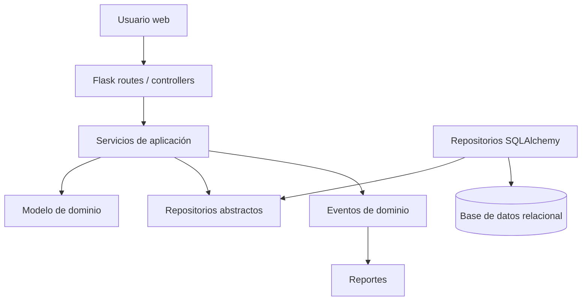
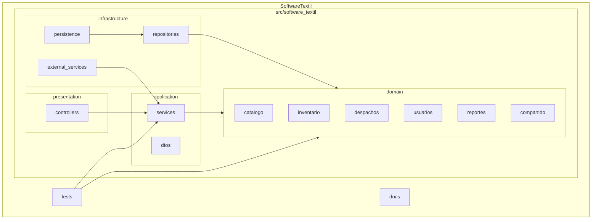
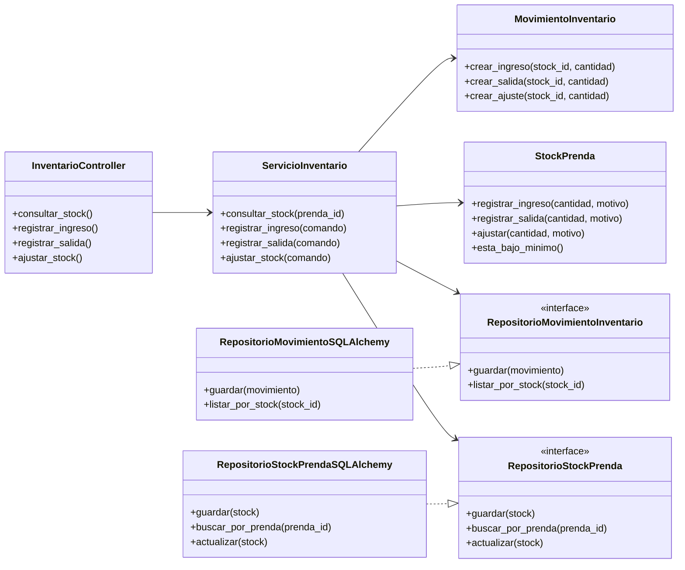
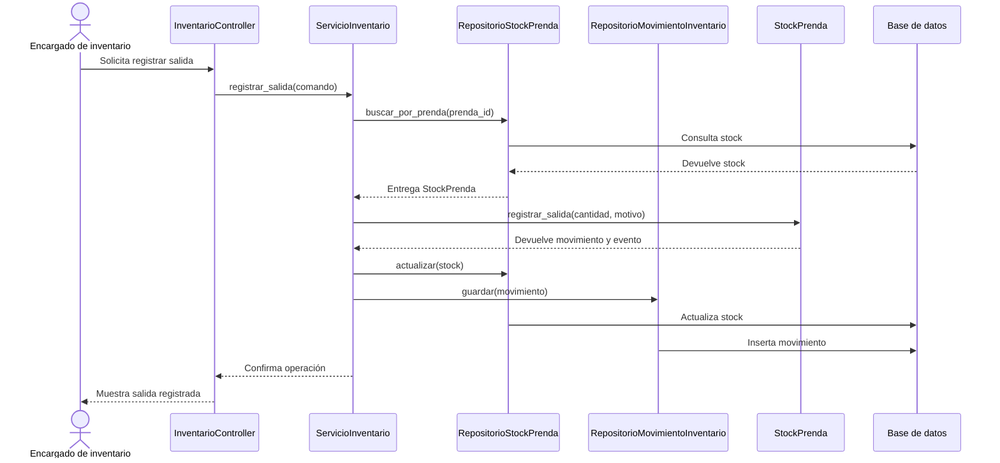

# Arquitectura

SoftwareTextil usa una arquitectura en capas con DDD. El equipo trabaja con un monolito modular porque este estilo reduce la complejidad inicial y conserva límites claros entre módulos de negocio.

## Capas

| Capa | Responsabilidad |
| --- | --- |
| Presentación | Recibe peticiones HTTP mediante controladores Flask. |
| Aplicación | Coordina casos de uso y comandos del usuario. |
| Dominio | Contiene agregados, objetos de valor, servicios de dominio, eventos e interfaces de repositorio. |
| Infraestructura | Implementa persistencia con SQLAlchemy y conecta servicios externos. |

## Reglas De Dependencia

| Regla | Aplicación |
| --- | --- |
| El dominio evita frameworks | Las entidades no importan Flask ni SQLAlchemy. |
| La aplicación usa el dominio | Los servicios coordinan agregados y repositorios abstractos. |
| La presentación usa la aplicación | Los controladores llaman casos de uso. |
| La infraestructura implementa contratos | Los repositorios concretos guardan y consultan datos. |

## Vista General



## Diagrama De Paquetes



## Diagrama De Clases Por Capas



## Flujo Registrar Salida



## Estructura De Carpetas

```text
src/software_textil/
├── presentation/
│   └── controllers/
├── application/
│   ├── dtos/
│   └── services/
├── domain/
│   ├── catalogo/
│   ├── inventario/
│   ├── despachos/
│   ├── usuarios/
│   ├── reportes/
│   └── compartido/
└── infrastructure/
    ├── external_services/
    ├── persistence/
    └── repositories/
```
