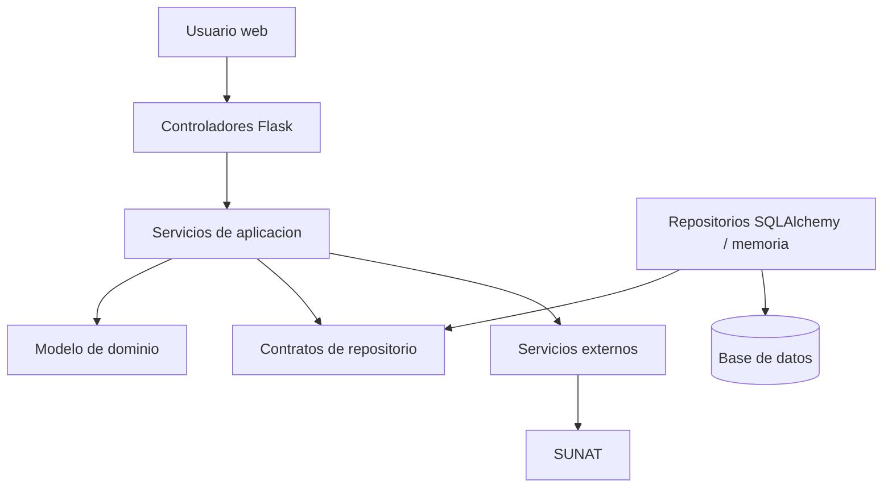
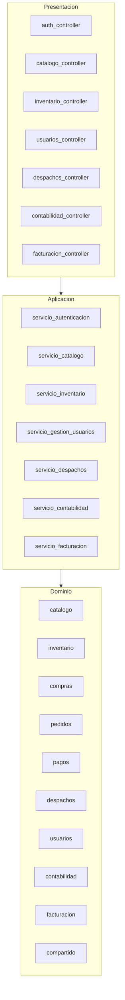
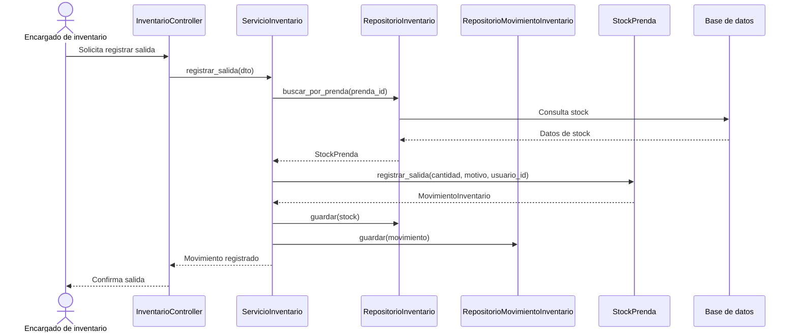

# Arquitectura

SoftwareTextil usa una arquitectura en capas con enfoque DDD. El sistema se organiza como un monolito modular: una sola aplicación desplegable, pero con límites internos claros para catálogo, inventario, e-commerce, despachos, contabilidad y facturación.

---

## Capas

| Capa | Responsabilidad |
| --- | --- |
| Presentación | Recibe peticiones HTTP mediante controladores Flask |
| Aplicación | Coordina casos de uso, DTOs y servicios de aplicación |
| Dominio | Contiene entidades, agregados, objetos de valor, enums y contratos |
| Infraestructura | Implementa persistencia, repositorios y servicios externos |

---

## Reglas De Dependencia

| Regla | Aplicación |
| --- | --- |
| El dominio no depende de frameworks | Las entidades no importan Flask ni SQLAlchemy |
| La aplicación depende del dominio | Los servicios coordinan agregados y repositorios abstractos |
| La presentación depende de aplicación | Los controladores llaman servicios de aplicación |
| La infraestructura implementa contratos | Los repositorios técnicos implementan interfaces del dominio |

---

## Vista General



---

## Módulos Del Monolito



---

## Estructura De Paquetes

```text
src/software_textil/
├── __init__.py              # create_app de Flask
├── bootstrap.py             # Composición de dependencias
├── presentation/
│   └── controllers/         # Blueprints Flask
├── application/
│   ├── dtos/                # DTOs de entrada
│   └── services/            # Casos de uso
├── domain/
│   ├── catalogo/
│   ├── inventario/
│   ├── despachos/
│   ├── usuarios/
│   ├── reportes/
│   ├── contabilidad/
│   ├── facturacion/
│   ├── auditoria/
│   ├── configuracion/
│   └── compartido/
└── infrastructure/
    ├── external_services/   # Integraciones externas, como SUNAT
    ├── persistence/         # Configuración y modelos SQLAlchemy
    └── repositories/        # Implementaciones de repositorios
```

Los módulos `compras`, `pedidos` y `pagos` están definidos por el nuevo modelo UML e-commerce. Su incorporación al código debe seguir la misma separación: dominio puro, servicios de aplicación, controladores e infraestructura.

---

## Controladores Flask

| Blueprint | Responsabilidad |
| --- | --- |
| `auth_controller.py` | Login, logout y validación de sesión |
| `usuarios_controller.py` | Usuarios y roles |
| `catalogo_controller.py` | Prendas, categorías y tipos de producto |
| `inventario_controller.py` | Stock, ingresos, salidas y ajustes |
| `despachos_controller.py` | Creación, preparación, confirmación y cancelación de despachos |
| `contabilidad_controller.py` | Ingresos y egresos contables |
| `facturacion_controller.py` | Emisión de comprobantes electrónicos |
| `reportes_controller.py` | Reportes operativos |
| `configuracion_controller.py` | Parámetros de configuración |

---

## Diagramas UML Relacionados

### Modelo Base


### Encargado de Inventario y Logística


### E-commerce: Compras, Pedidos y Pagos


### Sistema Contable Textil


---

## Flujo Registrar Salida



---

## Criterios Arquitectónicos

| Criterio | Decisión |
| --- | --- |
| Simplicidad inicial | Monolito modular en lugar de microservicios |
| Bajo acoplamiento | Dominio independiente de Flask y SQLAlchemy |
| Trazabilidad | Movimientos, despachos y comprobantes conservan responsables y fechas |
| Evolución | Nuevos módulos se agregan repitiendo el patrón dominio-aplicación-presentación-infraestructura |
| Persistencia | SQLAlchemy queda aislado en infraestructura |
