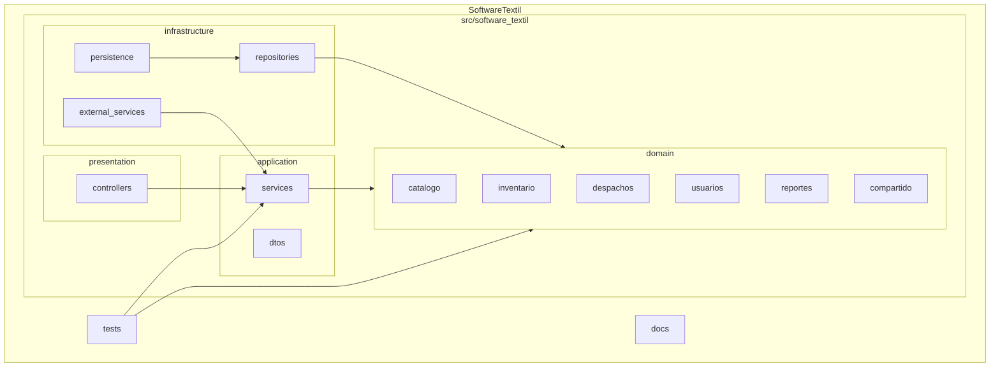
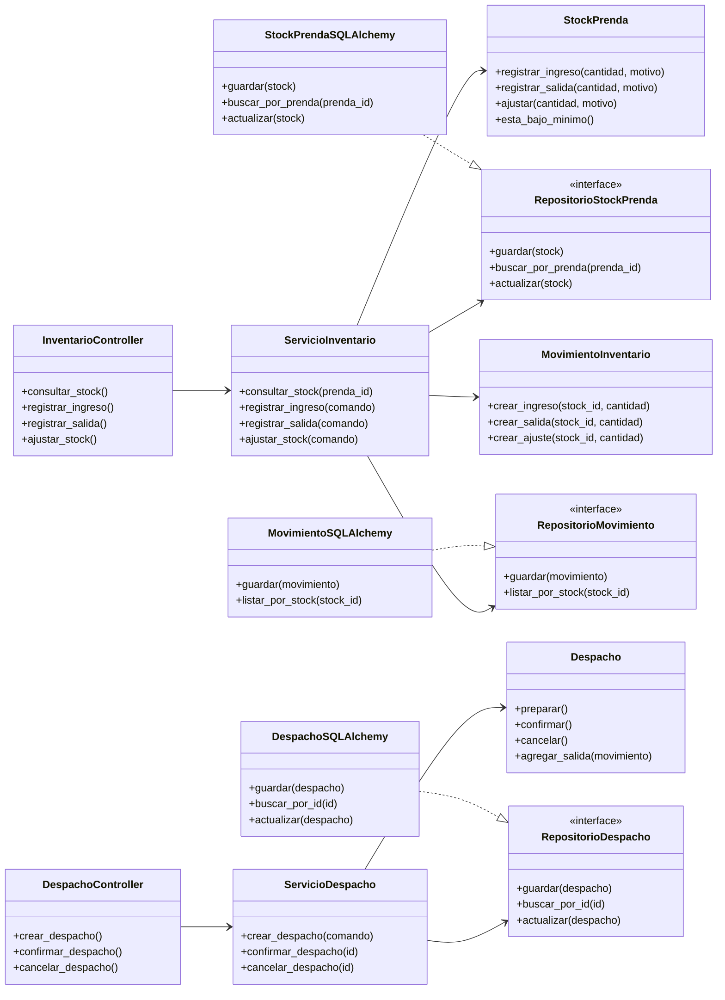
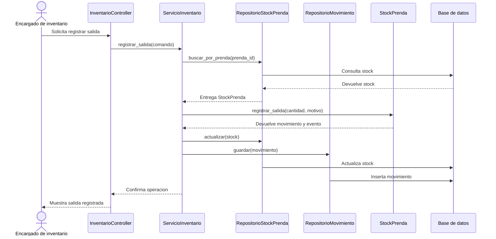

# Arquitectura

SoftwareTextil usa una arquitectura en capas con DDD. El equipo trabaja con un monolito modular porque reduce la complejidad inicial y conserva limites claros entre modulos de negocio.

## Capas

| Capa | Responsabilidad |
| --- | --- |
| Presentacion | Recibe peticiones HTTP mediante controladores Flask |
| Aplicacion | Coordina casos de uso y comandos del usuario |
| Dominio | Contiene agregados, objetos de valor, servicios de dominio, eventos e interfaces de repositorio |
| Infraestructura | Implementa persistencia con SQLAlchemy y conecta servicios externos |

## Reglas De Dependencia

| Regla | Aplicacion |
| --- | --- |
| El dominio evita frameworks | Las entidades no importan Flask ni SQLAlchemy |
| La aplicacion usa el dominio | Los servicios coordinan agregados y repositorios abstractos |
| La presentacion usa la aplicacion | Los controladores llaman casos de uso |
| La infraestructura implementa contratos | Los repositorios concretos guardan y consultan datos |

---

## Vista General


---

## Diagrama De Paquetes



---

## Modelo de Dominio UML (StarUML)

El modelo fue diseñado en StarUML. A continuacion se muestra el diagrama principal del dominio textil.


### Ejemplo de organizacion del Modelo de Dominio


---

## Diagrama De Clases Por Capas



---

## Codigo Generado desde StarUML

El modelo fue diseñado en StarUML y se genero codigo fuente para Python.


---

## Flujo Registrar Salida



---

## Estructura De Carpetas

```
src/software_textil/
├── presentation/     # Controladores Flask
│   └── controllers/
├── application/      # Casos de uso y DTOs
│   ├── dtos/
│   └── services/
├── domain/           # Modelo de dominio puro
│   ├── catalogo/
│   ├── inventario/
│   ├── despachos/
│   ├── usuarios/
│   ├── reportes/
│   └── compartido/
└── infrastructure/   # Implementaciones tecnicas
    ├── external_services/
    ├── persistence/
    └── repositories/
```
