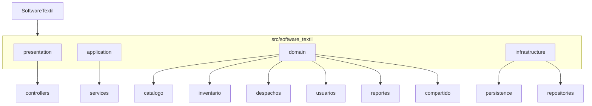
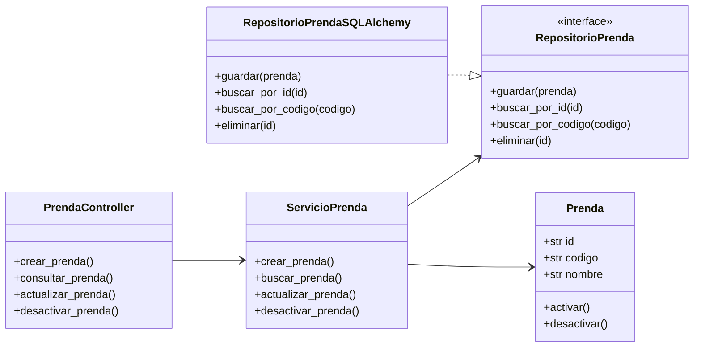

# Arquitectura

SoftwareTextil usa una arquitectura en capas con enfoque DDD. La aplicacion se organiza como monolito modular para mantener bajo el costo de desarrollo y, a la vez, dejar limites claros entre partes del sistema.

## Capas

| Capa | Responsabilidad |
| --- | --- |
| Presentacion | Recibe peticiones HTTP mediante controladores Flask. |
| Aplicacion | Coordina casos de uso y servicios de aplicacion. |
| Dominio | Contiene entidades, objetos de valor, agregados, servicios de dominio e interfaces de repositorio. |
| Infraestructura | Implementa persistencia con SQLAlchemy y servicios externos. |

## Reglas De Dependencia

| Regla | Aplicacion |
| --- | --- |
| El dominio no depende de frameworks | Las entidades no importan Flask ni SQLAlchemy. |
| La aplicacion depende del dominio | Los servicios usan entidades y repositorios abstractos. |
| La presentacion depende de la aplicacion | Los controladores llaman casos de uso. |
| La infraestructura implementa contratos del dominio | Los repositorios concretos guardan y consultan datos. |

## Diagrama De Paquetes



## Diagrama De Clases Por Capas



## Estructura De Carpetas

```text
src/software_textil/
├── presentation/
│   └── controllers/
├── application/
│   └── services/
├── domain/
│   ├── catalogo/
│   ├── inventario/
│   ├── despachos/
│   ├── usuarios/
│   ├── reportes/
│   └── compartido/
└── infrastructure/
    ├── persistence/
    └── repositories/
```
