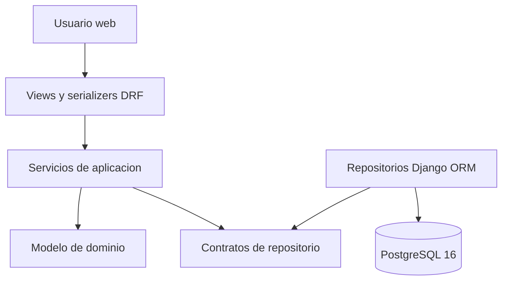
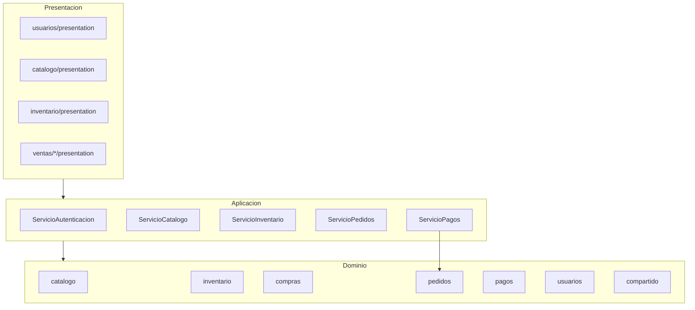
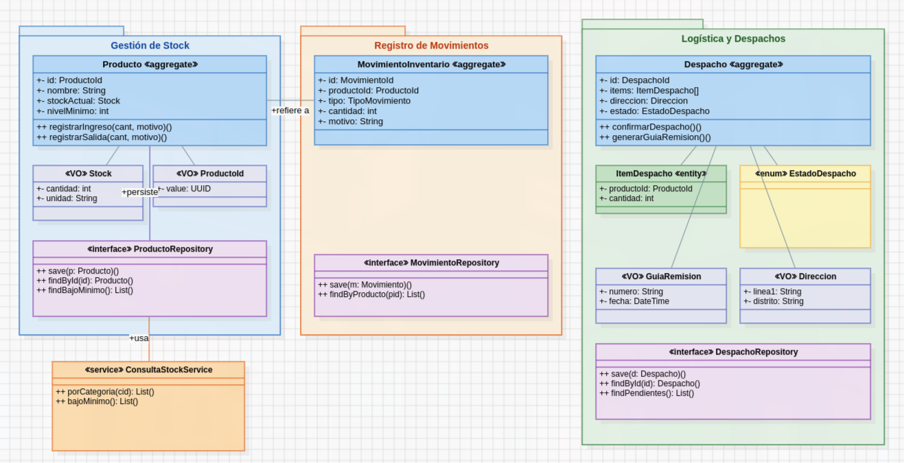
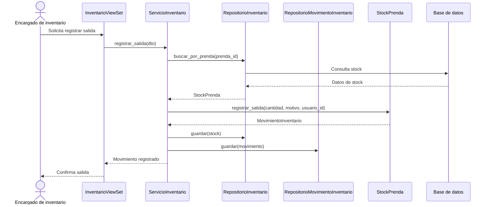

# 1. Arquitectura

SoftwareTextil usa una arquitectura en capas con enfoque DDD. El sistema se organiza como un monolito modular: una sola aplicación desplegable, pero con límites internos claros para catálogo, inventario, e-commerce, despachos, contabilidad y facturación.

---

## 1.1. Capas

| Capa            | Responsabilidad                                                    |
| --------------- | ------------------------------------------------------------------ |
| Presentación    | Recibe peticiones HTTP mediante views y serializers DRF            |
| Aplicación      | Coordina casos de uso, DTOs y servicios de aplicación              |
| Dominio         | Contiene entidades, agregados, objetos de valor, enums y contratos |
| Infraestructura | Implementa persistencia, repositorios y servicios externos         |

---

## 1.2. Reglas De Dependencia

| Regla                                   | Aplicación                                                   |
| --------------------------------------- | ------------------------------------------------------------ |
| El dominio no depende de frameworks     | Las entidades no importan Django ni Django REST Framework    |
| La aplicación depende del dominio       | Los servicios coordinan agregados y repositorios abstractos  |
| La presentación depende de aplicación   | Los controladores llaman servicios de aplicación             |
| La infraestructura implementa contratos | Los repositorios técnicos implementan interfaces del dominio |

---

## 1.3. Vista General


```mermaid
flowchart TD
    Usuario["Usuario web"] --> Controllers["Views y serializers DRF"]
    Controllers --> Services["Servicios de aplicacion"]
    Services --> Domain["Modelo de dominio"]
    Services --> Ports["Contratos de repositorio"]
    Repositories["Repositorios Django ORM"] --> Ports
    Repositories --> DB[("PostgreSQL 16")]
```

---

## 1.4. Módulos Del Monolito


```mermaid
flowchart TB
    subgraph Web["Presentacion"]
        AuthC["usuarios/presentation"]
        CatalogoC["catalogo/presentation"]
        InventarioC["inventario/presentation"]
        VentasC["ventas/*/presentation"]
    end

    subgraph App["Aplicacion"]
        AuthS["ServicioAutenticacion"]
        CatalogoS["ServicioCatalogo"]
        InventarioS["ServicioInventario"]
        PedidoS["ServicioPedidos"]
        PagoS["ServicioPagos"]
    end

    subgraph Domain["Dominio"]
        Catalogo["catalogo"]
        Inventario["inventario"]
        Compras["compras"]
        Pedidos["pedidos"]
        Pagos["pagos"]
        Usuarios["usuarios"]
        Compartido["compartido"]
    end

    Web --> App
    App --> Domain
    PagoS --> Pedidos
```

---

## 1.5. Estructura De Paquetes

```text
apps/
├── usuarios/
├── catalogo/
├── inventario/
├── compartido/
└── ventas/
    ├── carrito/
    ├── pedidos/
    ├── despachos/
    └── pagos/
        ├── presentation/     # API, permisos y serializers
        ├── application/      # Casos de uso y puertos entre contextos
        ├── domain/           # Agregado, políticas y repositorio abstracto
        └── infrastructure/   # Adaptadores Django ORM
```

Cada módulo implementado repite la separación presentación-aplicación-dominio-infraestructura. `config/` contiene la composición de Django y `tests/` las pruebas automatizadas.

---

## 1.6. Endpoints DRF

| Paquete | Responsabilidad |
| --- | --- |
| `usuarios/presentation` | Login, sesiones, perfiles, usuarios y roles |
| `catalogo/presentation` | Prendas y categorías |
| `inventario/presentation` | Stock, ingresos, salidas y ajustes |
| `ventas/carrito/presentation` | Carritos e items |
| `ventas/pedidos/presentation` | Generación y consulta de pedidos |
| `ventas/pagos/presentation` | Pagos autorizados, aprobación y rechazo |
| `ventas/despachos/presentation` | Programación, preparación y confirmación de despachos |

---

## 1.7. Diagramas UML Relacionados

### 1.7.1. Modelo Base


### 1.7.2. Encargado de Inventario y Logística



### 1.7.3. E-commerce: Compras, Pedidos y Pagos


### 1.7.4. Sistema Contable Textil


---

## 1.8. Flujo Registrar Salida


```mermaid
sequenceDiagram
    actor Encargado as Encargado de inventario
    participant API as InventarioViewSet
    participant Servicio as ServicioInventario
    participant StockRepo as RepositorioInventario
    participant MovRepo as RepositorioMovimientoInventario
    participant Stock as StockPrenda
    participant DB as Base de datos

    Encargado->>API: Solicita registrar salida
    API->>Servicio: registrar_salida(dto)
    Servicio->>StockRepo: buscar_por_prenda(prenda_id)
    StockRepo->>DB: Consulta stock
    DB-->>StockRepo: Datos de stock
    StockRepo-->>Servicio: StockPrenda
    Servicio->>Stock: registrar_salida(cantidad, motivo, usuario_id)
    Stock-->>Servicio: MovimientoInventario
    Servicio->>StockRepo: guardar(stock)
    Servicio->>MovRepo: guardar(movimiento)
    Servicio-->>API: Movimiento registrado
    API-->>Encargado: Confirma salida
```

---

## 1.9. Criterios Arquitectónicos

| Criterio            | Decisión                                                                                       |
| ------------------- | ---------------------------------------------------------------------------------------------- |
| Simplicidad inicial | Monolito modular en lugar de microservicios                                                    |
| Bajo acoplamiento   | Dominio independiente de Django y DRF                                                         |
| Trazabilidad        | Movimientos, despachos y comprobantes conservan responsables y fechas                          |
| Evolución           | Nuevos módulos se agregan repitiendo el patrón dominio-aplicación-presentación-infraestructura |
| Persistencia        | Django ORM queda aislado en infraestructura                                                    |
| Integridad          | Los invariantes expresables en SQL se declaran en el esquema (ver [`modelo_datos.md`](modelo_datos.md)) |
