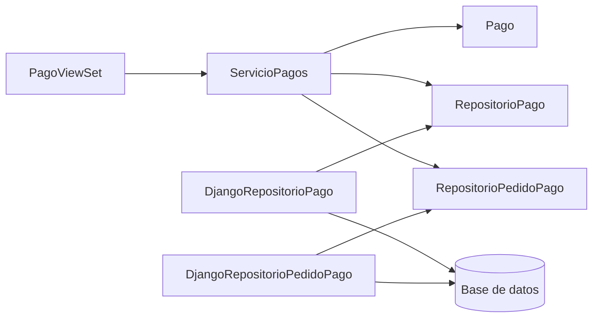

# Guía de Trabajo - Javier - Pagos

- **Integrante:** Peñalva Humire, Javier Alonzo
- **Rama:** `feature/pagos-javier`
- **Módulo:** `apps/ventas/pagos`
- **Alcance:** pago total único, consulta autorizada, aprobación y rechazo; no incluye pasarelas ni datos de tarjetas.

## Propósito y reglas

El módulo conserva la consistencia entre Pago y Pedido. Para registrar un pago, el pedido debe existir, pertenecer al cliente autenticado, estar creado y tener el mismo total. Solo puede existir un pago por pedido. Al aprobarlo, el pago y el pedido cambian de estado dentro de una transacción atómica.

| Actor | Operaciones |
| --- | --- |
| Cliente | Registrar un pago de un pedido propio y consultar únicamente sus pagos |
| Administrador | Listar, consultar, aprobar y rechazar pagos |
| Anónimo | Ninguna; recibe `401 Unauthorized` |

## Arquitectura DDD

| Capa | Responsabilidad | Archivos principales |
| --- | --- | --- |
| Presentación | Autenticación, autorización, validación HTTP, paginación y errores | `presentation/serializers.py`, `presentation/views.py` |
| Aplicación | Coordinar Pago, Pedido y unidad de trabajo | `application/services.py`, `application/ports.py` |
| Dominio | Invariantes, transiciones, políticas y puerto de pagos | `domain/pago.py`, `domain/politicas.py`, `domain/repositorios.py` |
| Infraestructura | ORM, bloqueos y adaptador anticorrupción de Pedido | `infrastructure/repositories.py`, `infrastructure/pedidos.py` |



La dependencia apunta hacia las abstracciones. El servicio no importa Django ni DRF; `transaction.atomic` se inyecta como fábrica de unidad de trabajo en el borde HTTP.

## Convenciones de codificación

| Práctica | Evidencia |
| --- | --- |
| PEP 8 y formato uniforme | Ruff analiza y formatea módulo, migración y pruebas |
| Lenguaje ubicuo | `Pago`, `PedidoParaPago`, `marcar_pagado`, `PagoPedidoDuplicado` |
| Type hints | Métodos públicos declaran parámetros y retornos |
| Constantes | Límites de referencia, identificadores y paginación tienen nombres |
| Errores específicos | Todas las reglas esperadas heredan de `ErrorPago` |

```python
def registrar_pago(
    self,
    pedido_id: str,
    monto: Decimal,
    metodo: MetodoPago | str,
    cliente_id: str,
    referencia: str = "",
) -> Pago:
```

## Estilos de programación

| Estilo | Aplicación |
| --- | --- |
| Things | `Pago` reúne identidad, estado y transiciones |
| Error/Exception Handling | Las reglas lanzan errores específicos y HTTP los traduce centralmente |
| Persistent-Tables | Los adaptadores implementan contratos y encapsulan Django ORM |
| RESTful | Pagos se exponen como recursos y aprobar/rechazar como acciones |

## Clean Code

**Funciones pequeñas:** cada método del servicio representa un caso de uso o una validación reutilizable.

**Sin booleanos ambiguos en persistencia:** el contrato separa `crear`, `actualizar_estado` y `buscar_por_id_para_actualizar`.

**Validación en profundidad:** serializer, dominio y restricciones SQL protegen los mismos límites en fronteras diferentes.

**Errores uniformes:** la API usa `{"codigo": "...", "detalle": "..."}` para errores controlados.

**Datos sensibles:** `SerializerEstricto` rechaza cualquier campo no declarado, por lo que PAN, CVV o PIN no entran al caso de uso.

```python
campos_desconocidos = set(self.initial_data) - set(self.fields)
if campos_desconocidos:
    raise serializers.ValidationError("Campos no permitidos")
```

## Principios SOLID

### SRP - Responsabilidad única

`PagoViewSet` adapta HTTP, `ServicioPagos` coordina reglas, `Pago` controla transiciones y los repositorios persisten.

```python
class DjangoRepositorioPago(RepositorioPago):
    def actualizar_estado(self, pago: Pago) -> None:
        PagoModel.objects.filter(id=pago.id).update(estado=pago.estado.value)
```

### OCP - Abierto/cerrado

Las reglas por método son políticas registrables. La prueba `test_factory_admite_politica_extensible` agrega una estrategia sin modificar Pago.

```python
class ValidadorMetodoPago:
    def __init__(
        self,
        politicas: Iterable[PoliticaReferenciaPago] | None = None,
    ) -> None:
```

### LSP - Sustitución de Liskov

`DjangoRepositorioPago` y `RepositorioPagoMemoria` satisfacen el mismo contrato. El servicio ejecuta las mismas reglas con ambos.

```python
class RepositorioPago(ABC):
    @abstractmethod
    def listar_pagina(...) -> PaginaPagos: ...
```

### DIP - Inversión de dependencias

El caso de uso recibe puertos de Pago y Pedido y una unidad de trabajo. Las clases ORM se crean únicamente en `_crear_servicio()`.

```python
return ServicioPagos(
    DjangoRepositorioPago(),
    DjangoRepositorioPedidoPago(),
    transaction.atomic,
)
```

## Robustez y escalabilidad

| Riesgo | Solución implementada |
| --- | --- |
| API pública | Token Bearer y permisos por rol |
| Acceso horizontal | El servicio comprueba propietario y filtra por cliente |
| Dos pagos para un pedido | Validación de aplicación y restricción SQL única |
| Aprobar y rechazar simultáneamente | `transaction.atomic` y `select_for_update` |
| Pago aprobado con pedido sin actualizar | Ambos cambios comparten la unidad de trabajo |
| Datos ORM corruptos | `CheckConstraint` para monto, método, estado y referencia |
| Listados ilimitados | Página configurable de 1 a 100 registros |
| Datos históricos incompatibles | Migración previa valida y detiene el despliegue con diagnóstico |

## Contrato REST

| Método y ruta | Permiso | Resultado |
| --- | --- | --- |
| `GET /api/ventas/pagos/` | Cliente o administrador | Página con `total`, `pagina`, `tamano`, `resultados` |
| `POST /api/ventas/pagos/` | Cliente | Registra un pago pendiente |
| `GET /api/ventas/pagos/<id>/` | Propietario o administrador | Obtiene el pago |
| `POST /api/ventas/pagos/<id>/aprobar/` | Administrador | Aprueba pago y pedido |
| `POST /api/ventas/pagos/<id>/rechazar/` | Administrador | Rechaza el pago |

## Pruebas y cobertura

| Nivel | Archivo | Escenarios principales |
| --- | --- | --- |
| Dominio | `tests/pagos/test_pago_dominio.py` | Estados, límites, referencias y política extensible |
| Aplicación | `tests/pagos/test_servicio_pagos.py` | Propiedad, total, duplicados, Pedido y filtros |
| Infraestructura | `tests/pagos/test_repositorio_pagos.py` | Restricciones, actualización acotada y páginas |
| API | `tests/pagos/test_api_pagos.py` | 401, 403, 400, 409, roles, propiedad e integración |

Resultados verificables de la implementación:

| Comando | Resultado |
| --- | --- |
| `uv run python manage.py check` | Sin problemas del sistema |
| `uv run python manage.py makemigrations --check --dry-run` | Sin cambios pendientes |
| `uv run pytest -q` | 64 pruebas aprobadas |
| `uv run pytest tests/pagos --cov --cov-branch -q` | 51 pruebas; cobertura superior a 89% |
| `uv run ruff check ...` | Sin hallazgos en el alcance modificado |
| `uv run ruff format --check ...` | Formato correcto |

## SonarLint

El análisis real de SonarQube for IDE/SonarLint continúa siendo manual porque este entorno no expone el IDE ni un servidor Sonar. No se inventaron resultados. El procedimiento y la tabla para registrar reglas reales están en [`../reportes/sonarlint-pagos.md`](../reportes/sonarlint-pagos.md).

## Checklist

- [x] SRP, OCP, LSP y DIP implementados con fragmentos reales.
- [x] Arquitectura DDD por capas y puerto anticorrupción con Pedido.
- [x] Autenticación, autorización y control de propiedad.
- [x] Atomicidad, bloqueo y restricciones de base de datos.
- [x] Pruebas con cobertura de ramas superior a 85%.
- [x] README con propósito, funcionalidades, arquitectura, Clean Code y SOLID.
- [ ] Ejecutar SonarLint en el IDE y registrar evidencia real.
