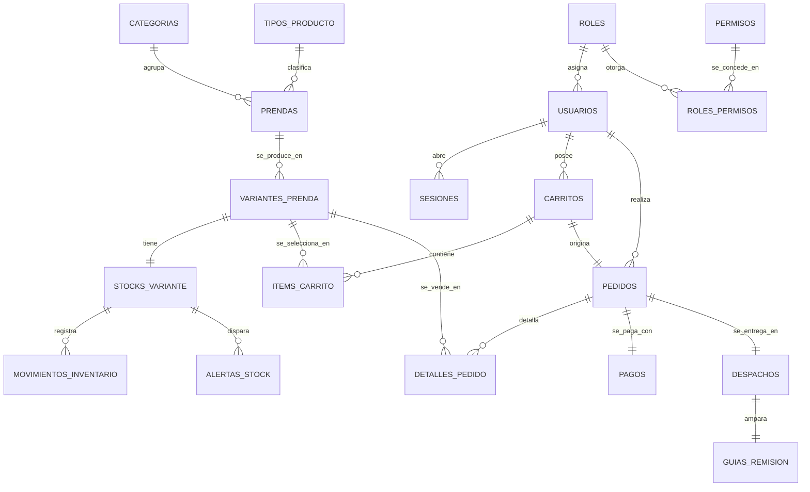

# 1. Modelo De Datos

El esquema de SoftwareTextil vive en **PostgreSQL 16+** y es la contraparte persistente del modelo de dominio descrito en [`modelo_dominio.md`](modelo_dominio.md). El principio que lo ordena es uno solo: **todo invariante del dominio que pueda expresarse en SQL, se expresa en SQL**. El código Python protege el negocio; la base de datos lo respalda.

---

## 1.1. Reglas De Diseño

Siete reglas gobiernan las 17 tablas. Son lo que hace el esquema legible: una convención, no diecisiete decisiones sueltas.

| # | Regla | Dónde se implementa |
| --- | --- | --- |
| 1 | Clave foránea en infraestructura, identificador de texto en el dominio | `ForeignKey` en `*/models.py`; `variante_id: str` en `*/domain/` |
| 2 | `UUIDField` como clave primaria en toda tabla | `ModeloBase` en `apps/compartido/infrastructure/models.py` |
| 3 | Los `StrEnum` son la única fuente de `choices` y `CheckConstraint` | `check_enum()` y `opciones()` en `apps/compartido/infrastructure/campos.py` |
| 4 | `on_delete` según el rol de la tabla | `CASCADE` dentro del agregado, `PROTECT` entre agregados, `SET_NULL` en auditoría |
| 5 | Dinero: dos columnas, una sola definición | `campo_monto()` / `campo_moneda()`; mapeo en `apps/compartido/infrastructure/mapeo.py` |
| 6 | Índice donde hay un `filter()`; índice **parcial** donde hay un estado | `models.Index(..., condition=Q(estado=...))` |
| 7 | Nomenclatura fija en español | tabla plural, constraint `<tabla_sing>_<regla>`, índice `<tabla_sing>_<cols>_idx` |

### Regla 1 en detalle: integridad sin acoplar el dominio

La regla de dependencia de [`arquitectura.md`](arquitectura.md) prohíbe que el dominio importe Django. Pero sin claves foráneas la base admite pedidos de clientes inexistentes. La resolución aprovecha que Django expone el atributo `<campo>_id` de toda FK:

```python
# apps/ventas/models.py — infraestructura: clave foránea real
cliente = models.ForeignKey("usuarios.UsuarioModel", on_delete=models.PROTECT)

# apps/ventas/pedidos/domain/pedido.py — dominio: sigue siendo texto plano
@dataclass
class Pedido:
    cliente_id: str

# apps/ventas/pedidos/infrastructure/repositories.py — el repositorio traduce
model.cliente_id = pedido.cliente_id
```

El dominio no sabe que existe una FK; la base de datos sí la impone.

### Regla 3 en detalle: un enum, dos usos

Antes, los valores válidos de un estado se repetían como literales en el modelo y otra vez en la migración. Ahora se derivan:

```python
# apps/compartido/infrastructure/campos.py
def check_enum(campo, enumeracion, nombre) -> models.CheckConstraint:
    return models.CheckConstraint(
        condition=models.Q(**{f"{campo}__in": valores(enumeracion)}),
        name=nombre,
    )

# apps/ventas/models.py
estado = campo_estado(EstadoPedido, default=EstadoPedido.CREADO)
constraints = [check_enum("estado", EstadoPedido, "pedido_estado_valido")]
```

Agregar un valor a `EstadoPedido` actualiza validación de aplicación y restricción de base de datos a la vez.

---

## 1.2. Diagrama Entidad-Relación



### La decisión central: la variante como unidad de negocio

`prendas` es el concepto comercial ("Camisa clásica"); **`variantes_prenda` es la unidad que se vende y de la que se lleva stock** (talla M, color azul, un SKU). Antes, las tallas vivían en un `JSONField` y el stock era una fila por prenda: era imposible responder *cuántas camisas talla M en azul quedan*. Ahora inventario, items de carrito y detalles de pedido apuntan a la variante.

En el dominio, `Prenda` es la raíz del agregado y `tallas` es una propiedad derivada de sus variantes, de modo que no hay dos fuentes de verdad:

```python
# apps/catalogo/domain/prenda.py
@property
def tallas(self) -> list[str]:
    return [variante.talla for variante in self.variantes]
```

---

## 1.3. Diccionario De Datos

### Usuarios

| Tabla | Columnas clave | Restricciones | Invariante que respalda |
| --- | --- | --- | --- |
| `roles` | `nombre` | `rol_nombre_unico_ci` | No hay dos roles con el mismo nombre |
| `permisos` | `codigo` UNIQUE, `modulo` | — | Persiste la entidad `Permiso` del dominio |
| `roles_permisos` | FK rol + FK permiso | `rol_permiso_unico` | Un permiso se concede una sola vez por rol |
| `usuarios` | `email`, `username`, FK `rol` (PROTECT), `creado_por` (self, SET_NULL) | `usuario_email_unico_ci`, `usuario_username_unico_ci`, `usuario_estado_valido` | Un usuario activo tiene rol asignado; la unicidad ignora mayúsculas porque la búsqueda usa `iexact` |
| `sesiones` | FK `usuario` (CASCADE), `token` UNIQUE | `sesion_estado_valido`, `sesion_expiracion_posterior_al_inicio`, índice parcial `WHERE estado='activa'` | Una sesión no expira antes de empezar |
| `intentos_login` | `username`, `fecha` | índice `(username, -fecha)` | Historial para detectar ataques de fuerza bruta |

Las columnas `password_hash`, `password_salt`, `password_algoritmo` y `password_actualizado_en` son el objeto de valor `Credencial` embebido en la fila del usuario: un VO no merece tabla propia.

### Catálogo

| Tabla | Columnas clave | Restricciones | Invariante que respalda |
| --- | --- | --- | --- |
| `categorias` | `nombre` | `categoria_nombre_unico_ci` | — |
| `tipos_producto` | `nombre`, `atributos_base` (JSONB) | `tipo_producto_nombre_unico_ci` | — |
| `prendas` | FK `categoria` (PROTECT), FK `tipo_producto` (SET_NULL), FK `registrado_por` (SET_NULL) | `prenda_estado_valido`, `prenda_precio_positivo`, índice parcial `WHERE estado='activa'` | Una prenda pertenece a una categoría válida; una categoría con prendas no se borra |
| `variantes_prenda` | FK `prenda` (CASCADE), `sku` UNIQUE, `talla`, `color` | `variante_combinacion_unica`, `variante_precio_completo` | No hay dos variantes con la misma talla y color; el precio propio es opcional pero nunca queda a medias |

### Inventario

| Tabla | Columnas clave | Restricciones | Invariante que respalda |
| --- | --- | --- | --- |
| `stocks_variante` | FK `variante` (PROTECT, 1:1), `cantidad_actual`, `cantidad_reservada` | `stock_cantidad_no_negativa`, `stock_reservada_no_negativa`, `stock_nivel_minimo_no_negativo`, `stock_reservada_no_excede_actual` | El VO `Stock` prohíbe cantidades negativas; no se reserva más de lo que hay |
| `movimientos_inventario` | FK `stock` (**PROTECT**), FK `registrado_por` (PROTECT) | `movimiento_tipo_valido`, `movimiento_cantidad_positiva`, índice `(stock, -fecha)` | **Un movimiento registrado no se modifica ni se borra**: el repositorio usa `create`, no `update_or_create`, y la FK es `PROTECT` |
| `alertas_stock` | FK `stock` (CASCADE) | `alerta_estado_valido`, **UNIQUE parcial** `WHERE estado='pendiente'` | Un stock no acumula dos alertas pendientes; antes solo lo cuidaba el servicio |

### Ventas

| Tabla | Columnas clave | Restricciones | Invariante que respalda |
| --- | --- | --- | --- |
| `carritos` | FK `cliente` (PROTECT) | `carrito_estado_valido`, **UNIQUE parcial** `WHERE estado='abierto'` | Un cliente tiene un solo carrito abierto; los convertidos y cancelados quedan como histórico |
| `items_carrito` | FK `carrito` (CASCADE), FK `variante` (PROTECT) | `item_carrito_cantidad_positiva`, `item_carrito_precio_positivo`, `item_carrito_variante_unica` | El agregado fusiona items repetidos, así que la tabla nunca guarda dos líneas de la misma variante |
| `pedidos` | FK `cliente` (PROTECT), FK `carrito` (PROTECT, 1:1) | `pedido_estado_valido`, `pedido_total_positivo`, índices `(cliente, -fecha)` y `(estado)` | Un carrito origina un solo pedido |
| `detalles_pedido` | FK `pedido` (CASCADE), FK `variante` (PROTECT) | `detalle_pedido_cantidad_positiva`, `detalle_pedido_precio_positivo`, `detalle_pedido_variante_unica` | Un pedido confirmado conserva su detalle |
| `pagos` | FK `pedido` (CASCADE, 1:1) | `pago_pedido_unico`, `pago_monto_positivo`, `pago_estado_valido`, `pago_metodo_valido`, `pago_referencia_requerida` | Existe un pago total por pedido; todo método salvo efectivo exige referencia |
| `despachos` | FK `pedido` (PROTECT, 1:1), FK `responsable` (SET_NULL) | `despacho_estado_valido`, `despacho_confirmado_con_fecha` | Un despacho confirmado deja constancia de cuándo lo fue |
| `guias_remision` | FK `despacho` (CASCADE, 1:1) | `guia_serie_numero_unica` | Una guía conserva serie y número irrepetibles |

---

## 1.4. Puesta En Marcha

```bash
cp .env.example .env            # ajustar credenciales si hace falta
docker compose up -d            # PostgreSQL 16
uv run python manage.py migrate
uv run python manage.py crear_admin --nombre "Admin" --email admin@textil.pe --username admin
```

La migración `usuarios/0002_roles_y_permisos_base` carga los tres roles base y los seis permisos, de modo que todo el equipo arranca con la misma matriz de autorización.

Desarrollo y producción comparten motor a propósito: los índices parciales, los `CHECK` y la unicidad sobre `Lower(...)` solo se comportan igual si las pruebas corren sobre PostgreSQL. Con SQLite quedaban sin verificar hasta el despliegue.

---

## 1.5. Verificación

```bash
uv run python manage.py makemigrations --check --dry-run   # sin migraciones pendientes
uv run pytest                                              # suite completa sobre PostgreSQL
uv run ruff check .                                        # análisis estático
```

`tests/compartido/test_integridad_esquema.py` es la evidencia de que los invariantes viven en la base y no solo en Python: cada prueba intenta escribir por el ORM una fila que el dominio prohíbe y verifica que PostgreSQL la rechaza con `IntegrityError`.

---

## 1.6. Diseño Futuro

Dos contextos de [`modelo_dominio.md`](modelo_dominio.md) quedan diseñados pero sin tablas, a la espera de sus casos de uso:

| Contexto | Tablas previstas | Nota de diseño |
| --- | --- | --- |
| Contabilidad | `ingresos`, `egresos`, `cierres_contables` | El VO `Periodo` (`apps/compartido/domain/periodo.py`) ya aporta la clave `AAAA-MM` del cierre |
| Facturación | `comprobantes_electronicos` | Serie y número únicos, como en `guias_remision`; el enum `TipoComprobante` ya existe |
