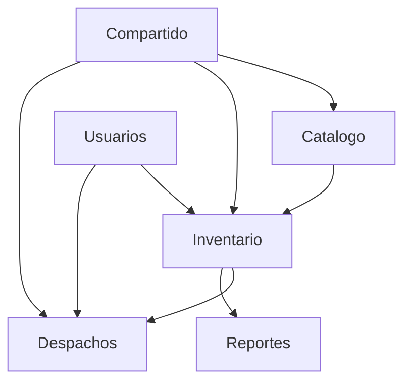
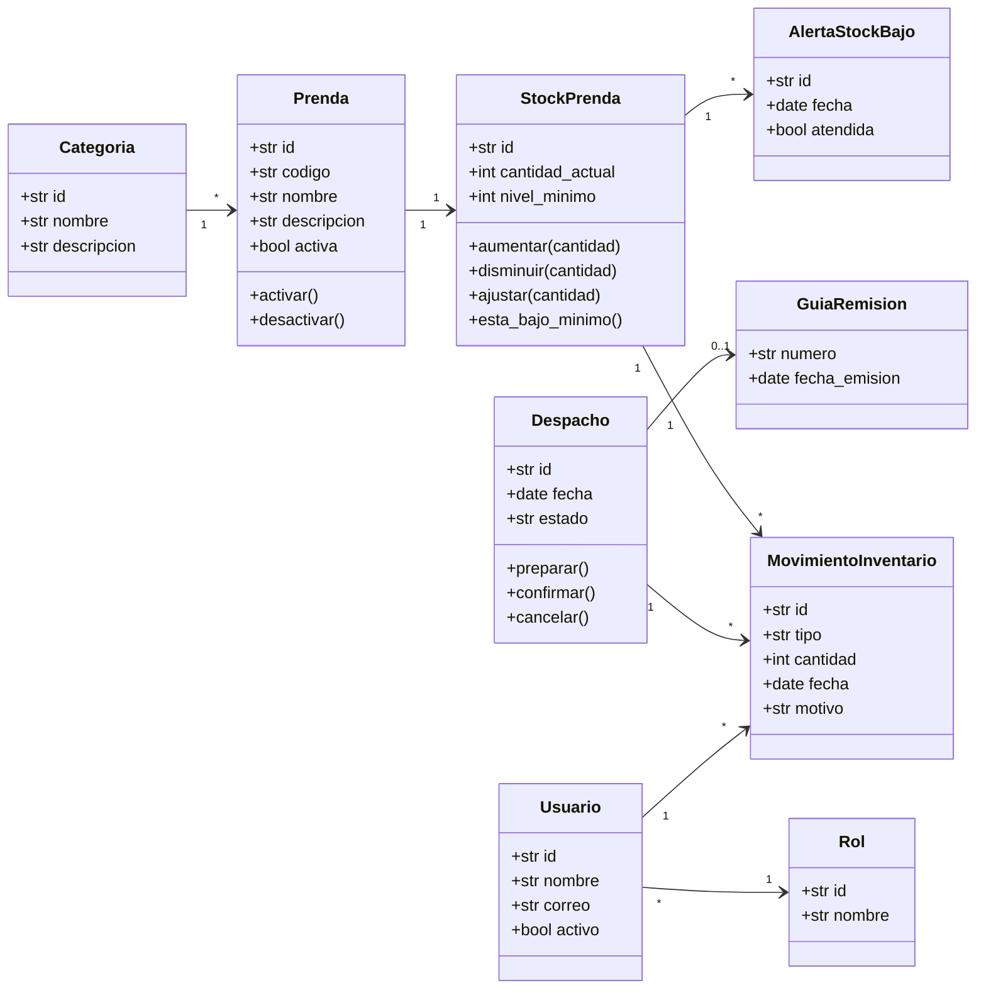

# Modelo De Dominio

El modelo de dominio se basa en `lab05.md`. El centro del sistema es la gestion de inventario textil, donde la prenda, el stock, los movimientos, los despachos y las alertas forman el nucleo del negocio.

## Lenguaje Ubicuo

| Termino | Definicion usada en el proyecto |
| --- | --- |
| Prenda | Producto textil terminado, como polo, pantalon o uniforme. |
| Stock | Cantidad disponible de una prenda en almacen. |
| Nivel minimo | Cantidad minima esperada para evitar falta de stock. |
| Ingreso | Entrada de prendas al almacen. |
| Salida | Egreso de prendas del almacen. |
| Movimiento | Registro inmutable de ingreso, salida o ajuste. |
| Despacho | Preparacion y envio de prendas a un cliente. |
| Guia de remision | Documento que acompania el traslado fisico. |
| Ajuste | Correccion manual por conteo, deterioro o regularizacion. |
| Alerta de stock bajo | Aviso generado cuando el stock actual es menor al nivel minimo. |
| Categoria | Agrupacion de prendas por tipo o uso. |

## Contextos Delimitados

| Contexto | Responsabilidad |
| --- | --- |
| Catalogo | Mantiene prendas, categorias, tallas, colores y precios. |
| Inventario | Controla stock, ingresos, salidas, ajustes y alertas. |
| Despachos | Gestiona preparacion, confirmacion y guia de remision. |
| Usuarios | Administra usuarios, roles y permisos. |
| Reportes | Consulta stock, movimientos, alertas y despachos. |
| Compartido | Reune objetos de valor comunes. |

## Agregados

| Agregado | Raiz | Repositorio |
| --- | --- | --- |
| Prenda | `Prenda` | `RepositorioPrenda` |
| Stock | `StockPrenda` | `RepositorioStockPrenda` |
| Movimiento | `MovimientoInventario` | `RepositorioMovimientoInventario` |
| Despacho | `Despacho` | `RepositorioDespacho` |
| Usuario | `Usuario` | `RepositorioUsuario` |

## Diagrama De Clases Del Dominio

