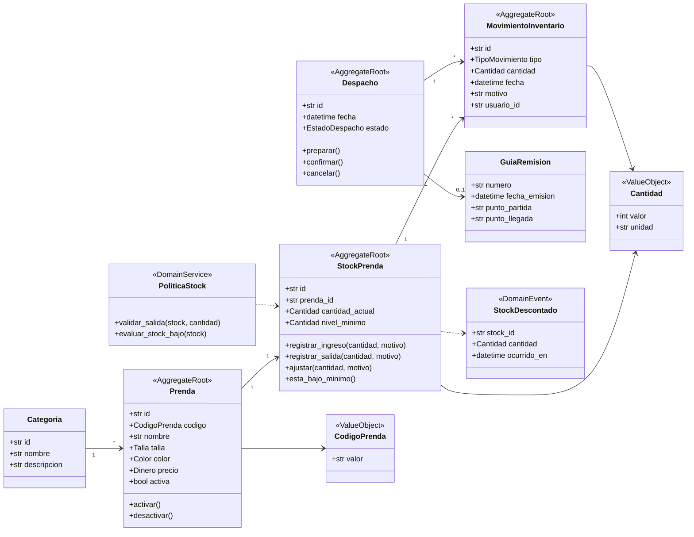
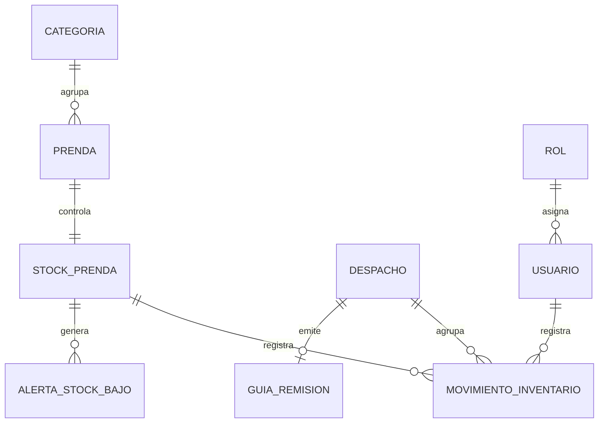

# Modelo De Dominio

SoftwareTextil modela el inventario textil con DDD. El dominio usa terminos cercanos al trabajo diario del almacen y protege las reglas mediante agregados, objetos de valor, repositorios y servicios de dominio.

## Lenguaje Ubicuo

| Termino | Definicion |
| --- | --- |
| Prenda | Producto textil terminado, como polo, pantalon, uniforme o casaca |
| Stock | Cantidad disponible de una prenda en almacen |
| Nivel minimo | Cantidad limite que activa una alerta de reposicion |
| Ingreso | Entrada de prendas por produccion, compra o devolucion |
| Salida | Egreso de prendas por venta, despacho, merma o ajuste |
| Ajuste | Correccion manual por conteo fisico, deterioro o regularizacion |
| Movimiento | Registro inmutable de un ingreso, salida o ajuste |
| Despacho | Preparacion y entrega fisica de prendas a un cliente |
| Guia de remision | Documento que acompaña el traslado fisico de las prendas |
| Alerta de stock bajo | Aviso que aparece cuando el stock actual baja del nivel minimo |
| Categoria | Agrupacion de prendas por linea comercial o uso |

---

## Modelo de Dominio UML (StarUML)

Modelo principal que organiza el dominio textil alrededor de inventario, movimientos, despachos y facturacion electronica.

---

## Contextos Delimitados

| Contexto | Responsabilidad |
| --- | --- |
| Catalogo | Mantiene prendas, categorias, tallas, colores y precios |
| Inventario | Controla stock, ingresos, salidas, ajustes y alertas |
| Despachos | Gestiona preparacion, confirmacion y guia de remision |
| Usuarios | Administra usuarios, roles y permisos |
| Reportes | Consulta stock, movimientos, alertas y despachos |
| Compartido | Objetos de valor, eventos y errores del dominio |

---

## Modulos del Dominio (StarUML)

### Autenticacion y Catalogo

Entidades y servicios de autenticacion, credenciales, sesiones, catalogo, prendas y categorias.

### Usuarios e Inventario

Modulos para usuarios, roles, permisos, inventario, stock, movimientos y alertas.

### Configuracion y Reportes

Configuracion general del sistema, parametros y reportes de inventario o ventas.

### Sistema Contable Textil

Contextos delimitados para autenticacion, gestion de ingresos/egresos, inventario, facturacion SUNAT, impuestos y auditoria.

### Dominio E-Commerce Textil

Agregados y relaciones para usuarios, carrito de compras, historial, pedidos, catalogo, pagos y entregas.

---

## Agregados

| Agregado | Raiz | Repositorio | Invariante principal |
| --- | --- | --- | --- |
| Prenda | `Prenda` | `RepositorioPrenda` | Una prenda mantiene un codigo unico y una categoria valida |
| Stock | `StockPrenda` | `RepositorioStockPrenda` | El stock no permite salidas mayores a la cantidad disponible |
| Movimiento | `MovimientoInventario` | `RepositorioMovimientoInventario` | Un movimiento no cambia despues de registrarse |
| Despacho | `Despacho` | `RepositorioDespacho` | Un despacho confirmado no vuelve a estado pendiente |
| Usuario | `Usuario` | `RepositorioUsuario` | Un usuario activo debe tener un rol asignado |

---

## Diagrama De Clases Del Dominio

---

## Relaciones De Entidades

---

## Codigo Generado desde StarUML

El modelo fue diseñado en StarUML y se genero codigo fuente para Python.

