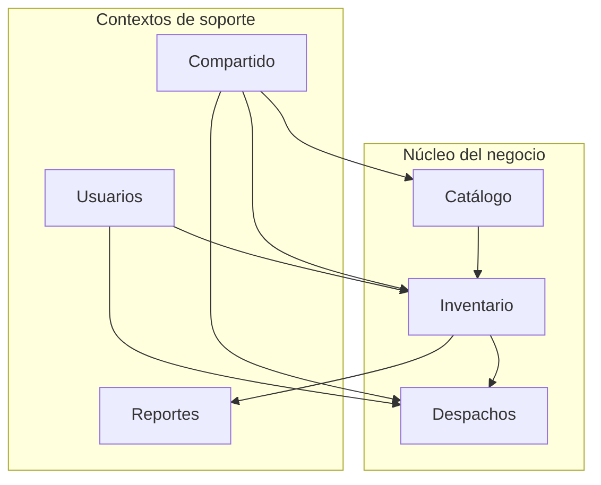
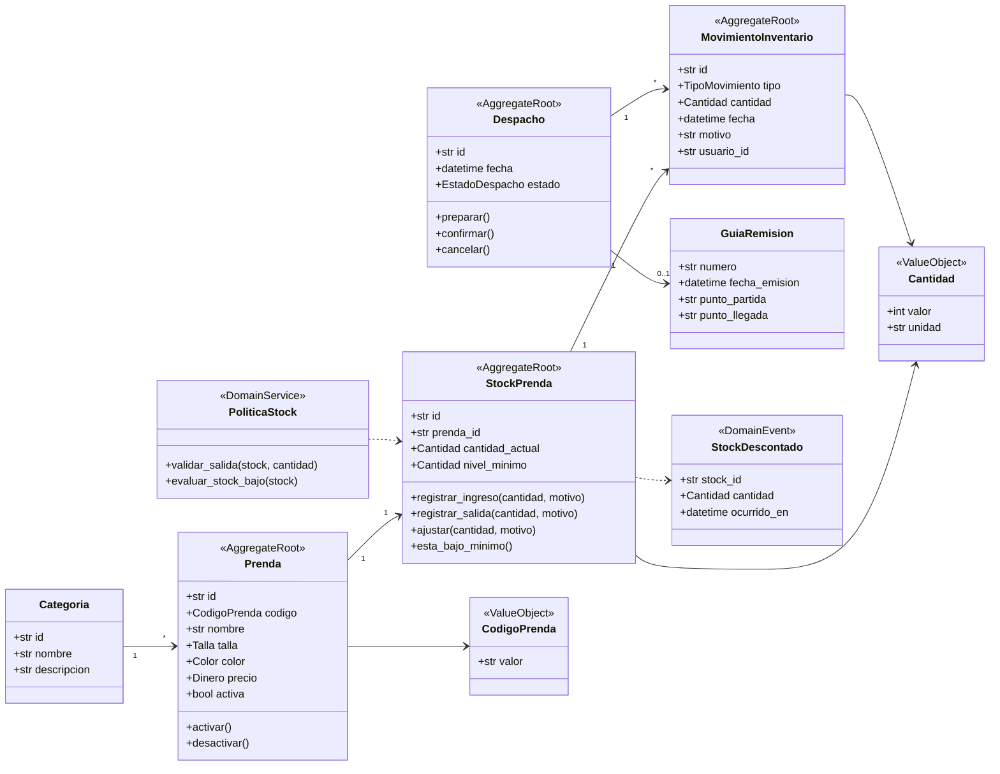
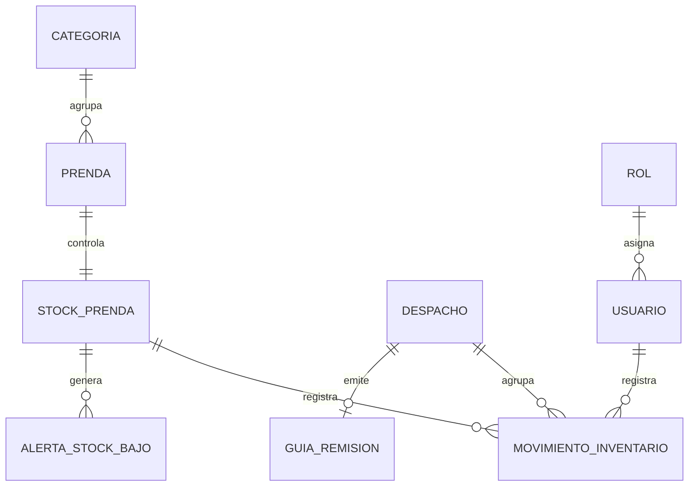

# Modelo De Dominio

SoftwareTextil modela el inventario textil con DDD. El dominio usa términos cercanos al trabajo diario del almacén y protege las reglas mediante agregados, objetos de valor, repositorios y servicios de dominio.

## Lenguaje Ubicuo

| Término | Definición usada en el proyecto |
| --- | --- |
| Prenda | Producto textil terminado, como polo, pantalón, uniforme o casaca. |
| Stock | Cantidad disponible de una prenda en almacén. |
| Nivel mínimo | Cantidad límite que activa una alerta de reposición. |
| Ingreso | Entrada de prendas por producción, compra o devolución. |
| Salida | Egreso de prendas por venta, despacho, merma o ajuste. |
| Ajuste | Corrección manual por conteo físico, deterioro o regularización. |
| Movimiento | Registro inmutable de un ingreso, salida o ajuste. |
| Despacho | Preparación y entrega física de prendas a un cliente. |
| Guía de remisión | Documento que acompaña el traslado físico de las prendas. |
| Alerta de stock bajo | Aviso que aparece cuando el stock actual baja del nivel mínimo. |
| Categoría | Agrupación de prendas por línea comercial o uso. |

## Contextos Delimitados

| Contexto | Responsabilidad |
| --- | --- |
| Catálogo | Mantiene prendas, categorías, tallas, colores y precios. |
| Inventario | Controla stock, ingresos, salidas, ajustes y alertas. |
| Despachos | Gestiona preparación, confirmación y guía de remisión. |
| Usuarios | Administra usuarios, roles y permisos. |
| Reportes | Consulta stock, movimientos, alertas y despachos. |
| Compartido | Reúne objetos de valor, eventos y errores del dominio. |

## Agregados

| Agregado | Raíz | Repositorio | Invariante principal |
| --- | --- | --- | --- |
| Prenda | `Prenda` | `RepositorioPrenda` | Una prenda mantiene un código único y una categoría válida. |
| Stock | `StockPrenda` | `RepositorioStockPrenda` | El stock no permite salidas mayores a la cantidad disponible. |
| Movimiento | `MovimientoInventario` | `RepositorioMovimientoInventario` | Un movimiento no cambia después de registrarse. |
| Despacho | `Despacho` | `RepositorioDespacho` | Un despacho confirmado no vuelve a estado pendiente. |
| Usuario | `Usuario` | `RepositorioUsuario` | Un usuario activo debe tener un rol asignado. |

## Diagrama De Clases Del Dominio

## Relaciones De Entidades

