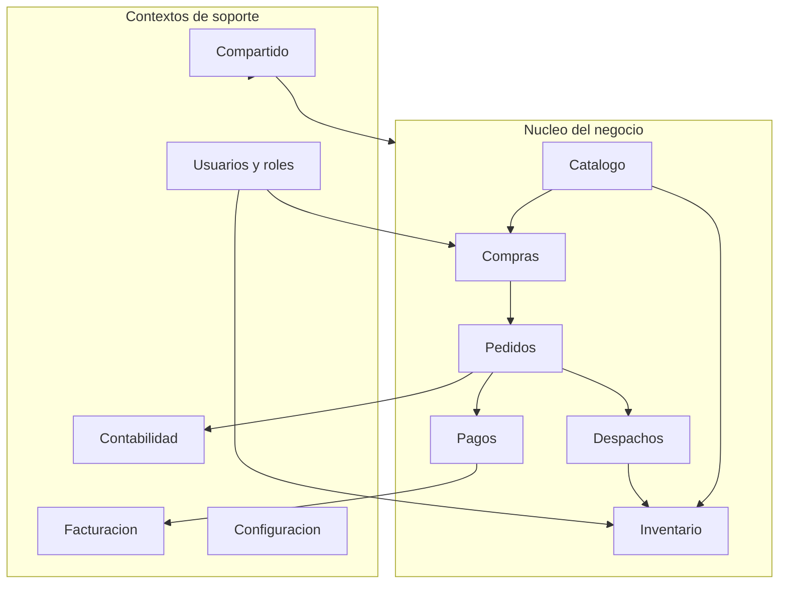

# Modelo De Dominio

SoftwareTextil organiza el negocio textil con DDD. El dominio usa conceptos del trabajo real: prendas, stock, carrito, pedidos, pagos, despachos, comprobantes, ingresos, egresos y cierre contable.

---

## Lenguaje Ubicuo

| Término | Definición |
| --- | --- |
| Prenda | Producto textil terminado disponible para venta o despacho |
| Categoría | Agrupación comercial de prendas |
| Stock | Cantidad disponible de una prenda en almacén |
| Nivel mínimo | Umbral que activa una alerta de reposición |
| Movimiento | Registro de ingreso, salida o ajuste de stock |
| Carrito | Selección temporal de productos antes de generar un pedido |
| Pedido | Solicitud formal de compra generada desde el carrito |
| Detalle de pedido | Línea del pedido con producto, cantidad y precio unitario |
| Pago | Registro del método y procesamiento económico del pedido |
| Despacho | Preparación y entrega física de prendas |
| Guía de remisión | Documento que acompaña el traslado físico |
| Comprobante electrónico | Boleta o factura enviada a SUNAT |
| Ingreso contable | Entrada económica registrada en contabilidad |
| Egreso contable | Salida económica por compra, proveedor, material o servicio |
| Periodo contable | Mes y año usados para declaraciones y cierre |

---

## Contextos Delimitados

| Contexto | Responsabilidad |
| --- | --- |
| Catálogo | Mantiene prendas, categorías y tipos de producto |
| Inventario | Controla stock, movimientos, alertas y consultas |
| Compras | Administra carrito e items seleccionados |
| Pedidos | Genera pedidos, detalle e historial |
| Pagos | Registra método y procesamiento de pagos |
| Despachos | Gestiona preparación, confirmación y guía de remisión |
| Usuarios | Administra usuarios, roles, permisos y sesiones |
| Contabilidad | Registra ingresos, egresos, impuestos y cierre |
| Facturación | Emite comprobantes electrónicos y conecta con SUNAT |
| Compartido | Agrupa enums, objetos de valor y conceptos reutilizables |

---

## Agregados Principales

| Agregado | Raíz | Repositorio | Invariante principal |
| --- | --- | --- | --- |
| Prenda | `Prenda` | `RepositorioPrenda` | Una prenda pertenece a una categoría válida |
| Stock | `StockPrenda` | `RepositorioInventario` | No permite salidas mayores al stock disponible |
| Movimiento | `MovimientoInventario` | `RepositorioMovimientoInventario` | Un movimiento registrado no debe modificarse |
| Carrito | `CarritoCompras` | `RepositorioCarrito` | El total refleja la suma de sus items |
| Pedido | `Pedido` | `RepositorioPedido` | Un pedido confirmado conserva su detalle |
| Pago | `Pago` | `RepositorioPago` | Un pago procesado conserva método y estado |
| Despacho | `Despacho` | `RepositorioDespacho` | Un despacho confirmado no vuelve a pendiente |
| Usuario | `Usuario` | `RepositorioUsuario` | Un usuario activo debe tener rol asignado |
| Contabilidad | `Ingreso`, `EgresoTextil` | `RepositorioIngreso`, `RepositorioEgreso` | Todo movimiento contable conserva monto, fecha y concepto |
| Facturación | `ComprobanteElectronico` | Servicio externo SUNAT | Un comprobante conserva serie, número, monto e IGV |

---

## Diagramas UML Exportados

### Modelo Base De Dominio

### Autenticación

### Usuarios y Roles

### Inventario

### Catálogo

### Compras, Pedidos y Pagos

### Sistema Contable Textil

### Encargado de Inventario y Logística

---

## Relación Entre Código Y Modelo

El código final no importa directamente los archivos generados por StarUML. Las salidas de StarUML se usan como referencia arquitectónica y se refinan a Python válido siguiendo convenciones del lenguaje:

Los archivos generados se conservan en `assets/starUML_codigo/` como evidencia del proceso, pero el código ejecutable del proyecto vive en `src/software_textil/`.

| Elemento UML | Implementación Python |
| --- | --- |
| Entidad o agregado | `dataclass` en `domain/` |
| Value Object | `dataclass(frozen=True)` |
| Enumeración | `StrEnum` |
| Interfaz de repositorio | Clase abstracta con `ABC` |
| Servicio de aplicación | Clase en `application/services/` |
| Adaptador técnico | Clase en `infrastructure/` |
