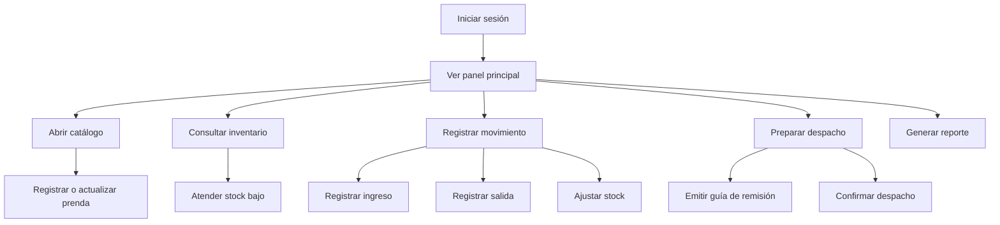

# Prototipo Del Sistema

SoftwareTextil presenta una interfaz web sencilla para que el encargado de inventario registre operaciones diarias sin perder trazabilidad.

## Objetivo Del Prototipo

El prototipo muestra el recorrido principal del usuario: iniciar sesión, revisar el panel, consultar stock, registrar movimientos, preparar despachos y generar reportes.

## Flujo Principal



## Pantalla Principal

```text
+--------------------------------------------------------------------------------+
| SoftwareTextil                                      Usuario: Encargado           |
| Inventario textil                                   Fecha: 2026-06-15            |
+-------------------------+------------------------------------------------------+
| Menú                    | Panel principal                                      |
|                         |                                                      |
| Inicio                  | Indicadores del día                                  |
| Catálogo                | +----------------+----------------+----------------+ |
| Inventario              | | Stock bajo: 8  | Movimientos:15 | Despachos: 4   | |
| Movimientos             | +----------------+----------------+----------------+ |
| Despachos               |                                                      |
| Reportes                | Acciones rápidas                                     |
| Usuarios                | [Registrar ingreso] [Registrar salida] [Despachar]  |
+-------------------------+------------------------------------------------------+
```

## Pantallas Consideradas

| Pantalla | Uso |
| --- | --- |
| Inicio de sesión | Valida el acceso de usuarios registrados. |
| Panel principal | Muestra stock bajo, movimientos y despachos pendientes. |
| Catálogo | Lista prendas con filtros por categoría, talla y color. |
| Registro de prenda | Crea o actualiza una prenda. |
| Inventario | Muestra stock actual, nivel mínimo y estado de alerta. |
| Movimientos | Registra ingresos, salidas y ajustes. |
| Despachos | Prepara, confirma o cancela despachos. |
| Reportes | Consulta movimientos, stock bajo y despachos. |
| Usuarios | Administra usuarios, roles y permisos. |

## Criterios De Usabilidad

| Criterio | Aplicación |
| --- | --- |
| Claridad | La interfaz usa términos del almacén textil. |
| Rapidez | El panel principal muestra accesos directos a operaciones frecuentes. |
| Trazabilidad | Cada movimiento conserva fecha, tipo, cantidad, motivo y usuario. |
| Control | Las alertas permiten actuar antes de quedarse sin stock. |
