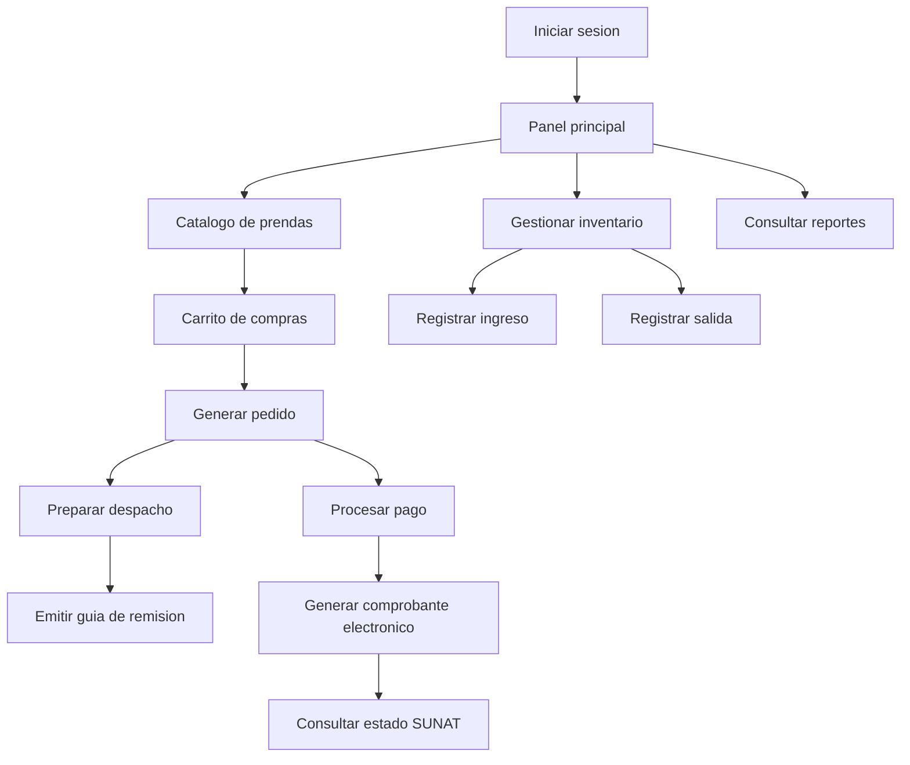
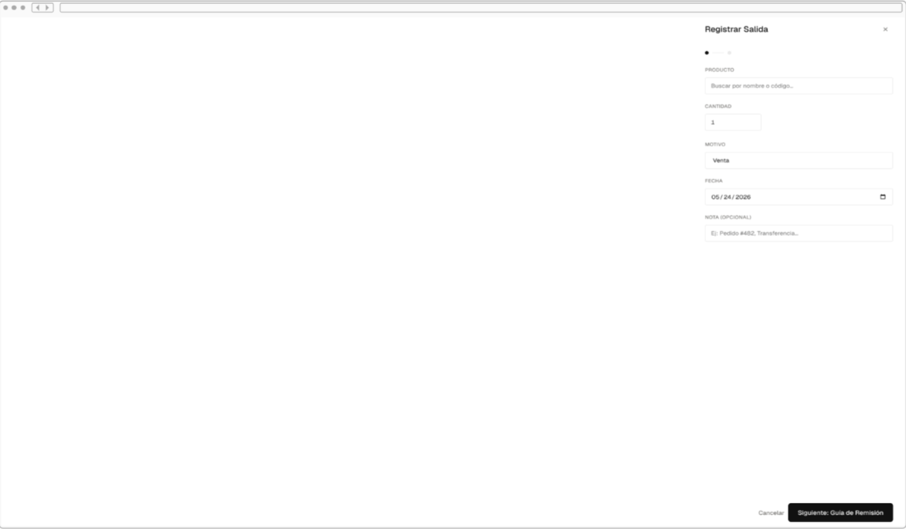
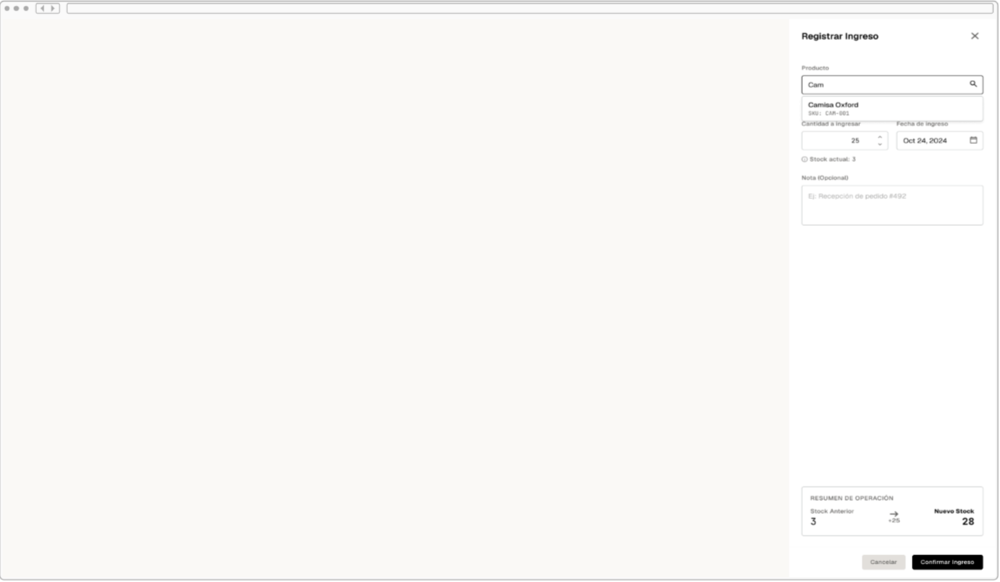
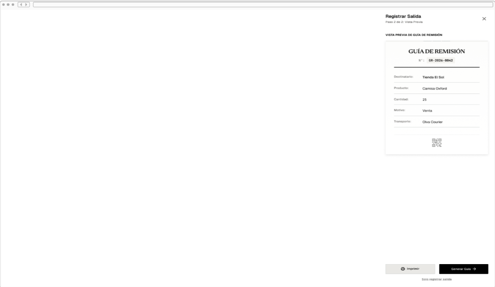
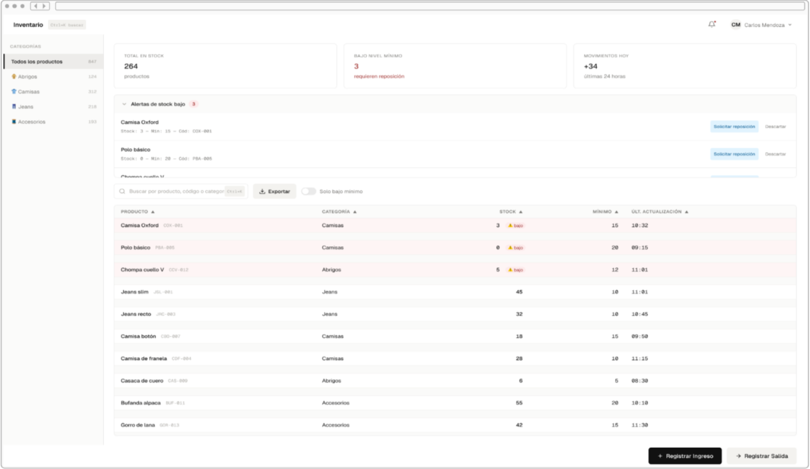
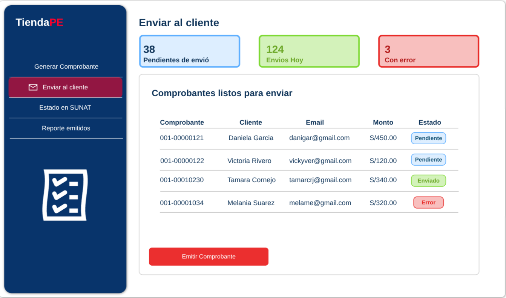
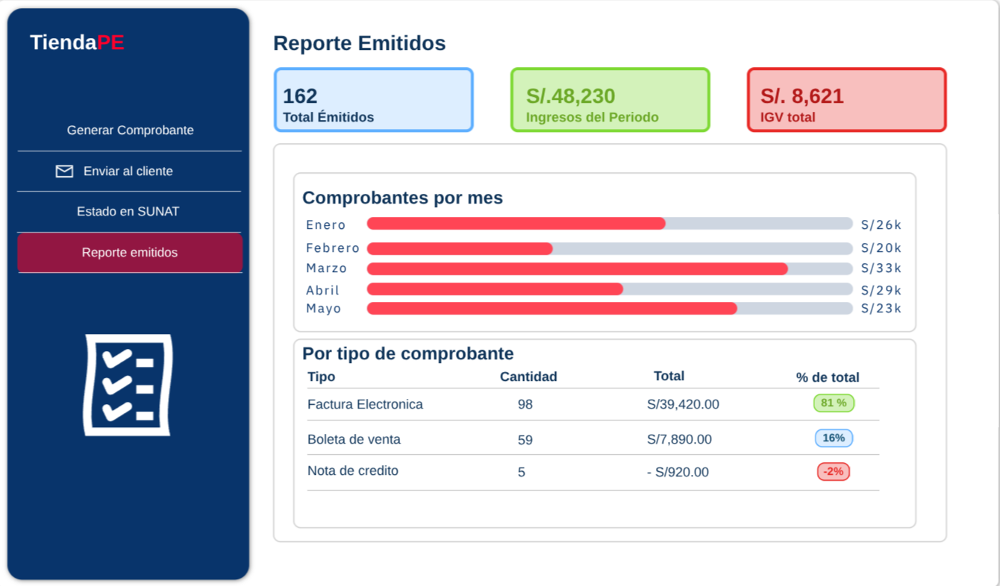

# Prototipo Del Sistema

El prototipo muestra el flujo principal de SoftwareTextil desde el inicio de sesión hasta la gestión de catálogo, carrito, inventario, pedidos, despachos, facturación y reportes.

---

## Flujo Principal

---

## Pantallas Del Prototipo

### Login

Pantalla de inicio de sesión para validar el acceso de usuarios registrados.

### Catálogo de Productos

Lista de prendas con filtros y datos comerciales. Permite revisar productos antes de agregarlos al carrito.

### Carrito de Compras

Vista para revisar productos seleccionados, cantidades y totales antes de confirmar el pedido.

### Registrar Salida de Inventario

Formulario para descontar prendas del almacén por venta, despacho, merma o ajuste.

### Registrar Ingreso de Inventario

Formulario para registrar entradas por producción, compra o devolución.

### Guía de Remisión

Pantalla para generar el documento que acompaña el traslado físico de prendas.

### Gestión de Pedidos

Vista administrativa para revisar y gestionar pedidos pendientes.

### Panel de Control

Dashboard con indicadores de stock, pedidos, movimientos y estado operativo del sistema.

### Generar Comprobante Electrónico

Formulario para generar boletas o facturas electrónicas asociadas a ventas o pedidos.

### Enviar a Cliente

Pantalla para enviar documentos o notificaciones al cliente.

### Estado SUNAT

Vista para consultar el estado de los comprobantes electrónicos enviados a SUNAT.

### Reporte de Emitidos

Listado de comprobantes emitidos y su estado.

### Flujo Mobile

Vista del flujo de navegación en dispositivos móviles.

---

## Pantallas Consideradas

| Pantalla | Uso |
| --- | --- |
| Inicio de sesión | Valida usuarios registrados |
| Panel principal | Resume acciones y accesos principales |
| Catálogo | Lista y filtra prendas disponibles |
| Carrito | Permite revisar productos antes del pedido |
| Gestión de pedidos | Administra pedidos pendientes |
| Registro de ingreso | Registra entradas de stock |
| Registro de salida | Registra egresos de stock |
| Guía de remisión | Emite documento para traslado físico |
| Comprobante electrónico | Genera boletas o facturas |
| Estado SUNAT | Consulta aceptación o rechazo del comprobante |
| Reportes | Muestra comprobantes o movimientos emitidos |
| Flujo mobile | Representa navegación adaptada a móviles |

---

## Criterios De Usabilidad

| Criterio | Aplicación |
| --- | --- |
| Claridad | Usa términos del negocio textil |
| Rapidez | Prioriza acciones frecuentes desde el panel principal |
| Trazabilidad | Cada operación conserva fecha, usuario y motivo |
| Control | Las alertas y estados permiten seguimiento operativo |
| Adaptabilidad | El flujo considera escritorio y móvil |
