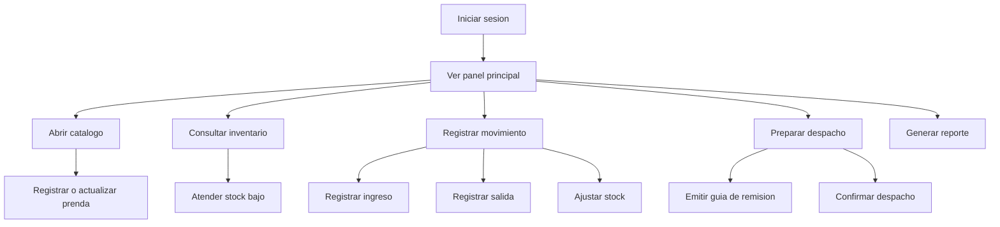
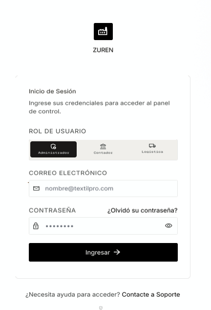
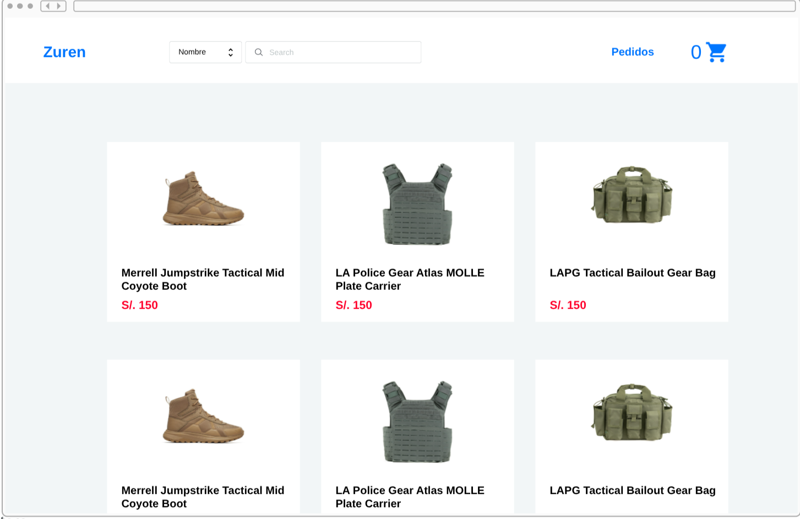
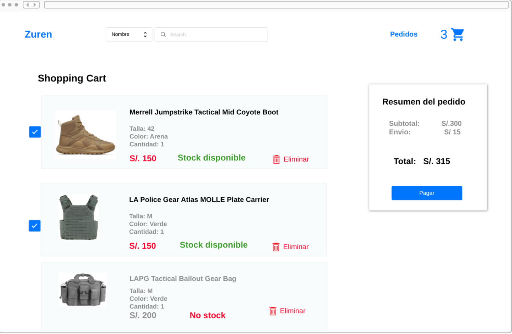
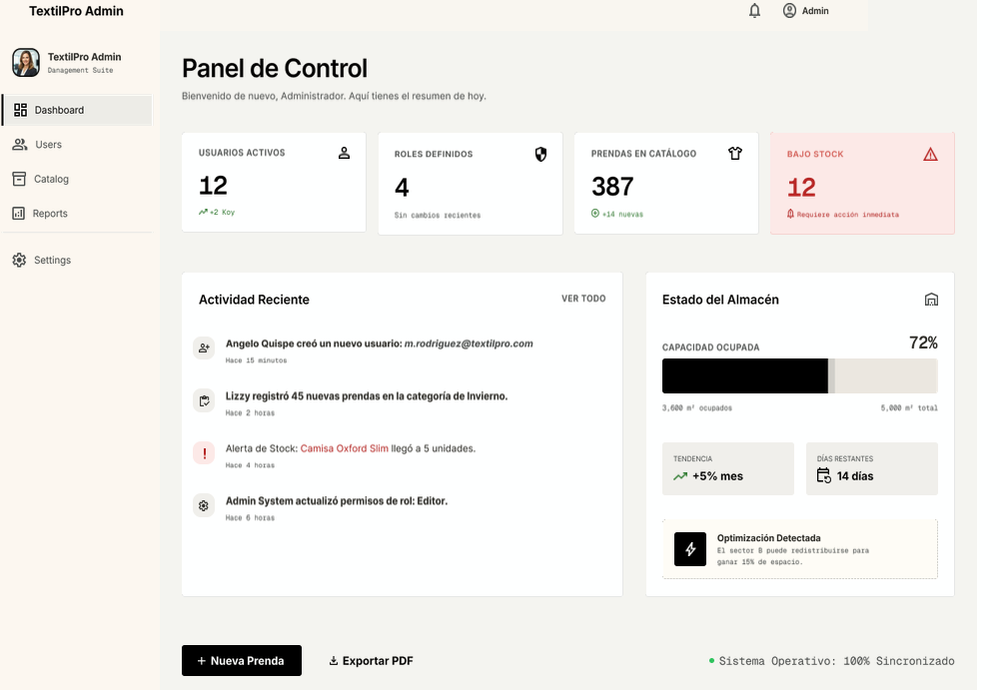
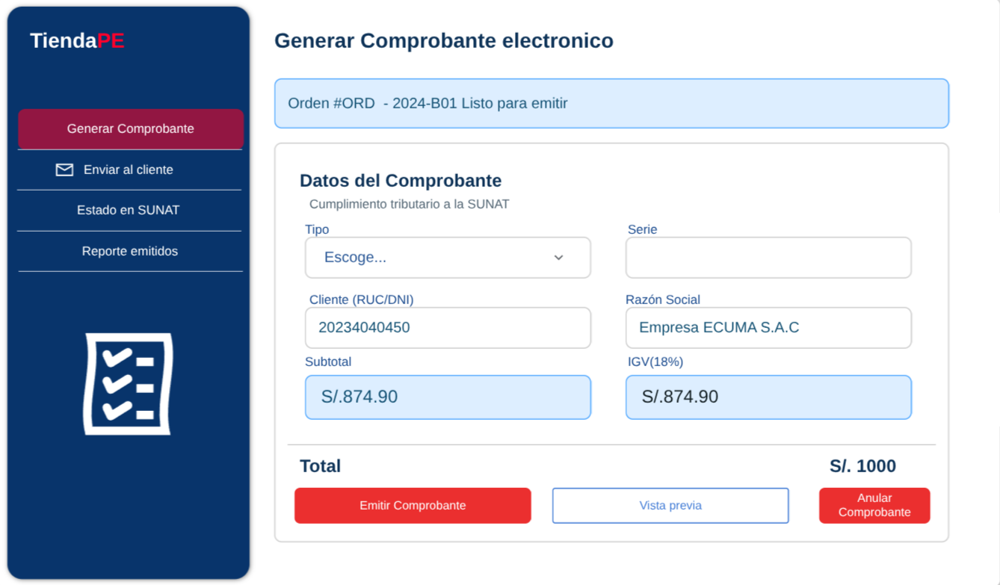
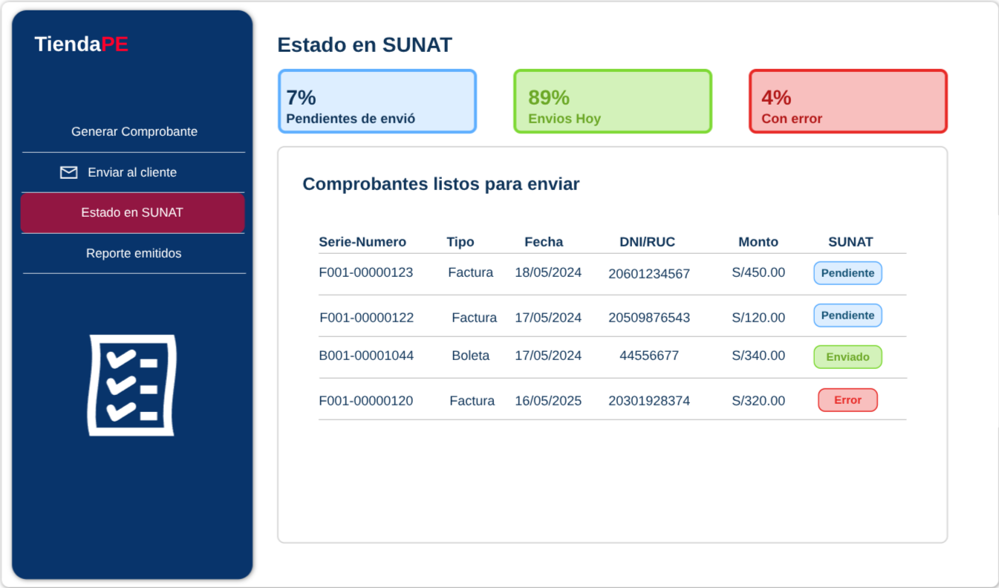
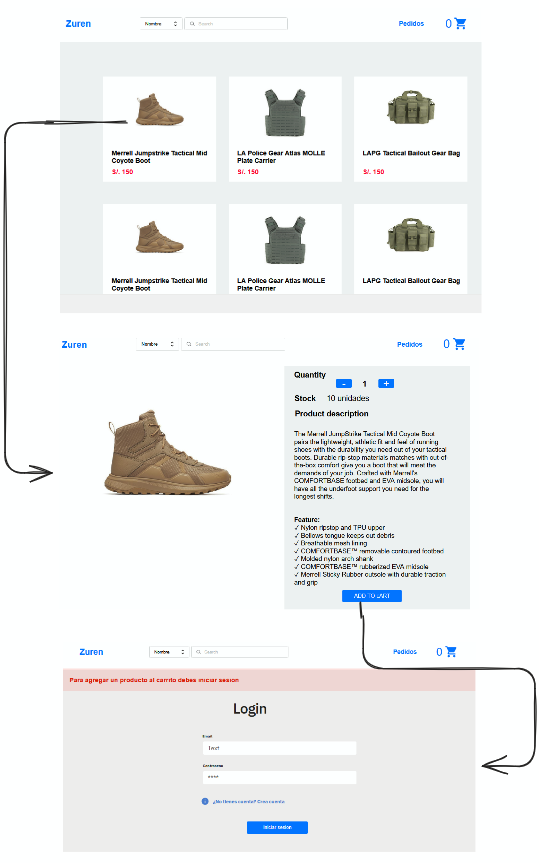

# Prototipo Del Sistema

SoftwareTextil presenta una interfaz web para que el encargado de inventario registre operaciones diarias sin perder trazabilidad. A continuación se muestran las pantallas del prototipo organizadas por flujo de usuario.

## Flujo Principal

---

## Pantallas Del Prototipo

### Login

Pantalla de inicio de sesion para validar el acceso de usuarios registrados.

### Catalogo de Productos

Lista de prendas con filtros por categoria, talla y color. Permite buscar y seleccionar productos.

### Carrito de Compras

Vista del carrito donde el usuario revisa los productos seleccionados antes de confirmar la operacion.

### Registrar Salida de Inventario

Formulario para registrar salidas de prendas por venta, despacho, merma o ajuste.

### Registrar Ingreso de Inventario

Formulario para registrar entradas de prendas por produccion, compra o devolucion.

### Guia de Remision

Pantalla para generar la guia de remision que acompaña el despacho fisico de prendas.

### Gestion de Pedidos (Administrador)

Vista del administrador para revisar, aprobar o rechazar pedidos pendientes.

### Panel de Control (Administrador)

Dashboard del administrador con indicadores de stock, movimientos y despachos.

### Generar Comprobante Electronico

Pantalla para generar comprobantes electronicos asociados a ventas o despachos.

### Enviar a Cliente

Pantalla para enviar documentos o notificaciones al cliente.

### Estado SUNAT

Vista del estado de los comprobantes ante SUNAT.

### Reporte de Emitidos

Reporte con listado de comprobantes emitidos y su estado.

### Flujo Mobile

Vista del flujo de la aplicacion en dispositivos moviles.

---

## Pantallas Consideradas

| Pantalla | Uso |
| --- | --- |
| Inicio de sesion | Valida el acceso de usuarios registrados |
| Panel principal | Muestra stock bajo, movimientos y despachos pendientes |
| Catalogo | Lista prendas con filtros por categoria, talla y color |
| Carrito de compras | Revision de productos seleccionados |
| Registro de salida | Registra egresos de prendas del almacen |
| Registro de ingreso | Registra entradas de prendas al almacen |
| Guia de remision | Genera el documento de traslado fisico |
| Gestion de pedidos | Administra pedidos pendientes |
| Panel de control | Dashboard con indicadores del sistema |
| Comprobante electronico | Generacion de comprobantes de venta |
| Estado SUNAT | Consulta de estado ante SUNAT |
| Reportes | Consulta de comprobantes emitidos |
| Flujo mobile | Navegacion en dispositivos moviles |

## Criterios De Usabilidad

| Criterio | Aplicacion |
| --- | --- |
| Claridad | La interfaz usa terminos del almacen textil |
| Rapidez | El panel principal muestra accesos directos a operaciones frecuentes |
| Trazabilidad | Cada movimiento conserva fecha, tipo, cantidad, motivo y usuario |
| Control | Las alertas permiten actuar antes de quedarse sin stock |
