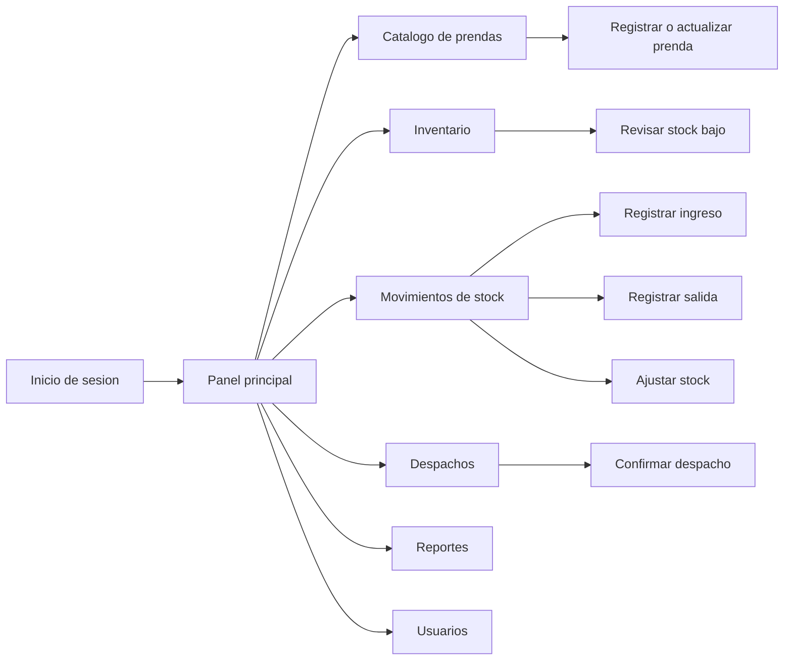

# Prototipo Del Sistema

Este documento complementa el README con la propuesta de interfaz para SoftwareTextil. El prototipo esta pensado para el encargado de inventario, tomando como base el rol definido en `lab05.md`.

## Objetivo Del Prototipo

El objetivo es mostrar una interfaz sencilla para trabajar con prendas, stock, movimientos, despachos y reportes. La prioridad es que el usuario pueda encontrar rapidamente las operaciones del dia.

## Flujo Principal



## Pantalla Principal

```text
+--------------------------------------------------------------------------------+
| SoftwareTextil                                                                  |
| Gestion de inventario textil                                                    |
+-------------------------+------------------------------------------------------+
| Menu                    | Panel principal                                      |
|                         |                                                      |
| Inicio                  | Indicadores                                          |
| Catalogo                | Stock bajo: 8 prendas                               |
| Inventario              | Movimientos del dia: 15                             |
| Movimientos             | Despachos pendientes: 4                             |
| Despachos               |                                                      |
| Reportes                | Acciones rapidas                                     |
| Usuarios                | [Registrar ingreso] [Registrar salida] [Despacho]   |
+-------------------------+------------------------------------------------------+
```

## Pantallas Consideradas

| Pantalla | Uso |
| --- | --- |
| Inicio de sesion | Valida el acceso de usuarios registrados. |
| Panel principal | Muestra resumen de stock, alertas y movimientos recientes. |
| Catalogo | Lista prendas con filtros por categoria, talla y color. |
| Registro de prenda | Permite crear o actualizar una prenda. |
| Inventario | Muestra stock actual, nivel minimo y estado de alerta. |
| Movimientos | Registra ingresos, salidas y ajustes. |
| Despachos | Permite preparar, confirmar o cancelar despachos. |
| Reportes | Permite consultar movimientos, stock bajo y despachos. |
| Usuarios | Administra usuarios, roles y permisos. |

## Criterios De Usabilidad

| Criterio | Aplicacion |
| --- | --- |
| Claridad | Las acciones usan nombres propios del negocio textil. |
| Rapidez | El panel principal muestra accesos directos a operaciones frecuentes. |
| Trazabilidad | Cada movimiento conserva fecha, tipo, cantidad, motivo y usuario. |
| Control | Las alertas permiten actuar antes de quedarse sin stock. |
